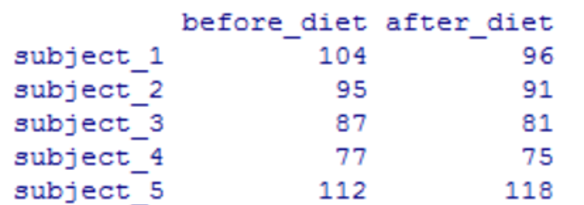

# **Topic 2 - Data manipulation**

Data manipulation involves modifying data to make it easier to read and to be more organized. We manipulate data for analysis and visualization. It is also used with the term ‘data exploration’ which involves organizing data using available sets of variables.

At times, the data collection process done by machines involves a lot of errors and inaccuracies in reading. Data manipulation is also used to remove these inaccuracies and make data more accurate and precise.


```{r,  eval=FALSE}
library (datasets) # load the dataset package
rm(list=ls()) # remove objects already present
data(iris) # load iris dataset
ls() # the function data import an object 'iris'
iris # print the object
fix(iris) # open a speadsheet on the object
summary(iris) # summarize the object
class(iris) # give the class of the object
str(iris) # examine the structure of the object
```

The object `iris' is a data.frame and is composed of 5 variables and 150 observations. Four variables are numeric, one  is a factor made of 3 levels.

Other object types and structures also exist: data frame,  factor, integer, matrix, etc. but more on this later (it is long and boring, yet important)


## Row and column selection

Let's assume an online dataframe reporting the height and shoesize of 10 Taiwanese students:

```{r,  eval=FALSE}
students<-read.table('https://www.dipintothereef.com/uploads/3/7/3/5/37359245/students.txt',header=T, sep="\t", dec='.') # inspect the object created
```

A single column (height) is needed for further processing. This is accomplished by using the `$` operator. A column is selected by putting together on the same line the:

- name of the object
- operator `$`
- name of the column

Here the column `height` can be selected using: `students$height`. The same column can be extracted using the subscript  which is denoted by the square brackets after the object name `students[,1]`:

```{r,  eval=FALSE}
class(students$height)
class(students[,1])
```

This column is an integer: a whole number (not a fractional number) that can be positive, negative, or zero. This can be converted as a numerical using the function: `as.numeric'

```{r,  eval=FALSE}
students$height<-as.numeric(students$height) # assigned numerical value to this column
class(students$height) # check the change was made
```

Extracting a row can obly be accomplished with a subsecript. Therefore, to extract the first row of our dataframe:

```{r,  eval=FALSE}
students[1,] #extract the first row of the table
```

Following the same methods, check the results of: 

```{r,  eval=FALSE}
students[1,1] # element in the first row, first column
students$height[1] # first element in our vector height
```

<span style="color: red">Always remember `object[no. row, no. column]`</span>


## Sub-setting

The purpose is to  extract information following a given condition. Such, we only want to select female students:

1. Add a condition and check whether or not the observation (row) is for female students:

```{r,  eval=FALSE}
students$gender=="female" # check which information is for female
```

2. Create a filter, here I called it `f`: 

```{r,  eval=F}
f<-students$gender=="female" # create a 'filter' called f
``` 

3. Apply my filter using subsript, I want to extract only the rows that contain data for female students. I put the results in a new object call `female`:

```{r,  eval=F}
females<-students[f,] # filter our 'students' dataset
females
```

It selected 5 students. The dimensions of my new data frame is a table of 5 obs. by 4 col. Column names `colnames` remained unchanged, but I have now only 5 names for the rows `rownames`. I can rename my `rownames` by  combining names into a vector  `c`. 

```{r,  eval=F}
dim(females) # size of my new data frame
colnames(females) # names of the columns
rownames(females) # names of the rows
rownames(females)<-c('Vanessa', 'Vicky', 'Marianna', 'Joyce', 'Victoria')
females
``` 

> *<span style="color: green">**RP2**: Using our `iris` data set, create three different data set corresponding to the three species designated in the column `Species`</span>* 

```{r class.source = "fold-hide",  eval=FALSE}
levels(iris$Species)
setf<-iris$Species=="setosa"
setosa<-iris[setf,]
verf<-iris$Species=="versicolor"
versicolor<-iris[verf,] 
virf<-iris$Species=="virginica"
virginica<-iris[virf,] 
```

## Sample

The function `sample` is used to generate a sample of a specific size from a vector or a dataset, eithre with or without replacement.

The basic syntax of the `sample` function is as follows:

```{r class.source = "fold-show",  eval=FALSE}
sample(data, size, replace = FALSE, prob = NULL)
#get source code
# View(sample) OR getAnywhere(sample()) 
```

To select randomly two individuals in our`students` dataset, I first need to define the size of my target, create a filter with my random selection of individuals, then apply my filter on my `students` dataset: 


```{r,  eval=FALSE}
nrow(students) # number of rows in student, same as dim(students)[1] 
1:nrow(students) # create a vector from 1 to nrow(students) observation: 10
stuf<-sample(1:nrow(students), 2) # filter randonly 2 students on my 10 students
stuf # my two students
students[stuf,] # apply my filter
```


## Sorting

Sorting a data frame is done by combining command `order` with a subscript. Like for sub-setting, we first need to create a vector that will tell into which order the rows of the table need to be arranged:

```{r,  eval=FALSE}
ind1<-order (students$height ) # create the vector of order: ind1
rownames(students) # the first ind '1 | height 167' should move at position 5
students [ind1,] # sorting my data with my vector of order, check ind.1 is at position 5 
```

All can be combined into 1 line, without creating a vector order:

```{r,  eval=FALSE}
students[order(students$height),]
```

You can now guess what the following vectors will do: 

```{r,  eval=FALSE}
ind2<-order(-students$height)
ind3<-order(students$height,decreasing =T)
```

## Recoding

Recoding is replacing values with new ones. Values in a varaible can be recoded using the command `ifelse`. Le's recode our `gender` variable with different colors in order to have male=blue and female=red. Note 'equal to' is given with the operator `==` 

```{r,  eval=FALSE}
colors<-ifelse(students$gender=='male', 'blue','red') # if condition is true it will take the value 'blue', if not the value 'red' 
```

You can create an new column:

```{r,  eval=FALSE}
students$colors<-ifelse(students$gender=='male','blue','red') # create a new column
```

Or replace the existing one: 

```{r,  eval=FALSE}
students$gender<-ifelse(students$gender=='male', 'blue','red') # replace an existing column
```

More operators, which can be combined together:

`==` equal to 

`>=` equal to or greater than

`<=` equal to or less than

`!=` not equal to

`&` and

`|` or

```{r,  eval=F}
students$height <= 165 # students shorter or equal to 165 cm
students$shoesize < 37 # students with shoes size less than 37
students$height <= 165 & students$shoesize < 37 # students with height and shoes size <37
students$dual.cond<-ifelse(students$height<=165 & students$shoesize<37,'blue','red') # Use with ifelse()
students # only one student follow the two conditions
```


> *<span style="color: green">**RP3**: Reverse variable `gender` with `male` and `female` by replacing color names. Delete extra variables created to come back to our orignal table (the variable received `NULL`). Using the `iris` dataset create a new variable with flower colors. Iris setosa is purple.Iris versicolor is blue. Iris virginica is pink. Sort individuals by decreasing `Sepal.Width`. Hypothesize on the use of this trait to discriminate the species.</span>* 


```{r class.source = "fold-hide",  eval=FALSE}
#`students` dataset
students$gender<-ifelse(students$gender=='blue','male','female')
students$colors<-NULL
students$dual.cond<-NULL

# `iris` dataset
iris$colors<-ifelse(iris$Species=='setosa','purple', ifelse(iris$Species=='versicolor','blue','pink'))
iris[order(iris$Sepal.Width, decreasing = T),]
```

## Package `dplyr` 

So fare we used functions in base. Other useful functions`subset`, `with`, `within`, etc. Packages like `data.table`, `ggplot2`, `reshape2`, etc. also offer usueful functions. `dplyr` package is  dedicated for manipulating the data in R with many common functions to fasten the data exploration and transformation. Some important functions included in the `dplyr` packages:


+ `select` to select columns (variables)
+ `filter` to filter (subset) rows
+ `mutate` to create new variables
+ `summarise` to summarize (or aggregate) data
+ `group_by` to group data
+ `arrange` to sort data
+ `join` to join data frames


### `select`

It is used to select data by its column name. We can select any number of columns in a number of ways. For example:

```{r class.source = "fold-show",  eval=FALSE}
library (dplyr)
selected <- select(iris, Sepal.Length, Sepal.Width, Petal.Length) #To select the following columns
head(selected) # print the beginning of the data set created
selected1 <- select(iris, Sepal.Length:Petal.Length) #To select all columns from Sepal.Length to Petal.Length
head(selected1, 4) #To print first four rows of the data set created                       
selected1 <- select(iris,c(3:5)) #To select columns with numeric indexes
head(selected1)
```

We used `-` to hide a particular column

```{r,  eval=F}
selected <- select(iris, -Sepal.Length, -Sepal.Width)
head(selected)
```

### `filter`

It is used to find rows with matching criteria. It also works like the select() function, i.e., we pass a data frame along with a condition separated by a comma. For example:

```{r,  eval=F}
#To select the first 3 rows with Species as setosa
filtered <- filter(iris, Species == "setosa" )
head(filtered,3)
```

And for dual conditions:

```{r,  eval=F}
#To select the last 5 rows with Species as versicolor and Sepal width more than 3
filtered1 <- filter(iris, Species == "versicolor", Sepal.Width > 3)
tail(filtered1)
```

### `mutate`

It creates new columns and preserves the existing columns in a dataset. For example:

```{r,  eval=F}
#To create a column “Greater.Half” which stores TRUE if given condition is TRUE
col1 <- mutate(iris, Greater.Half = Sepal.Width > 0.5 * Sepal.Length)
tail(col1)
```

To check how many flower satisfy this condition, the output of the function `table{base}` is a contingency table:

```{r,  eval=F}
table(col1$Greater.Half)
```

### `arrange`

It is used to sort rows by variables in both an ascending and descending order. For example:

```{r,  eval=F}
#To arrange Sepal Width in ascending order
arranged <- arrange(col1, Sepal.Width)
head(arranged)
#To arrange Sepal Width in descending order
arranged <- arrange(col1, desc(Sepal.Width))
head(arranged)
```

### `summarise`


It is used to find insights(mean, median, mode, etc.) from a dataset. It reduces multiple values down to a single value. For example:

```{r,  eval=F}
summarised <- summarise(arranged, Mean.Width = mean(Sepal.Width))
head(summarised)
```

### `group_by`

It is done to group observations within a dataset by one or more variables. Most data operations are performed on groups defined by variables. For example:

```{r,  eval=F}
#To find mean sepal width by Species, we use grouping as follows
gp <- group_by(iris,Species)
mn <- summarise(gp,Mean.Sepal = mean(Sepal.Width))
mn
```

## Pipe operator

Pipe operator lets us wrap multiple functions together. It is denoted as `%>%`. It can be used with functions like `filter`, `select`, `arrange`, `summarise`, `group_by`, etc. For example:

```{r,  eval=F}
#To get rows with the following conditions
iris %>% filter(Species == "setosa",Sepal.Width > 3.8)
```

To find mean Sepal Length by Species, we use pipe operator as follows:

```{r,  eval=F}
iris  %>% group_by(Species) %>% summarise(Mean.Length = mean(Sepal.Length))
```


> *<span style="color: green"> **Challenge**: the data set `rairuoho`provides growth data for 8 days in different treatments. Reformat the table in order to have the `day` as a variable with 6 levels together with another variable called length. You may use another famous package for data manipulation `tidyr` and the function `gather()`. Current variables are given as:</span>* 

*<span style="color: green">- `day3` to `day8`:  mean length of the grass at the given day </span>*

*<span style="color: green">- `day3` to `day8`:  mean length of the grass at the given day </span>*

*<span style="color: green">- `germinate`:  no. of germinated seeds </span>*

*<span style="color: green">- `bed`: where the grass was growing, 4 levels: thin (mould1),   thick (mould2) mould, thin (paper4) and thick (paper8) paper </span>*

*<span style="color: green">- `treatement`: watering scheme, 2 levels: either pure water or water with nutrients </span>*

*<span style="color: green">- `treatement`: watering scheme, 2 levels: either pure water or water with nutrients </span>*

*<span style="color: green">- `spatial1`: vertical location of the plot </span>*

*<span style="color: green">- `spatial2`: horizontal location of the plot </span>*

*<span style="color: green">extra variable `row` and `column` can be removed</span>*

```{r,  eval=FALSE}
rairuoho<-read.table('Data/rairuoho.txt',header=T, sep="\t", dec=".")
head(rairuoho)
```

## Data object type and structure

### Core data types

These data types, or modes, define how the values are stored in the computer. You can get an object’s mode using the `typeof` function. Note that R also has a built-in `mode` function that will serve the same purpose with the one exception in that it will not distinguish integers from doubles.

#### Numeric

The numeric data type is probably the simplest. It consists of numbers such as integers (e.g. 1 ,-3 ,33 ,0) or doubles (e.g. 0.3, 12.4, -0.04, 1.0). For example, to create a numeric (double) vector we can type:

```{r,  eval=T}
x <- c(1.0, -3.4, 2, 140.1)
mode(x)
```

To assess if the number is stored as an integer or a double use the `typeof` function.

```{r,  eval=T}
typeof(x)
```

Note that removing the fraction part of a number when creating a numeric object does not necessarily create an integer. For example, creating what seems to be an integer object returns double when queried by `typeof`:

```{r,  eval=T}
x <- 4
typeof(x)
```

To force R to recognize a value as an integer add an upper case `L` to the number.

```{r,  eval=T}
x <- 4L
typeof(x)
```


#### Character

The character data type consists of letters or words such as "a", "f", "project", "house value".

```{r,  eval=T}
x <- c("a", "f", "project", "house value")
typeof(x)
```

Characters can also consist of numbers represented as characters. The distinction between a character representation of a number and a numeric one is important. For example, if we have two numeric vectors `x` and `y` such as


```{r,  eval=T}
x <- 3
y <- 5.3
```

and we choose to sum the two variables, we get:


```{r,  eval=T}
x + y
```


If we repeat these steps but instead choose to represent the numbers '3' and '5.3' as characters we get the following error message:


```{r,  eval=T}
x <- "3"
y <- "5.3"
# Error in x + y: non-numeric argument to binary operator
```

Note the use of quotes to force numbers to character mode.


#### Logical

Logical values can take on one of two values: `TRUE` or `FALSE`. These can also be represented as `1` or `0`. For example, to create a logical vector of 4 elements, you can type

```{r,  eval=T}
x <- c(TRUE, FALSE, FALSE, TRUE)
```

or

```{r,  eval=T}
x <- as.logical(c(1,0,0,1))
```

Note that in both cases, `typeof` returns logical. Also note that the `1`’s and `0`’s in the last example are converted to `TRUE`’s and `FALSE`’s internally.

### Derived data types

These data types are stored as either numeric, character or logical but have additional *attribute* information that allow these objects to be treated in special ways by certain functions in R. These attributes define an object’s **class** and can be extracted from that object via the 'class' function.


#### Factor

**Factors** are normally used to group variables into a fixed number of unique categories or **levels**. For example, a dataset may be grouped by gender or month of the year. Such data are usually loaded into R as a numeric or character data type requiring that they be converted to a factor using the `as.factor` function.

```{r,  eval=T}
a <- c("M", "F", "F", "U", "F", "M", "M", "M", "F", "U")
a.fact <- as.factor(a)
```

Note that `a` is of `character` data type.


```{r,  eval=T}
typeof(a)
```

However, the derived object `a.fact` is now stored as an `integer`!

```{r,  eval=T}
typeof(a.fact)
```

Yet, when displaying the contents of `a.fact` we see character values.

```{r,  eval=T}
a.fact
```

How can this be? Well, `a.fact` is a more complicated object than the simple objects created thus far in that the factor is storing additional information not seen in its output. This hidden information is stored in **attributes**. To view these hidden attributes, use the `attributes` function.

```{r,  eval=T}
attributes(a.fact)
```

There are two attributes: `levels` and `class`. The levels attribute lists the three unique values in `a.fact`. The order in which these levels are listed reflect their *numeric* representation. So in essence, `a.fact` is storing each value as an integer that points to one of the three unique levels. The unique levels of a factor, and the order in which they are stored can be extracted using the `levels` function.

```{r,  eval=T}
levels(a.fact)
```

Remember, the order in which the levels are displayed match their integer representation. If we wanted them  in a different order (i.e. U first followed by F then M) we would need to modify them by recreating the factor object as follows:

```{r,  eval=T}
factor(a, levels=c("U","F","M"))
```

This can be important when you will try to rearrange a plot.

> *<span style="color: green">**RP4**: Understanding the factors and their levels is critical, especially when you will subset. Let's explore together why using our `iris` dataset

```{r class.source = "fold-show",  eval=FALSE}
iris.sel<- subset(iris, Species == "setosa" | Species == "virginica") # let's subset two species
levels(iris.sel$Species) # the 3 species are still there
boxplot(Petal.Width ~ Species, iris.sel, horizontal = TRUE) # This can be a nuisance when plotting the data subset

iris.sel$Species <- droplevels(iris.sel$Species)
levels(iris.sel$Species)
boxplot(Petal.Width ~ Species, iris.sel, horizontal = TRUE)
```

**ALWAYS** CHECK THE DATA TYPE AND STRUCTRE OF YOUR DATA SET!

#### Date

Date values are stored as numbers. But to be properly interpreted as a date object in R, their attribute must be explicitly defined as a **date**. R provides many facilities to convert and manipulate dates and times, but a package called `lubridate` makes working with dates/times much easier. Working wit data could be the object of a specific topic, and it will no be covered here.

#### NA and NULL

You will find that many data files contain missing or unknown values. It may be tempting to assign these missing or unknown values a `0` but doing so can lead to many undesirable results when analyzing the data. R has two placeholders for such elements: `NA` and `NULL`


```{r class.source = "fold-show",  eval=T}
x <- c(23, NA, 1.2, 5)
```

`NA` (Not Available) is a missing value indicator. It suggests that a value should be present but is unknown.

The `NULL` object also represents missing values but its interpretation is slightly different in that it suggests that the value does not exist or that it’s not measurable.


```{r class.source = "fold-show",  eval=T}
y <- c(23, NULL, 1.2, 5)
```

Remember when we previously removed the variables that we did not want to exist in our `students` dataset.The difference between `NA` and `NULL` may seem subtle, but their interpretation in some functions can lead to different outcomes. For example, when computing the mean of `x`, R returns an `NA` value:

```{r class.source = "fold-show",  eval=T}
mean(x)
```

This serves as a check to remind the user that one of the elements is missing. This can be overcome by setting the `na.rm` parameter to `TRUE` as in `mean(x, na.rm=T)` in which case R ignores the missing value.

A `NULL` object, on the other hand, is treated differently. Since `NULL` implies that a value should not be present, R no longer feels the need to treat such element as questionable and allows the mean value to be computed:

```{r class.source = "fold-show",  eval=T}
mean(y)
```

It’s more common to find data tables with missing elements populated with `NA`’s than `NULL`’s so unless you have a specific reason to use `NULL` as a missing value placeholder, use `NA` instead.


### Data structures

Most datasets we work with consist of batches of values such as a table of temperature values or a list of survey results. These batches are stored in R in one of several data structures. These include **(atomic) vectors**, **matrices**, **data frames** and **lists**.


#### (Atomic) vectors

The **atomic vector** (or **vector** for short) is the simplest data structure in R which consists of an ordered set of values of the same type and or class (e.g. numeric, character, date, etc…). A vector can be created using the combine function c() as in

```{r class.source = "fold-show",  eval=T}
x <- c(674 , 4186 , 5308 , 5083 , 6140 , 6381)
x
```

As we seen before, a vector object is an indexable collection of values which allows one to access a specific index number. For example, to access the third element of x, type:


```{r class.source = "fold-show",  eval=T}
x[3]
```

You can also select a subset of elements by index values using the combine function c().

```{r class.source = "fold-show",  eval=T}
x[c(1,3,4)]
```

Or, if you are interested in a range of indexed values such as index 2 through 4, use the : operator.

```{r class.source = "fold-show",  eval=T}
x[2:4]
```

You can also assign new values to a specific index. For example, we can replace the second value in vector `x` with `0`.

```{r class.source = "fold-show",  eval=T}
x[2] <- 0
x
```

Note that a vector can store any data type such as characters.

```{r class.source = "fold-show",  eval=T}
x <- c("all", "b", "olive")
x
```

However, a vector can only be of one type. For example, you cannot mix numeric and character types as follows:

```{r class.source = "fold-show",  eval=T}
x <- c( 1.2, 5, "Rt", "2000")
```

In such a situation, R will convert the element types to the **highest common mode** following the order **NULL** < **logical** < **integer** < **double** < **character**. In our working example, the elements are coerced to character:

```{r class.source = "fold-show",  eval=T}
typeof(x)
```


#### Matrices and arrays


Matrices in R can be thought of as vectors indexed using two indices instead of one. For example, the following line of code creates a 3 by 3 matrix of randomly generated values. The parameters 'nrow' and 'ncol' define the matrix dimension and the function 'runif' generates the nine random numbers that populate this matrix.

```{r class.source = "fold-show",  eval=T}
m <- matrix(runif(9,0,10), nrow = 3, ncol = 3)
m
```


If a higher dimension vector is desired, then use the `array` function to generate the n-dimensional object. A 3x3x3 array can be created as follows:


```{r class.source = "fold-show",  eval=T}
m <- array(runif(27,0,10), c(3,3,3))
m
```

Matrices and arrays can store numeric or character data types, but they cannot store both. 

#### Data frames

A **data frame** is what comes closest to our perception of a data table. It’s an extension of the matrix object in that, unlike a matrix, a data frame can *mix* data types across columns (e.g. both numeric and character columns can coexist in a data frame) but data type remains the same across rows.


```{r class.source = "fold-show",  eval=T}
name   <- c("a1", "a2", "b3")
value1 <- c(23, 4, 12)
value2 <- c(1, 45, 5)
dat    <- data.frame(name, value1, value2)
dat
str(dat) # provide structure
attributes(dat) # provide attributes
names(dat) # extract colum names
rownames(dat) # extract row names
```

#### Lists

A **list** is an ordered set of components stored in a 1D vector. In fact, it’s another kind of vector called a recursive vector where each vector element can be of different data type and structure. This implies that each element of a list can hold complex objects such as matrices, data frames and other list objects too! Think of a list as a single column spreadsheet where each cell stores anything from a number, to a three paragraph sentence, to a five column table.

A list is constructed using the `list` function. For example, the following list consists of 3 components: a two-column data frame (tagged as component `A`), a two element logical vector (tagged as component `B`) and a three element character vector (tagged as component `C`).


```{r class.source = "fold-show",  eval=T}
A <- data.frame(
     x = c(7.3, 29.4, 29.4, 2.9, 12.3, 7.5, 36.0, 4.8, 18.8, 4.2),
     y = c(5.2, 26.6, 31.2, 2.2, 13.8, 7.8, 35.2, 8.6, 20.3, 1.1) )
B <- c(TRUE, FALSE)
C <- c("apples", "oranges", "round")
lst <- list(A = A, B = B, C = C)
```

You can view each component’s structure using the `str` function.


```{r class.source = "fold-show",  eval=T}
str(lst)
names(lst)
```

Each component of a list can be extracted using the `$` symbol followed by that component’s name. For example, to access component A from list `lst`, type:


```{r class.source = "fold-show",  eval=T}
lst$A
```

You can also access that same component using its numerical index. Since A is the first component in `lst`, its numerical index is `1`.

```{r class.source = "fold-show",  eval=T}
lst[[1]]
class(lst[[1]])
```

Note that components do not require names. For example, we could have created a list as follows (note the omission of `A=`, `B=`, etc…):


```{r class.source = "fold-show",  eval=T}
lst.notags <- list(A, B, D)
lst.notags
```

When lists do not have component names, the `names` function will return NULL.

```{r class.source = "fold-show",  eval=T}
names(lst.notags)
```


You’ll find that many functions in R return list objects such as the linear regression model function `lm`. For example, when we run a regression analysis for vector elements `x` and `y` (in data frame `A`) and save the output of the regression analysis to an object called M:

```{r class.source = "fold-show",  eval=T}
M <- lm( y ~ x, A)
str(M)
names(M)
```

The `M` list is more complex than the simple list `lst` we created earlier. In addition to having more components, it stores a *wider* range of data types and structures. For example, element qr is itself a list of five elements!

```{r class.source = "fold-show",  eval=T}
str(M$qr)
```

So if we want to access the element rank in the component qr of list `M`, we can type:

```{r class.source = "fold-show",  eval=T}
M$qr$rank
```

### Coercing data

Data can be coerced from one type to another. For example, to coerce the following vector object from character to numeric, use the `as.numeric` function.

```{r class.source = "fold-show",  eval=T}
y   <- c("23.8", "6", "100.01","6")
y.c <- as.numeric(y)
y.c
```

The `as.numeric` function forces the vector to a double (you could have also used the `as.double` function). If you convert `y` to an integer, R will remove all fractional parts of the number.

```{r class.source = "fold-show",  eval=T}
as.integer(y)
```

To convert a number to a character use `as.character`

```{r class.source = "fold-show",  eval=T}
numchar <- as.character(y.c)
numchar
```

You can also coerce a number or character to a factor.

```{r class.source = "fold-show",  eval=T}
numfac <- as.factor(y)
numfac
```

```{r class.source = "fold-show",  eval=T}
charfac <- as.factor(y.c)
charfac
```


There are many other coercion functions in R, a summary of some the most common ones we’ll be using in this course follows:


```{r class.source = "fold-show",  eval=F}
as.character() #	Convert to character
as.numeric()  as.double()	# Convert to double
as.integer()	# Convert to integer
as.factor()	# Convert to factor
as.logical()	#Convert to a Boolean
```

---------

> *<span style="color: green">**RP5**: create the following data frame summarizing the results of a small experiment on 5 individuals testing the efficiency of a specific diet (drinking bubble tea only - feak data). Calculate the % of weight loss, and comment </span>*

<div style="width:300px; height=200px">



