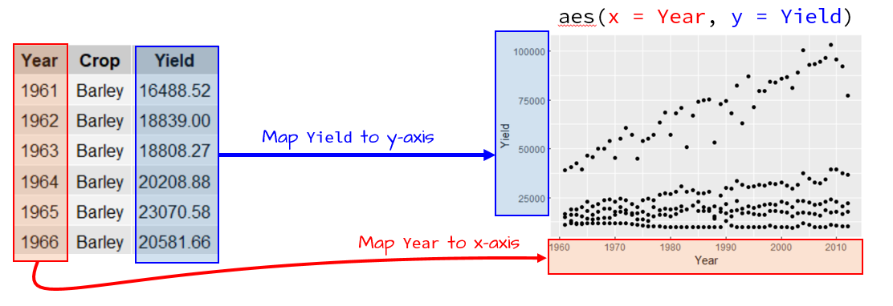
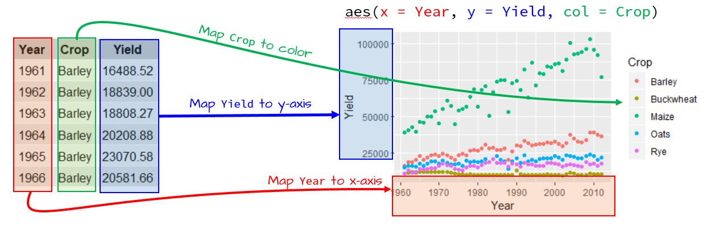
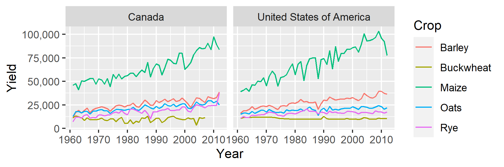
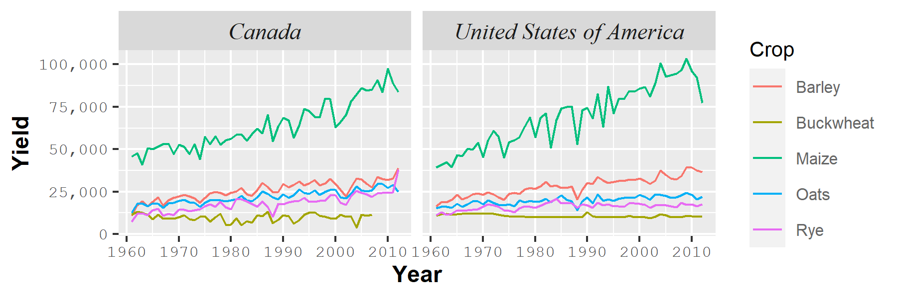

# **Topic 3 - Plots**

## Base plotting environment

### Point and line plots

The most commonly used plot function in R is `plot` which generates both points and line plots. For example, to plot length of petal `Petal.Length` vs the width of petal (`Petal.Width`) for each individual measured:

```{r,  eval=T}
data(iris)
plot(iris$Petal.Length) # index observation for Petal.Length
plot(iris$Petal.Width) # index observation for Petal.Width
plot(Petal.Length ~ Petal.Width, dat = iris) # pairwise
```


The above plot command takes two arguments: Petal.Length ~ Petal.Width which is to be read as plot variable `Petal.Length` as a function of `Petal.Width`, and `dat = iris` which tells the plot function which data frame to extract the variables from. Another way to call this command is to type:

```{r,  eval=F}
plot(iris$Petal.Length ~ iris$Petal.Width) # using the $ operator
```


The `plot` function can take on many other arguments to help customize the default plot options. For example, we may want to change the axis labels to something more descriptive than the table variable name:


```{r,  eval=T}
plot(Petal.Length ~ Petal.Width, dat = iris,
     xlab = 'Petal width (cm)', # add label to x-axis 
     ylab = 'Petal length (cm)', # add label to y-axis 
     main = 'Petal width and length of iris flower') # add title to the plot 
```

We can change the symbole type using argument `pch` (plotting ‘character’, see `?pch` for point options). `pch = 19` will produce a solid circle. The argument `cex` will control his size (character expansion). We can also set its colors to be 90% transparent (10% opaque) using expression `col = rgb (0,0,0,0.10)`. The `rgb` function defines the intensity for each of the display primary colors (on a scale of 0 to 1). The primary colors are red, green and blue. The forth value is optional and provides the fraction opaqueness (or transparency) with a value of 1 being completely opaque. 


```{r,  eval=T}
plot(Petal.Length ~ Petal.Width, dat = iris,
     xlab = 'Petal width (cm)', 
     ylab = 'Petal length (cm)', 
     main = 'Petal width and length of iris flower',
     pch = 19, cex=2, 
     col = rgb (0,0,0,0.10)) # set up symbol types and their color  

plot(Petal.Length ~ Petal.Width, dat = iris,
     xlab = 'Petal width (cm)', 
     ylab = 'Petal length (cm)', 
     main = 'Petal width and length of iris flower',
     pch = 19, cex=2, 
     col = rgb (1,0,0,0.10)) # set up symbol types and their color  

```

Now it is time to combine this with what we previously learned on conditional selection. How to add different colors for the three different species. Remember the `ifelse`?

```{r,  eval=T}
col.iris<-ifelse(iris$Species=='setosa','purple',ifelse(iris$Species=='versicolor','blue','pink')) # create a vector of character with the name of the color we wanna use
col.iris
```

We can insert this color vector in the argument `col` and controlling its opacity with the `alpha` function from the package `scales`. You can guess the argument `col` can accept a vector of character with just the name of color instead of a `rgb` code.

```{r,  eval=T}
library(scales)
plot(Petal.Length ~ Petal.Width, dat = iris,
     xlab = 'Petal width (cm)', 
     ylab = 'Petal length (cm)', 
     main = 'Petal width and length of iris flower',
     pch = 19, cex=2, 
     col = alpha(col.iris, 0.2)) # set up symbol types and their color 
```
 
We now must add a legend to our plot. Observe the conversion of the color list into a factor, and the extraction of levels in the `col` argument.

```{r,  eval=T}
plot(Petal.Length ~ Petal.Width, dat = iris,
     xlab = 'Petal width (cm)', 
     ylab = 'Petal length (cm)', 
     main = 'Petal width and length of iris flower',
     pch = 19, cex=2, 
     col = alpha(col.iris, 0.2))

legend(x="bottomright", pch= 19, cex=1.5, legend= c("versicolor","setosa", "virginica"), col=levels(as.factor(alpha(col.iris, 0.2))))
    
```

The argument `las=1` will rotate y-axis labels. This is often a requirement for publication quality plots. 

```{r,  eval=T}
plot(Petal.Length ~ Petal.Width, dat = iris,
     xlab = 'Petal width (cm)', 
     ylab = 'Petal length (cm)', 
     main = 'Petal width and length of iris flower',
     pch = 19, cex=2, las=1,
     col = alpha(col.iris, 0.2)) # set up symbol types and their color 

legend(x="bottomright", pch= 19, cex=1.5, legend= c("versicolor","setosa", "virginica"), col=levels(as.factor(alpha(col.iris, 0.2))))
```

The size of the main title, axis, labels is also control with `cex` arguments 

```{r,  eval=T}
plot(Petal.Length ~ Petal.Width, dat = iris,
     xlab = 'Petal width (cm)', 
     ylab = 'Petal length (cm)', 
     main = 'Petal width and length of iris flower',
     cex.axis=1.0, cex.lab=1.5, cex.main=1.5,
     pch = 19, cex=2, las=1,
     col = alpha(col.iris, 0.2))

legend(x="bottomright", pch= 19, cex=1.5, legend= c("versicolor","setosa", "virginica"), col=levels(as.factor(alpha(col.iris, 0.2))))

```

The size of the points can be set as a proportion of a given continuous variable


```{r,  eval=T}
ratio<-iris$Petal.Length/iris$Sepal.Width  # ratio between the length of petal and the width of Sepal
plot(Petal.Length ~ Petal.Width, dat = iris,
     xlab = 'Petal width (cm)', 
     ylab = 'Petal length (cm)', 
     main = 'Petal width and length of iris flower',
     cex.axis=1.0, cex.lab=1.5, cex.main=1.5,
     pch = 19, las=1, cex= ratio * 2, # incude this ration in cex, multiply x2 to make it more visual
     col = alpha(col.iris, 0.2))
# looks like Sepal.Width is poorly informative in disriminating species

legend(x="bottomright", pch= 19, cex=1.5, legend= c("versicolor","setosa", "virginica"), col=levels(as.factor(alpha(col.iris, 0.2))))
```

The function `pairs` allows a quick examination of the relationship among variables of interest: a scatterplot matrix. 

```{r,  eval=T}
pairs(iris[1:4], pch=19, col = alpha(col.iris, 0.2))
```

A conversion to a line plot is easily made by specifying the `type` of plot. Y

```{r,  eval=T}
iris<-iris[order(iris$Petal.Width),] # first order
blossom<-NULL
blossom$year <- 2010:2019                                               # 
blossom$count.alaska <- c(3, 1, 5, 2, 3, 8, 4, 7, 6, 9)
blossom$count.canada <- c(4, 6, 5, 7, 10, 8, 10, 11, 15, 17)
as.data.frame(blossom)
plot(count.alaska ~ year,dat = blossom, type='l',
      ylab = "No. of flower blossoming") 
```

To plot both points and line, set the type parameter to "b" (for both). We’ll also set the point symbol to 20.

```{r,  eval=T}
plot(count.alaska ~ year,dat = blossom, type='b', pch=20,
      ylab = "No. of flower blossoming") 
```

We can rotate the axis, increase the width of the line, change its type and color:  

```{r,  eval=T}
plot(count.alaska ~ year,dat = blossom, type='b', pch=20,
     lty=2, lwd=0.5, col='red',
     ylab = "No. of flower blossoming") 
```


We can add the other variable by adding a line of another type and color:  
```{r,  eval=T}
plot(count.alaska ~ year,dat = blossom, type='b', pch=20,
     lty=2, lwd=0.5, col='red',
     ylab = "No. of flower blossoming") 
lines(count.canada ~ year,dat = blossom, type='b', pch=20,
     lty=3, lwd=0.5, col='blue')
```

The plot is a static object meaning that we need to define the axes limits before calling the original plot function. Both axes limits can be set using the `xlim` and `ylim` parameters. We don’t need to set the x-axis range since both variables cover the same year range. We will therefore only focus on the y-axis limits. We can grab both the minimum and maximum values for the variables `count.alaska` and `count.canada` using the `range` function, then pass the range to the `ylim` parameter in the call to plot.

```{r,  eval=T}
y.rng<-range(c(blossom$count.alaska, blossom$count.canada))

plot(count.alaska ~ year,dat = blossom, type='l', ylim = y.rng,
     lty=2, lwd=1, col='red',
     ylab = "No. of flower blossoming") 
lines(count.canada ~ year,dat = blossom,
     lty=1, lwd=1, col='blue')
```


Point plots from different variables can also be combined into a single plot using the `points` function in lieu of the `lines` function. Let's get back to our iris dataset and build our plot sequentially for two species.


```{r,  eval=T}
iris.ver<- subset(iris, Species == "versicolor")
iris.vir<- subset(iris, Species == "virginica")

y.rng <- range( c(iris.ver$Petal.Length, iris.vir$Petal.Length) , na.rm = TRUE) 
x.rng <- range( c(iris.ver$Petal.Width, iris.vir$Petal.width) , na.rm = TRUE) 

# Plot an empty plot

plot(Petal.Length ~ Petal.Width, dat = iris.ver,
     xlab = 'Petal width (cm)', 
     ylab = 'Petal length (cm)', 
     main = 'Petal width and length of iris flower',
     cex.axis=1.0, cex.lab=1.5, cex.main=1.5, type='n',
     xlim=x.rng,  ylim=y.rng)

# Add points for versicolor
points(Petal.Length ~ Petal.Width, dat = iris.ver, pch = 20,cex=2, 
       col = rgb(0,0,1,0.10))
       
# Add points for versicolor
points(Petal.Length ~ Petal.Width, dat = iris.vir, pch = 20,cex=2, 
      col =  alpha('#fc03c6', 0.2))

# Add legend
legend("topleft", c("versicolor", "virginica"), pch = 19, cex=1.2,
       col = c(rgb(0,0,1,0.10), alpha('#fc03c6', 0.2)))
```


Note 1: that `na.rm=T` is added in the `range` function to prevent `NA` value in the data from returning an `NA` value in the range.

Note 2: You can define the color using the `rgb` function, or by color name such as `col = "red"` or `col = "bisque"`. For a full list of color names, type colors() at a command prompt. You can also the hexadecimal code of the color. Google "color picker". Color gradient can easily be created and personnalized [here](https://www.webfx.com/web-design/color-picker/).


### Boxplots

A boxplot is one of many graphical tools used to summarize the distribution of a data batch. The graphic consists of a “box” that depicts the range covered by 50% of the data (aka the interquartile range, IQR), a horizontal line that displays the median, and “whiskers” that depict 1.5 times the IQR or the largest (for the top half) or smallest (for the bottom half) values.

For example, we can summarize the width of the sepal for all individuals in our iris dataset:

```{r,  eval=T}
boxplot(iris$Sepal.Width, na.rm = TRUE)
```

Several variables can be summarized on the same plot.

```{r,  eval=T}
boxplot(iris$Sepal.Width,iris$Sepal.Length, iris$Petal.Width,iris$Petal.Length, names = c("Sepal.Width", "Sepal.Length", "Petal.Length","Petal.Width"), main = "Iris flower traits")
```

The `names` argument labels the x-axis and the `main` argument labels the plot title. The outliers can be removed from the plot, if desired, by setting the `outline` parameter to FALSE. The boxplot graph can also be plotted horizontally by setting the `horizontal` parameter to `TRUE`:

```{r,  eval=T}
boxplot(iris$Sepal.Width,iris$Sepal.Length, iris$Petal.Width,iris$Petal.Length, names = c("Sepal.Width", "Sepal.Length", "Petal.Length","Petal.Width"), main = "Iris flower traits",outline = FALSE, horizontal = TRUE )
```

Using a long version of a table (`pivot_longer`), the variable can be summarized by the levels of a factor, here the `Species` levels

```{r,  eval=T}
boxplot(Sepal.Width ~ Species,iris) 
```

We can `reorder` the boxplots based on the median value. By default, `boxplot` will order the boxplots following the factor’s level order.
        
```{r,  eval=T}
iris$Species.ord <- reorder(iris$Species,iris$Sepal.Width, median)
levels(iris$Species.ord)
boxplot(Sepal.Width ~ Species.ord, iris)
```       
        
### Histograms

The histogram is another form of data distribution visualization. It consists of partitioning a batch of values into intervals of equal length then tallying their count in each interval. The height of each bar represents these counts. For example, we can plot the histogram of the width od sepal using the `hist` function as follows:
        
```{r,  eval=T}
hist(iris$Sepal.Width, xlab = "Width of Sepal", main = NA)
```

To control the number of bins add the `breaks` argument. The `breaks` argument can be passed different types of values. The simplest value is the desired number of bins. Note, however, that you might not necessarily get the number of bins defined with the `breaks` argument.

```{r,  eval=T}
hist(iris$Sepal.Width, xlab = "Width of Sepal", main = NA, breaks=10)
```

The documentation states that the breaks value “**is a suggestion only as the breakpoints will be set to `pretty` values**”. `pretty` refers to a function that rounds values to powers of 1, 2 or 5 times a power of 10.

If you want total control of the bin numbers, manually create the breaks as follows:     

```{r,  eval=T}
n <- 10  # Define the number of bin
minx <- min(iris$Sepal.Width, na.rm = TRUE)
maxx <- max(iris$Sepal.Width, na.rm = TRUE)
bins <- seq(minx, maxx, length.out = n +1)
hist(iris$Sepal.Width, xlab = "Width of Sepal", main = NA, breaks = bins)
```

### Density plot

Histograms have their pitfalls. For example, the number of bins can drastically affect the appearance of a distribution. One alternative is the density plot which, for a series of x-values, computes the density of observations at each x-value. This generates a “smoothed” distribution of values.

Unlike the other plotting functions, `density` does not generate a plot but a list object instead. But the output of `density` can be wrapped with a `plot` function to generate the plot.


```{r,  eval=T}   
dens <- density(iris$Sepal.Width)
plot(dens, main = "Density distribution of the width of sepal")
```

You can control the bandwidth using the bw argument. For example:

```{r,  eval=T}   
dens <- density(iris$Sepal.Width, bw=0.05)
plot(dens, main = "Density distribution of the width of sepal")
```

The bandwidth parameter adopts the variable’s units.

### QQ plot

This is an important plot called by the function `qqnorm` to examine the normality of a variable. A `qqline` can be added to represent a “theoretical”, by default normal, quantile-quantile plot.  

```{r,  eval=F}
qqnorm(iris$Sepal.Width)
qqline(iris$Sepal.Width)
```

> *<span style="color: green">**RP6**: Using our previous `rairuoho` dataset, examine the relationship between the length of the plant at `day3` and the length at `day7`: create a scatterplot. Examine if the length at `day7` is normal: you will use `hist`, a `density` plot and `qqnorm`. How does the`treatment` affect the length at day7: make a `boxplot`. Make a comparison of the lenght of the plant between each pair of days using `pairs`.</span>*

```{r class.source = "fold-hide",  eval=FALSE}
rairuoho<-read.table('Data/rairuoho.txt',header=T, sep="\t", dec=".")
plot(day3 ~ day7,dat=rairuoho,
    xlab = 'Length at day 3', 
    ylab = 'Length at day 7', 
    main = 'Realtionship between the length at day 3 and day 7')
hist(rairuoho$day7)
dens.rai <- density(rairuoho$day7, bw=6)
plot(dens.rai, main = "Density distribution of thelength at Day 7")
qqnorm(rairuoho$day7)
qqline(rairuoho$day7)
boxplot(day7~treatment, data=rairuoho) 
pairs(rairuoho[,1:6])
```

## Graphical options

See the current graphical settings using:

```{r class.source = "fold-show",  eval=FALSE}
par() # graphical options
# also use change the current settings
```

The `par` function allows you to set up graphical parameters (for all coming plots)

```{r,  eval=F}
plot(Petal.Length ~ Petal.Width, dat = iris,las=1)
# `las` can be applied to all following plots by setting `par`

par(las=1) 
plot(Petal.Length ~ Petal.Width, dat = iris)
# it will apply to all following plots unless say otherwise.
```


**Some useful settings control by the function `par`:**

*Text and symbol size*

`cex` point and text size 

`cex.axis`  axis tick label size 

`cex.lab` axis label size

`cex.main` title size

`cex.sub` subtitle size 

*Plotting symbol (e.g., for scatter plots)*

`pch` plotting symbol (`pch=19` or `pch="*"`) 

*Lines (e.g., for line plots)*

`lty` line type (1=solid,2.6=dashed or dotted)
	
`lwd` line width 

*Margins (have to be setup before plotting)*

`mar` margins (in order: bottom, left, top, right)

*Panels (have to be setup before plotting)*

`mfrow` no. of rows and column, e.g. `par(mfrow=c(2,2))`

```{r,  eval=F}
par(mfrow=c(1,2))# define graphical parameter: 1 row, 2 columns
plot (1, 1, cex=15, pch=15) # 1st plot
plot (1, 1, cex=15, pch=19) # 2nd plot
```

*Axis range*

`xlim` min, max

`ylim` min, max

```{r,  eval=T}
par(bg="#FCE8C5", mar=c(4,4,4,4), pch = 19, las=1, cex=1.2, cex.main=1.2, cex.axis=1,cex.lab=1)

plot(Petal.Length ~ Petal.Width, dat = iris,
     xlab = 'Petal width (cm)', 
     ylab = 'Petal length (cm)', 
     main = 'Petal width and length of iris flower',
     col = alpha(col.iris, 0.2)) # set up symbol types and their color 

legend(x="bottomright", pch= 19, cex=0.8, legend= c("versicolor","setosa", "virginica"), col=levels(as.factor(alpha(col.iris, 0.2))))
``` 

We reinitialize the graphical parameters using `dev.off()`

```{r,  eval=T}
dev.off()
```

Other elements to add in a plot:


- Title and labels`title`  

```{r,  eval=F}
title (main='title', ylab='y-axis title", xlab'x-axis title')
```


- Text annotation `text` or in the margine using `mtext`

```{r,  eval=F}
text (x=1, y=1,'text')
mtext ('text', side=1, line=1)
```


- Horizontal or vertical line `abline`

```{r,  eval=F}
abline (h=1)
abline (v=1)
```

`line`, `points`, `legend`, etc. already mentioned


## Exporting plot

You might need to export your plots as standalone image files for publications. R will export to many different raster image file formats such as jpg, png, gif and tiff, and several vector file formats such as PostScript, svg and PDF. You can specify the image resolution (in dpi), the image height and width, and the size of the margins.

The following example saves the last plot as an uncompressed tiff file with a 5“x6” dimension and a resolution of 300 dpi. This is accomplished by simply book-ending the plotting routines between the `tiff` and `dev.off`functions:


```{r,  eval=T}
tiff(filename = "Output/iris_plot.tif", width = 5, height = 6, units = "in", compression = "none", res = 300)

par(bg="#FCE8C5", mar=c(4,4,4,4), pch = 19, las=1, cex=1.2, cex.main=1.2, cex.axis=1,cex.lab=1)

plot(Petal.Length ~ Petal.Width, dat = iris,
     xlab = 'Petal width (cm)', 
     ylab = 'Petal length (cm)', 
     main = 'Petal width and length of iris flower',
     col = alpha(col.iris, 0.2)) # set up symbol types and their color 

legend(x="bottomright", pch= 19, cex=0.8, legend= c("versicolor","setosa", "virginica"), col=levels(as.factor(alpha(col.iris, 0.2))))

dev.off()
```


To save the same plot to a pdf file format, simply substitute `tiff` with `pdf` and adjust the parameters as needed:

```{r,  eval=T}
pdf(file= "Output/iris_plot.pdf", width = 5, height = 6)

par(bg="#FCE8C5", mar=c(4,4,4,4), pch = 19, las=1, cex=1.2, cex.main=1.2, cex.axis=1,cex.lab=1)

plot(Petal.Length ~ Petal.Width, dat = iris,
     xlab = 'Petal width (cm)', 
     ylab = 'Petal length (cm)', 
     main = 'Petal width and length of iris flower',
     col = alpha(col.iris, 0.2)) # set up symbol types and their color 

legend(x="bottomright", pch= 19, cex=0.8, legend= c("versicolor","setosa", "virginica"), col=levels(as.factor(alpha(col.iris, 0.2))))

dev.off()
```


> *<span style="color: green">**RP7**: Take back the previous scatterplot produced on the rairuoho dataset. Make it informative by adding as many elements you think it need and customizing graphical options. Make the y-axis staring at **exactly** 0 and and end at 130. Save the plot as a `pdf` ready for publication.</span>* 

## The `lattice` package

The `lattice` package is an implementation of the **Trellis** display (or multi-panel display) used to visualize multivariate data or, more specifically, to visualize the dependencies and interactions between multiple variables. 

### Univariate distribution

Let’s look at a simple example where the density distribution of Petal.Length is conditioned by Species.

```{r,  eval=T}
library(lattice)
densityplot(~ Petal.Length| Species, iris, plot.points = "", layout=c(1,3))
```

The `layout=c(1,3)` parameter instructs the lattice function to layout the panels along 1 column and 3 row. If you wanted the plots to be displayed in 1 rows and 3 column you would simply type `layout=c(3,1)` which is the default option.

The first thing to note is that the x-scale axis range is the same for all five plots. At first, this may seem as an inefficient use of the range of x values–for example, the setosa density plot is squeezed in the left-hand side of the plot, but it is important to understand the purpose of a trellis plot: to facilitate comparison of plots. By ensuring that all scale ranges remain the same, we can easily compare the plot shape. In the above plot, it is clear that the length of petal differs among **species**.

The `lattice` packages also has a histogram function

```{r,  eval=T}
histogram(~ Petal.Length| Species, iris, plot.points = "", nint = 20, layout=c(1,3))
```

Note the importance of having a table shaped in “long form”. The density plots are conditioned on **species** which requires that  species be treated as different values of a same variable (i.e. column `Species` in `iris`). The above plot could not be generated if the **species** crop were treated as separate variable variables (i.e. columns)in iris.

You can also compare the distributions to a normal distribution (i.e. a Q-Q plot):

```{r,  eval=T}
qqmath(~ Petal.Length| Species, iris, plot.points = "", nint = 20, layout=c(3,1))
```


Boxplots are another popular way to view the distribution of values. In the following example, we create boxplots of Petal Length as a function of a dummy variable `variety` (`Petal.Length ~  variety`) and condition this comparison on species (`|Species`) 

```{r,  eval=T}
iris$variety<-rep(c(rep('pure',25), rep('hybrid',25)),3) # dummy variable
bwplot(Petal.Length ~  variety|Species, iris)
```

### Multivariate data

#### Scatter plots

The Lattice package allows us to plot several variables on a same plot. For example, we can plot `Sepal.Length + Sepal.Width` vs `Petal.Length + Petal.Width` for each `Species` on a same plot:

```{r,  eval=T}
xyplot(Sepal.Length + Sepal.Width ~ Petal.Length + Petal.Width | Species,
       data = iris, scales = "free", layout = c(2, 2), type=c("p","g"),
       auto.key = list(x = .6, y = .7, corner = c(0, 0)))
```

The `xyplot` function is passed several parameters. The parameter `type = c("p","g")` instructs the function to generate both points, `"p"`, and a background grid `"g"`. Parameter `type` can accept many other options, a few are listed in the following table:


Option|Adds
------|-----
`"p"`|`Points`
`"l"`|`Lines`
`"b"`|`Both points and lines`
`"o"`|`Both points and lines`
`"r"`|`Regression line`
`"g"`|`	Reference grid`
`"smooth"`|`LOESS fit`
`"spline"`|`Cubic spline fit`


Let's check how `Petal.Length` is related to other variables in each species

```{r,  eval=T}
xyplot(Sepal.Length + Sepal.Width + Petal.Width ~ Petal.Length  | Species,
       data = iris, scales = "free", layout = c(2, 2), type=c("p","r"),
       auto.key = list(x = .6, y = .7, corner = c(0, 0)))
```

#### Basic line plots

After `order` my data `iris` by `Petal.Length`

```{r,  eval=T}
xyplot(Sepal.Length + Sepal.Width + Petal.Width ~ Petal.Length  | Species,
       data = iris[order(iris$Petal.Length),], scales = "free", layout = c(2, 2), 
       type=c("l"), auto.key = list(x = .6, y = .7, corner = c(0, 0)))
```

The parameters `pch` and `cex` define the symbol shape and size. The parameter `col.symbol` defines the point color. The parameter `aspect="iso"` sets the aspect ratio in such a way that a unit of measure along x matches that of y. The parameter `abline=c(0,1)` generated a 45° line. Etc.

We can take this a step further. We could condition the previous relationship by species and variety.

```{r,  eval=T}
xyplot(Sepal.Length + Sepal.Width + Petal.Width ~ Petal.Length  | variety+Species,
       data = iris[order(iris$Petal.Length),], scales = "free", layout = c(3, 2),
       type=c("l"), auto.key = T)
```


### Customizing trellis plots

As the `par` function mentioned ealier, Various elements of a trellis plot can be customized by passing the graphic parameters to the `trellis.par.set` function. To get the list of graphic parameters and their values call:

```{r,  eval=F}
trellis.par.get()
```

It gives you an idea about how many parameters can be customized. Those defaults can be store in an object to further restore them. Many tutorials are available online on the `lattice` package in order to customize your plots as you need. However, the `lattice` package is not always easy to use, and inspire the main author of another package `ggplot` that become the "reference" in matter of plots in R.


## The `ggplot` package

Note: *Tutorial from Manny Gimond (2020)*

The `ggplot2` package is designed around the idea that statistical graphics can be decomposed into a formal system of grammatical rules. The `ggplot2` learning curve is the steepest of all graphing environments encountered thus far, but once mastered it affords the greatest control over graphical design. For an up-to-date list of `ggplot2` functions, you may want to refer to ggplot2’s [website](https://ggplot2.tidyverse.org/reference/).

A plot in `ggplot2` consists of different *layering components*, with the three primary components being:

+ The **dataset** that houses the data to be plotted;
+ The **aesthetics** which describe how data are to be mapped to the geometric elements (color, shape, size, etc..);
+ The **geometric elements** to use in the plot (i.e. points, lines, rectangles, etc…).

Additional (optional) layering components include:

+ **Statistical** elements such as smoothing, binning or transforming the variable
+ **Facets** for conditional or trellis plots
+ **Coordinate systems** for defining the plots shape (i.e. cartesian, polar, spatial map projections, etc…)

To access `ggplot2` functions, you will need to load its library:

```{r,  eval=T}
library(ggplot2)
```

Today, we will use the following datasets: 

(1) `dat1`: [grain harvest for North-America] (http://www.fao.org/faostat/en/#data/QC) + several long and wide versions of this dataset. Examine objects created.  

```{r,  eval=T, message=F}
library(tidyr)
library(dplyr)

dat1 <- read.csv("Data/FAO_grains_NA.csv", header=TRUE)

dat1w <- dat1 %>% filter(Information == "Yield (Hg/Ha)", Country =="United States of America", Crop %in% c("Oats", "Maize", "Barley", "Buckwheat","Rye")) %>% select (Year, Crop, Value) %>% spread(key = Crop,value="Value")
              
dat1l <- dat1w %>% pivot_longer(2:6, names_to = "Crop", values_to = "Yield")

dat1l2 <- dat1 %>% filter(Information == "Yield (Hg/Ha)", Crop %in% c("Oats", "Maize", "Barley", "Buckwheat","Rye")) %>% select( Year, Crop, Country, Yield = Value)  # Note that we are renaming the Value field
```

(2) `dat2`: [income/education census data] (https://www.socialexplorer.com/data/ACS2016/metadata/?ds=ACS16&table=B20004) for the US and its long version (only for advance use later). Examine objects created.  

```{r,  eval=T}
library(stringr)

dat2 <- read.csv("Data/Income_education.csv", header=TRUE)

Edu.Gend <- data.frame( 
               variable = paste("B200040", str_pad(1:18, width=2 , pad="0"),sep="" ),
               Level = rep(c("All", "NoHS","HS","AD","BD","Grad"), times=3),
               Gender = rep(c("All", "M","F"), each=6))

# Create a region/state join table
st.reg <- data.frame(State = tolower(state.abb), Region = state.region)
st.reg <- rbind(st.reg , data.frame(State="dc", Region="South"))

# Start the piping operations
dat2b <- dat2 %>%
  gather(key = "variable", value = "value", -1:-2)  %>%
  left_join(Edu.Gend, by="variable" )              %>%
  select(State, County, Level, Gender, value)       %>%
  mutate(Level = factor(Level, levels = c("All","NoHS","HS", "AD", "BD", "Grad"))) %>%
  left_join(st.reg , by="State")

dat2c <- spread(dat2b, key = Gender, value = value )
```

From a grammatical perspective, a scientific graph is the conversion of *data* to **aesthetic** attributes and **geometric** objects. This is an important concept to grasp since it underlies the construction of all graphics in `ggplot2`.

For example, if we want to generate a point plot of crop yield as a function of year using the `dat1l` data frame, we type:

```{r,  eval=T}
ggplot(dat1l , aes(x = Year, y = Yield)) + geom_point()
```

where the function, `ggplot` will pass the data frame name whose content will be mapped; the `aes` function is given data-to-geometry mapping instructions (`Year` is mapped to the x-axis and `Yield` is mapped to the y-axis); and `geom_point` is the geometry type.



If we wanted to include a third variable, crop type, to the map, we would need to map its aesthetics: here we’ll map `Crop` to the color element of the geom.

```{r,  eval=T}
ggplot(dat1l , aes(x = Year, y = Yield, color = Crop)) + geom_point()
```

The parameter color acts as a grouping parameter whereby the groups are assigned unique colors.



If we want to plot lines instead of points, simply substitute the geometry type with the `geom_line` geometry.

```{r,  eval=T}
ggplot(dat1l , aes(x = Year, y = Yield, color = Crop)) + geom_line()
```

Note that the aesthetics are still mapped in the same way with `Year` mapped to the x coordinate, `Yield` mapped to the y coordinate and `Crop` mapped to the geom’s color.

Note that the parameters `x=` and `y=` can be omitted from the syntax reducing the line of code to:

```{r,  eval=T}
ggplot(dat1l , aes(Year, Yield, color = Crop)) + geom_line()
```


### Geometries

Examples of a few available geometric elements follow.

#### `geom_line`

`geom_line` generates line geometries. We’ll use data from `dat1w` to generate a simple plot of oat yield as a function of year.

```{r,  eval=T}
ggplot(dat1w, aes(x = Year, y = Oats)) + geom_line() 
```

Parameters such as color and linetype can be passed directly to the `geom_line` function:

```{r,  eval=T}
ggplot(dat1w, aes(x = Year, y = Oats)) + 
  geom_line(linetype = 2, color = "blue", size=0.4)
```

Note the difference in how `color=` is implemented here. It’s no longer **mapping** a variable’s levels to a range of colors as when it’s called inside of the `aes` function, instead, it’s **setting** the line color to blue.

#### `geom_point`

This generates point geometries. This is often used in generating scatterplots. For example, using `dat` dataste to plot  female income (variable `B20004013`) vs male income (variable `B20004007`):

```{r,  eval=T}
ggplot(dat2, aes(x = B20004013, y = B20004007)) + geom_point(alpha = 0.3) 
```

As did earlier, we modify the point’s transparency by passing the `alpha=0.3` parameter to the `geom_point` function. Other parameters that can be passed to point geoms include `colour`, `pch` and `cex`.

```{r,  eval=T}
ggplot(dat2, aes(x = B20004013, y = B20004007)) + 
  geom_point(colour = "red", pch=3 , alpha = 0.3, cex=0.6)
```

#### `geom_hex`

When a bivariate scatter plot has too many overlapping points, it may be helpful to bin the observations into regular hexagons. This provides the number of observations per bin.

```{r,  eval=T}
library(hexbin)
ggplot(dat2, aes(x = B20004013, y = B20004007)) + 
  geom_hex(binwidth = c(1000, 1000))
```

The `binwidth` argument defines the width and height of each bin in the variables’ axes units.

#### `geom_boxplot`

In the following example, a boxplot of `Yield` is generated for each `Crop` type.

```{r,  eval=T}
ggplot(dat1l, aes(x = Crop, y = Yield)) + geom_boxplot(fill = "bisque") 
```

If we want to generate a single boxplot (for example for all yields irrespective of crop type) we need to pass a dummy variable to `x=`:

```{r,  eval=T}
ggplot(dat1l, aes(x = "", y = Yield)) + 
  geom_boxplot(fill = "bisque") + xlab("All crops")
```

#### `geom_violin`

A violin plot is a symmetrical version of a density plot which provides greater detail of a sample’s distribution than a boxplot.

```{r,  eval=T}
ggplot(dat1l, aes(x = "", y = Yield)) + geom_violin(fill = "bisque") 
```

#### `geom_histogram`

Histograms can be plotted for single variables only (unless faceting is used) as can be noted by the absence of a `y=` parameter in `aes`:

```{r,  eval=T}
ggplot(dat1w, aes(x = Oats)) + geom_histogram(fill = "grey50")
```

The bin widths can be specified in terms of the value’s units. In our example, the unit is yield of oats (in hg/Ha). So if we want to generate bin widths that cover 1000 hg/Ha (= 100 kg / Ha), we can type:

```{r,  eval=T}
ggplot(dat1w, aes(x = Oats)) + 
  geom_histogram(fill = "grey50", binwidth = 1000) 
```

If you want to control the number of bins, use the parameter `bins=` instead. For example, to set the number of bins to 8, modify the above code chunk as follows:

```{r,  eval=T}
ggplot(dat1w, aes(x = Oats)) + 
  geom_histogram(fill = "grey50", bins = 8) 
```

#### `geom_bar`

Bar plots are used to summaries the counts of a categorical value. For example, to plot the number of counties in each state (note that each record in `dat2` is assigned a county):

```{r,  eval=T}
ggplot(dat2, aes(State)) + geom_bar()
```

To sort the bars by length we need to rearrange the State factor level order based on the number of counties in each state (which is the number of times a state appears in the data frame). We’ll make use of `forcats`’s `fct_infreq` function to reorder the State factor levels based on frequency.

```{r,  eval=T}
library(forcats)
ggplot(dat2, aes(fct_infreq(State,ordered = TRUE))) + geom_bar()
```

If we want to reverse the order (i.e. plot from smallest number of counties to greatest), wrap the `fct_infreq` function with `fct_rev`.

```{r,  eval=T}
ggplot(dat2, aes(fct_rev(fct_infreq(State,ordered = TRUE)))) + geom_bar()
```

The `geom_bar` function can also be used with count values (i.e. variable already summarized by count). First, we’ll summaries the number of counties by state using the dplyr package. This will generate a data frame with just 51 records: one for each of the 50 states and the District of Columbia.

```{r,  eval=T}
dat2.ct <- dat2 %>% group_by(State) %>% 
                summarize(Counties = n())
head(dat2.ct)
```

When using summarized data, we must pass the parameter `stat="identity"` to the `geom_bar` function. We must also explicitly map the *x* and *y* axes geometries. Note that since we are now generating bar heights from a value field and not a frequency, we will need to use another `forcats` ordering function called `fct_reorder`. This function takes three parameters: the variable to be ordered (`State`), the variable whose values will determine the order (`Counties`) and the function, `fun=`, which defines the statistic used to summaries the sorting variable. Since there is just one value per state, we can use any summary statistic such as `median`, `mean`, `sum`, `min` or `max`.

```{r,  eval=T}
ggplot(dat2.ct, aes(x=fct_reorder(State, Counties, .fun = median), y = Counties)) + geom_bar(stat = "identity")
```

Note that you can replace `fct_reorder` with the base function `reorder` we saw before.

#### dot plot

The dot plot is an alternative way to visualize counts as a function of a categorical variable. Instead of mapping `State` to the x-axis, we’ll map it to the y-axis.

```{r,  eval=T}
ggplot(dat2.ct , aes(x = Counties, y = State)) + geom_point()
```

Dot plot graphics benefit from sorting–more so then bar plots. Here, we’ll make use of **`forcats::fct_reorder`** function (note on this notation: it is to call a function from a specific package, such as it can avoid conflicts).

```{r,  eval=T}
ggplot(dat2.ct , aes(x = Counties, y = fct_reorder(State, Counties, .fun = median))) + geom_point()
```

#### Combining geometries

Obviously, geometries can be  layered. For example, to overlay a linear regression line to the data we can add a `geom_smooth` layer:

```{r,  eval=T}
ggplot(dat2, aes(x = B20004013, y = B20004007)) + 
  geom_point(alpha = 0.3, color='#4f4b4b') + 
  geom_smooth(method = "lm", color='green')
```

The `geom_smooth` can be used to fit other *lines* such as a loess:

```{r,  eval=T}
ggplot(dat2, aes(x = B20004013, y = B20004007)) + 
  geom_point(alpha = 0.3, color='#4f4b4b') +
  geom_smooth(method = "loess", color='green')
```

The confidence interval can be removed from the smooth geometry by specifying `se = FALSE`.

### Tweaking a ggplot2 graph

Little trick for data visualization with `ggplot2` summarized [here](https://rstudio.com/wp-content/uploads/2015/03/ggplot2-cheatsheet.pdf). You will have to spend a lot of time, to know all the functionality off the `ggplot2`. Happily, many documentations are available online . Check the [R gallery](https://www.r-graph-gallery.com/).

#### Plot title 

You can add a plot title using the `ggtile` function.

```{r,  eval=T}
ggplot(dat2, aes(State)) + geom_bar() + ggtitle("Number of counties by state")
```

#### Axes titles

Axes titles can be explicitly defined using the `xlab` and `ylab` functions.

```{r,  eval=T}
ggplot(dat2, aes(x = B20004013, y = B20004007)) + geom_point(alpha = 0.3) + xlab("Female income ($)") + ylab("Male income ($)")
```

To remove axis labels, simply pass NULL to the functions as in `xlab(NULL)` and `ylab(NULL)`


#### Axes labels

You can customize an axis’ label elements. If you are mapping continuous values along the x and y axes, use the `scale_x_continuous` and `scale_y_continuous` functions. For example, to specify where to place the tics and the accompanying labels, type:

```{r,  eval=T}
ggplot(dat2, aes(x = B20004013, y = B20004007))+ 
  geom_point(alpha = 0.3) +
  xlab("Female income ($)") + 
  ylab("Male income ($)") +
  scale_x_continuous(breaks = c(10000, 30000, 50000),labels = c("$10,000", "$30,000", "$50,000"))
```

You change the label formats whereby the numbers are truncated to a thousandth of their original value, you can make use of `unit_format` from the `scales` package:

```{r,  eval=T}
ggplot(dat2, aes(x=B20004013, y=B20004007)) + geom_point(alpha=0.3) +
   xlab("Female income ($)") + ylab("Male income ($)") +
   scale_x_continuous(labels=scales::unit_format(suffix="k",scale=0.001, sep="")) +
   scale_y_continuous(labels=scales::unit_format(suffix="k", scale=0.001, sep=""))
```

You can rotate axes labels using the theme function.

```{r,  eval=T}
ggplot(dat2, aes(x=B20004013, y=B20004007)) + geom_point(alpha=0.3) +
   xlab("Female income ($)") + ylab("Male income ($)") +
   scale_x_continuous(labels=scales::unit_format(suffix="k", scale=0.001, sep="")) +
   scale_y_continuous(labels=scales::unit_format(suffix="k", scale=0.001, sep="")) +
   theme(axis.text.x = element_text(angle = 45, hjust = 1)) 
```

The `hjust` argument justifies the values horizontally. Its value ranges from `0` to `1` where `0` is completely left-justified and `1` is completely right-justified. Note that the justification is *relative* to the text’s orientation and *not* to the axis. So it may be best to first rotate the label values, then to adjust justification based on the plot’s look as needed.

If you want the label values rotated 90° you might also need to justify vertically (relative to the text’s orientation) using the `vjust` argument where `0` is completely top-justified and `1` is completely bottom-justified.

#### Axes limits


The axis range can be set using `xlim` and `ylim`.


```{r,  eval=T}
ggplot(dat2, aes(x = B20004013, y = B20004007)) + geom_point(alpha = 0.3) +
       xlab("Female income ($)") + ylab("Male income ($)") +
       xlim(10000, 75000) + ylim(10000, 75000)
```

However, if you are calling the `scale_x_continuous` and `scale_y_continuous` functions, you do not want to use `xlim` and `ylim`. Instead, you should set the `limit=` argument to the aforementioned functions. For example:

```{r,  eval=T}
ggplot(dat2, aes(x = B20004013, y = B20004007)) + geom_point(alpha = 0.3) +
   xlab("Female income ($)") + ylab("Male income ($)") +
   scale_x_continuous(limit  = c(10000, 75000),labels = scales::comma_format()) +
   scale_y_continuous(limit  = c(10000, 75000), labels = scales::comma_format())
```

Note the use of the function `comma_format` from the `scale` that will add commas to large numbers

#### Axes breaks

You can explicitly define the breaks with the `breaks` argument. Continuing with the last example, we get:

```{r,  eval=T}
ggplot(dat2, aes(x = B20004013, y = B20004007)) + geom_point(alpha = 0.3) +
   xlab("Female income ($)") + ylab("Male income ($)") +
   scale_x_continuous(limit  = c(10000, 75000),labels = scales::comma_format(),breaks = c(10000, 30000, 50000, 70000)) +
   scale_y_continuous(limit  = c(10000, 75000),labels = scales::comma_format(),breaks = c(10000, 30000, 50000, 70000))
```

Note that the `breaks` argument can be used in conjunction with other arguments (as shown in this example), or by itself.

#### Axes and data transformations

If you wish to apply a non-linear transformation to either axes (while preserving the untransformed axis values) add the `coord_trans` function as follows:

```{r,  eval=T}
ggplot(dat2, aes(x = B20004013, y = B20004007)) + geom_point(alpha = 0.3) +
       xlab("Female income ($)") + ylab("Male income ($)") +
       coord_trans(x = "log")
```

You can also transform the y-axis by specifying the parameter `y=`. The `log` transformation defaults to the natural log. For a log base 10, use"`log10`" instead. For a square root transformation, use "`sqrt`". For the inverse use "`reciprocal`".

Advanced transformations can be called via the `scales` package. For example, to implement the box-cox transformation (with a power of `-0.3`), type:

```{r,  eval=T}
ggplot(dat2, aes(x = B20004013, y = B20004007)) + geom_point(alpha = 0.3) +
       xlab("Female income ($)") + ylab("Male income ($)") +
       coord_trans(x = scales::boxcox_trans(-0.3))
```

Note that any statistical geom (such as the regression line) will be applied to the *un-transformed* data. So a linear model may end up looking non-linear after an axis transformation. If a linear fit is to be applied to the transformed data, a better alternative is to transform the values instead of the axes. The transformation can be done on the original data or it can be implemented in ggplot using the `scale_x_continuous` and `scale_y_continuous` functions such as:

```{r,  eval=T}
ggplot(dat2, aes(x = B20004013, y = B20004007)) + geom_point(alpha = 0.3) +
       geom_smooth(method = "lm", se = FALSE) +
       xlab("Female income ($)") + ylab("Male income ($)") +
       scale_x_continuous(trans = "log", breaks = seq(10000,60000,10000))
```

The `scale_x_continuous` and `scale_y_continuous` functions will accept `scales` transformation parameters–e.g. `scale_x_continuous(trans = scales::boxcox_trans(-0.3))`. Note that the parameter `breaks` is not required but is used here to highlight the transformed nature of the axis.

#### Aspect ratio

You can impose an aspect ratio to your plot using the `coord_equal` function. For example, to set the axes units equal (in length) to one another set `ratio=1`:

```{r,  eval=T}
ggplot(dat2, aes(x = B20004013, y = B20004007)) + geom_point(alpha = 0.3) +
       geom_smooth(method = "lm") +
       xlab("Female income ($)") + ylab("Male income ($)") +
       coord_equal(ratio = 1)
```

#### Colors

You can customize geom colors using one of two sets of color schemes: one for continuous values, the other for categorical (discrete) values.

Continous|Categorical
---------|------------
scale_colour_gradient|scale_colour_hue
scale_colour_gradient2|scale_colour_grey
scale_color_distiller|scale_colour_manual
scale_fill_gradient2|scale_colour_brewer
scale_fill_gradient|
scale_fill_distiller|

##### Continuous color schemes

The following chunk of code summarizes dat2 by tallying the number of counties in each state and by computing the median county income values.

```{r,  eval=T}
dat2.ct2 <- dat2 %>% group_by(State) %>% summarize(Counties = n(), Income = median(B20004001))
```

The following chunk applies a green to red color gradient fill to each bar based on the median county incomes. Note that we are using the summarized count table (and not the original dat2 table). Recall that when plotting bars from counts that are already tabulated we must specify `stat="identity"` in the `geom_bar` function.

```{r,  eval=T}
ggplot(dat2.ct2, aes(x = fct_reorder(State, Counties), y = Counties, fill = Income)) +
   geom_bar(stat = "identity") + 
   scale_fill_gradient(low = "green", high = "red")
```

The following chunk applies a divergent color scheme while allowing one to specify the central value of this scheme. Note that the colors are symmetrical about the midpoint which may result in only a partial range of the full possible gradient of colors.

```{r,  eval=T}
ggplot(dat2.ct2, aes(x = fct_reorder(State, Counties), y = Counties, fill = Income)) +
   geom_bar(stat = "identity") + 
   scale_fill_gradient2(low = "darkred", mid = "white",  high = "darkgreen", midpoint = 30892)
```

In the last two chunk, we *filled* the bars with colors (note the use of functions with the string `_fill_`). When assigning color to point or line symbols, use the function with the `_colour_` string. For example:

```{r,  eval=T}
ggplot(dat2.ct2, aes(y = fct_reorder(State, Counties), x = Counties, col = Income)) +
   geom_point() +
   scale_colour_gradient2(low = "darkred", mid = "white",  high = "darkgreen", midpoint = 30892)
```

##### Discrete color schemes

In the following chunk, we assign colors manually to each level in the variable `Yield`. The order of the color names mirror the order of the variable levels.

```{r,  eval=T}
ggplot(dat1l, aes(Year, Yield, col = Crop)) + 
       geom_line() +
       scale_colour_manual(values = c("red", "orange", "green", "blue", "yellow"))
```

The following chunk applies a predefined discrete color scheme using one of Brewer’s preset qualitative colors, palette `Dark2`, to each level.

```{r,  eval=T}
ggplot(dat1l, aes(Year, Yield, col = Crop)) + 
              geom_line() +
              scale_colour_brewer(palette = "Dark2")
```

You can also apply sequential or divergent "Brewer" color schemes to variables having an implied order.

Let’s assume that there is an implied order to the crop types. For example, we’ll reorder the crop types based on their median yield (this creates an ordered factor from the `Crop` variable). We can then use one of Brewer’s sequential color schemes such as `Reds`.

```{r,  eval=T}
ggplot(dat1l, aes(Year, Yield, col = reorder(Crop, Yield, median))) + 
              geom_line() +
              guides(colour = guide_legend(title = "Crops")) +  
              scale_colour_brewer(palette = "Reds") 
```

Note that we’ve added a `guides` function to rename the legend title. This is not needed to generate the sequential colors.

To reverse the color scheme, set the `direction` argument to `-1` in the function `scale_colour_brewer`

You can view a list of predifined Brewer color schemes using `RColorBrewer::display.brewer.all()`.

#### Adding mathematical symbols to a plot

You can embed math symbols using `plotmath`’s mathematical expressions by wrapping these expressions in an `expression` function. For example:

```{r,  eval=T}
ggplot(dat2, aes(x = B20004013^0.333, y = sqrt(B20004007))) + geom_point(alpha = 0.3) +
       xlab( expression(("Female income") ^ frac(1,3))) + 
       ylab( expression(sqrt("Male income")))
```

To view the full list of mathematical expressions, call for help `?plotmath`.

### Faceting

The functionality of teh `lattice` package are also available in `ggplot2`. It is called *faceting*

#### Faceting by categorical variables

##### `facet_wrap`

Faceting (or conditioning on a variable) can be implemented in `ggplot2` using the `facet_wrap` function.

```{r,  eval=T}
ggplot(dat1l2, aes(x = Year, y = Yield, color = Crop)) + geom_line() + 
       facet_wrap( ~ Country, nrow = 1)
```

The parameter `~ Country` tells ggplot to condition the plots on country. If we wanted the plots to be stacked, we would set `nrow` to `2`.

We can also condition the plots on two variables such as `Crop` and `Country`. In essence, this stacks the categories (Note that we will also rotate the x-axis labels to prevent overlaps).

```{r,  eval=T}
ggplot(dat1l2, aes(x = Year, y=Yield)) + geom_line() +
    theme(axis.text.x = element_text(angle = 90, vjust = 0.5, hjust = 1)) +
    facet_wrap(Crop ~ Country, nrow = 1)
```

You can wrap the facet headers using the `label_wrap_gen` function as an argument value to `labeler`. For example, to wrap the `United States of America` value, we’ll specify the maximum number of characters per line using the `width` argument:

```{r,  eval=T}
ggplot(dat1l2, aes(x = Year, y=Yield)) + geom_line() +
  theme(axis.text.x = element_text(angle = 90, vjust = 0.5, hjust = 1)) +
  facet_wrap(Crop ~ Country, nrow = 1, labeller = label_wrap_gen(width = 12))
```


##### `facet_grid`

The above `facet_wrap` example generated unique combinations of the variables `Crop` and `Country`. But such plots are usually best represented in a grid structure where one variable is spread along one axis and the other variable is spread along another axis of the plot layout. This can be accomplished using the `facet_grid` function:

```{r,  eval=T}
ggplot(dat1l2, aes(x = Year, y = Yield)) + geom_line() + 
       facet_grid( Crop ~ Country)
```
 
#### Faceting by continous variables (advance)

In the above examples, we are faceting the plots based on a categorical variable: `Country` and/or `crop`. But what if we want to facet the plots based on a continuous variable? For example, we might be interested in comparing male and female incomes across different female income ranges. This requires that a new categorical field (a factor) be created assigning to each case (row) an income group. We can use the `cut` function to accomplish this task (we’ll also omit all values greater than 100,000):

```{r,  eval=T}
dat2c$incrng <- cut(dat2c$F , breaks = c(0, 25000, 50000, 75000, 100000) )
```

In this chunk of code, we create a new variable, `incrng`, which is assigned an income category group depending on which range `dat2c$F` (female income) falls into. The income interval breaks are defined in `breaks=`. In the output, you will note that the factor `incrng` defines a range of incomes (e.g. (`0` , `2.5e+04`]) where the parenthesis `(` indicates that the left-most value is exclusive and the bracket `]` indicates that the right-most value is inclusive.

However, because we did not create categories that covered all income values in `dat2c$F` we ended up with a few `NA`’s in the `incrng` column:

```{r,  eval=T}
summary(dat2c$incrng)
```

We will remove all rows associated with missing `incrng` values:

```{r,  eval=T}
dat2c <- na.omit(dat2c)
```

We can list all unique levels in our newly created factor using the levels() function.

```{r,  eval=T}
levels(dat2c$incrng) 
```

The intervals are not meaningful displayed as is (particularly when scientific notation is adopted). So we will assign more meaningful names to our factor levels as follows:

```{r,  eval=T}
levels(dat2c$incrng) <-  c("Under 25k", "25k-50k", "50k-75k", "75k-100k")
head(dat2c)
```

Note that the order in which the names are passed must match that of the original breaks.

Now we can facet male vs. female scatter plots by income ranges. We will also throw in a best fit line to the plots.


```{r,  eval=T}
ggplot(dat2c, aes(x = F, y = M)) + geom_point(alpha=0.2, pch=20) +
       geom_smooth(method = "lm", col = "red") +
       facet_grid( . ~ incrng) 
```

One reason we would want to explore our data across different ranges of value is to assess the consistency in relationship between variables. In our example, this plot helps assess whether the relationship between male and female income is consistent across income groups.

### Exporting to an image

you can export a ggplot figure to an image using the `ggsave` function. For example:

```{r,  eval=T}
p1 <- ggplot(dat1l2, aes(x = Year, y = Yield, color = Crop)) + geom_line() + 
  facet_wrap( ~ Country, nrow = 1) +
  scale_y_continuous(labels = scales::comma_format())

ggsave("Output/fig0.png", plot = p1, width = 6, height = 2, units = "in", device = "png")
```




The width and height arguments are defined in units of inches, `in`. You can also specify these parameters in units of centimeters by setting units `= "cm"`. The `device` argument controls the image file type. Other file types include `"jpeg"`, `"tiff"`, `"bmp"` and `"svg"` just to name a few.

For greater control of the font sizes, you need to make use of the `theme` function when buiding the plot.

```{r,  eval=T}
p2 <- ggplot(dat1l2, aes(x = Year, y = Yield, color = Crop)) + geom_line() + 
  facet_wrap( ~ Country, nrow = 1) +
  scale_y_continuous(labels = scales::comma_format()) +
  theme(axis.text    = element_text(size = 8, family = "mono"),
        axis.title   = element_text(size = 11, face = "bold"),
        strip.text   = element_text(size = 11, face="italic", family = "serif"),
        legend.title = element_text(size = 10, family = "sans"),
        legend.text  = element_text(size = 8,  color = "grey40"))

ggsave("Output/fig1.png", plot = p2, width = 6, height = 2, units = "in")
```




The `family` argument controls the font type. It does not automatically access all the fonts in your operating system. The three R fonts accessible by default are "`serif`", "`sans`" and "`mono`". These are usually mapped to your system’s fonts.

To access other fonts on your operating system, you will need to make use of the `showtext` package. The package is not covered in this tutorial, instead, refer to the package’s website for instructions on using the package.