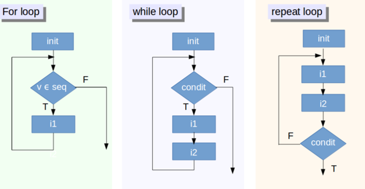
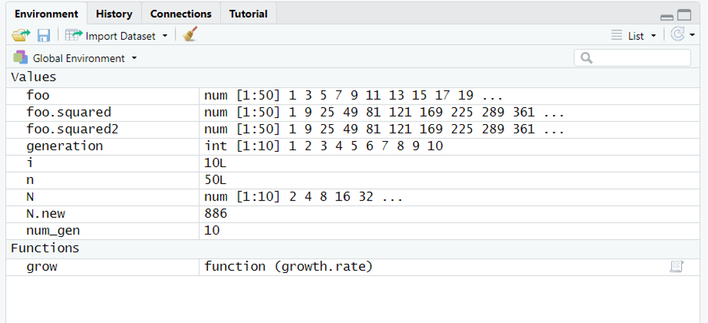
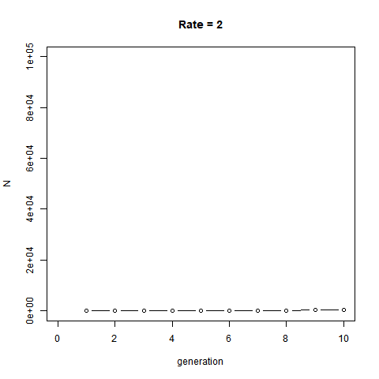

# Topic 5 - Loop & Functions

Today, we will illustrate the use of loop and function by creating a function and using it within a loop. For this purpose, we will build  simple demographic models. Ultimately, our aim is to visualize the population dynamics of two species competing. We will create a GIF animation using the package `animation`. The function `saveGIF` will only work if you have install [Image Magick](http://imagemagick.org) or [GraphicsMagick](http://www.graphicsmagick.org) on your computer. Install with legacy utilities (e.g. convert).Obviously the animation will not work if skip this step. 


## Loops

A loop is use to repeat the same task a specific number of time. A loop (whatever its size) has always the same structure, basically as following:  

`for` `(`counter in vector`)``{`task`}`

This is `for` loop but `while` and `repeat` loops also exist.




### Basic structure

A very basic loop can be produced by:

```{r,  eval=FALSE}
for(i in 1:100) {
print("Hello world!")
print(i*i)
}
```

`for(i in 1:100)` is our counter: `i` will take the values 1, 2, 3, ..., 100. Therefore the loop will repeat 100 times what follow within `{}`. At the first loop, `i` will take the value 1. After printing `"Hello world"`, follows the result of `i*i` e.g. 1. And so one for the next 99 cycles of our loop. Got it? Let's make it a bit more elegant.

The "counter" is commonly set distinctly.  Check carefully, the syntax of a loop:

```{r,  eval=T}
foo <- seq (1,100,by=2) # a sequence  1, 3, ..., 99
n<-length(foo) # the size of the sequence: 50
foo.squared = NULL # an empty object
for (i in 1:n) { # our counter
  foo.squared[i] = foo[i]^2 # the task the fist value of foo.squared will receive the fist value of foo
}

foo.df<-data.frame(foo,foo.squared) # we combine both sequences in a data.frame
plot (foo.df$foo~foo.df$foo.squared) # we plot both sequences together
```

**Beautiful**, but **useless**. The same will be accomplished by the short code: 

```{r,  eval=FALSE}
foo.squared2<-foo^2
plot (foo~foo.squared2)
```

Functions in R are vectorized. It means when you applied them to a vector, they will apply to all the elements of this vector. You don't need to say you want top apply something to the first element of this vector, then repeat the same for the second element, etc. (what we did in our loop). A function will usually consider a vector as a block and will apply this task to all elements at once. So, why do we care about loops?

Simply saying, a loop will have a use when you try to recycle an element and when the task will change form the previous one by being enriched by a new element.

### Recycling

Let's think about a population growth where the number of individuals at one generation will determine the population at the next generation:

```{r,  eval=FALSE}
num_gen <- 10 # my counter, number of generation
N <- rep (0,num_gen) # this creates a "vector" of 10 zeros, can also be empty `NULL`
N[1] <- 2 # we set the first value equal to 2
for (i in 2:num_gen){ #  move from 2 to num_gen =10
N[i]=2*N[i-1] # the population will double every generation
}
plot (N) # plotting the results
```

Let's add a variable `generation`, to make our plot more visual:

```{r,  eval=T}
num_gen<-10 # my counter, number of generation
generation<-1:num_gen # create a variable generation
N <- rep (0,num_gen)# this creates a "vector" of 10 zeros, can also be empty `NULL`
N[1] <- 2 # we set the first value equal to 2
for (i in 2:num_gen) { # i will move from 2 to num_gen =10
  N[i]=2*N[i-1] # the population will double every generation
   }
plot(N~generation, type='b') # plotting the results 
```

Congrats! You just wrote your first demographic model: the exponential growth. This is typically the demographic model used in microbiology wher bacteria tend to grow exponentially through time. Here the population double at each generation (time). You can now play at increasing initial population size and manipulating growth rate.

## Function

We used plenty of function so far, so let's create ours. A function by the creating an named object containing a `function`, you then specify the arguments you wanna control. Let's illustrate it by wrapping our small demographic model to give more flexibility in controlling the growth rate.

```{r,  eval=T} 
grow <- function (growth.rate) { # "growth rate" will be argument for our function grow 
num_gen<-10
generation<-1:num_gen
N <- rep (0,num_gen)
N[1] <- 1
for (i in 2:num_gen) {
  N[i]=growth.rate*N[i-1] # we replace 2 by our argument
}
  plot(N~generation,type='b', main=paste("Rate =", growth.rate)) 
}
```




It creates the function `grow` in your  environment. Simply use your function by calling it and changing the argument `growth.rate`. This function can now be put itself in a loop (therefore creating a loop within a loop - usually not recommended).

```{r,  eval=T} 
par(mfrow=c(2,3))
for (i in 2:7){
  grow(i)
}
```

Our function can be further extended with an extra argument such as the number of generation. 


> *<span style="color: green">**RP8**: Create the function `grow2` where both arguments: the `growth.rate` and `number.generation` are flexible. </span>* 

```{r class.source = "fold-hide",  eval=T}
grow2 <- function (growth.rate, number.generation) { 
  num_gen<-number.generation
  generation<-1:num_gen
  N <- rep (0,num_gen)
  N[1] <- 1
  for (i in 2:num_gen) {
    N[i]=growth.rate*N[i-1] 
  }
  plot(N~generation,type='b', main=paste("Rate =", growth.rate, ", ", number.generation, "generations"))
  }
```

## Animation
### gif
An animation will consist in overlapping created plots. Because we will overlap plots, this time we will fix the limit of our axes. Let's get back to our function with flexibility on `growth.rate` only.


```{r class.source = "fold-show",  eval=T}
grow3 <- function (growth.rate) { 
  num_gen<-10
  generation<-1:num_gen
  N <- rep (0,num_gen)
  N[1] <- 1
  for (i in 2:num_gen) {
    N[i]=growth.rate*N[i-1]
  }
  plot(N~generation, xlim=c(0,10), ylim=c(0,100000), type='b', main=paste("Rate =", growth.rate))
}
```

Once done, the package `animation` (IMPORTANT: with "legacy" utilities) and its function `saveGIF` will combine together all plots created

```{r,  eval=T} 
library(animation)
saveGIF({ # combine different plot together using function saveGIF function
for (i in 2:10){
  grow3(i)
}})
```




The result is an illustration of the exponential growth over 10 generations at various growth rates.


### `gganimate`

```{r,  eval=F} 
library(ggplot2)
library (gganimate)

demo<-NULL
demo$count<-N
demo$generation<-generation
demo<-as.data.frame(demo)

p <- ggplot(demo, aes(x = generation, y=count, size =2)) +
   geom_point(show.legend = FALSE, alpha = 0.7) +
   scale_color_viridis_d() +
   scale_size(range = c(0, 12)) +
   labs(x = "Generation", y = "Individuals")

p + transition_time(generation) +
   labs(title = "Generation: {frame_time}") +
   shadow_wake(wake_length = 0.2, alpha = FALSE)
```


Check it [here](https://www.datanovia.com/en/blog/gganimate-how-to-create-plots-with-beautiful-animation-in-r/) for more fancy option. Obviously, you can combine those animation in a [map](https://gist.github.com/rafapereirabr/0d68f7ccfc3af1680c4c8353cf9ab345

## DIY

> *<span style="color: green">**RP9**: write a code to illustrate a different kind of growth, the logistic growth. Logistic growth follows: </span>* 

$$N_{t+1}= N_{t}+\left[growth.rate* N_{t}*\left(\frac{100-N_{t}}{100}\right)\right]$$
*<span style="color: green">100 is the "carrying capacities K", means the population will be limited at 100 individuals. Start with 10 individuals</span>*

*<span style="color: green"> - make the number of generation flexible - simulate 50 generations </span>*

*<span style="color: green"> - make it automatic and flexible by changing growth.rate. What do you observe? </span>*

*<span style="color: green"> - save an animated plot as .gif file </span>*

```{r class.source = "fold-hide",  eval=F}
# Too easy! This time, no solution. However if you click here you are ready for the next step. See below for the population growth of two species interacting
```


--------------

> *<span style="color: green">**RP10**:  If we have two species that use the same resource (but with different rates of efficiency), then we can model their population growth using two linked equations: </span>* 

$$N1_{t+1}= N1_{t}+\left[growth.rate* N1_{t}*\left(\frac{K1-N1_{t}-\alpha_{12}N2_{t}}{K1}\right)\right]$$
$$N2_{t+1}= N2_{t}+\left[growth.rate* N2_{t}*\left(\frac{K2-N2_{t}-\alpha_{21}N2_{t}}{K2}\right)\right]$$

*<span style="color: green"> Those equation are known as the _Lotka-Volterra_ equations where _K_ values are the carrying capacities for each of the two species, both $\alpha$ values are competition coefficients that translate the effect of one species on another. Do not worry about this for now, try a range of 0.5 to 1.5, which would indicate that species are fairly similar competitors </span>*


*<span style="color: green">I wrote the script, approaching the solution but damn... still not working! Help me to fix the following codes - this time you can look at it! See if you can debug this program that grows each species alone (no competition with the other species, then put the two species interacting. Compare the results 3 different plot. It would be easier if you first focus on the function of two species competing. Make an animation that makes sense will further be amazing</span>*

```{r class.source = "fold-hide",  eval=F}
# WRONG CODE
# ADVICES: START FROM SCRATCH, 
# JUST GET INSPIRATION FROM MY CODE, WORK STEP BY STEP
grow<-function(start_1){
  num_gen<=30
  N1 <- rep(0,10)
  N2 <- rep(0,10)
  generation<-rep(1,num_gen)
  growth.rate<-1.2
  K1<-100
  K2<-120
  a12<-0.8
  a21<-0.8
  N1[1]<-0
  N2[1]<-start_2
  for (i in 2:3)  {
    N1[i] = N1[i-1] + (3.2* N1[i-1] * ((K1-N1[i-1]-(a12*N2[i-1]))/K1))
    N2[i] = N2[i] + (growth.rate * N2[i-1] * ((K2-N2[i-1]-(a21*N1[i-1]))*K2))
    generation[1]=1
    print (N1[i])
  )
  if (N1[1]>2){
    plot(N1~generation,typ="b",ylim=c(0,min(c(K1,K2))),ylab="N")
  }  else {
    plot(N1~generation,typ="n",ylim=c(0,min(c(K1,K2))),ylab="N")
  }
  print(N2[1])
  if (N2[1]>0){
    lines(N2~generation,typ="b",col=2)}
  }

par(mar=c(9,4,1,1),mfrow=c(5,1),las=1)

grow(1,0)
text(4,110,"Species 1 alone")

grow(0,1)
text(4,110,"Species 2 alone")

grow(1,2)
text(6,110,"Both Species competing")


```


