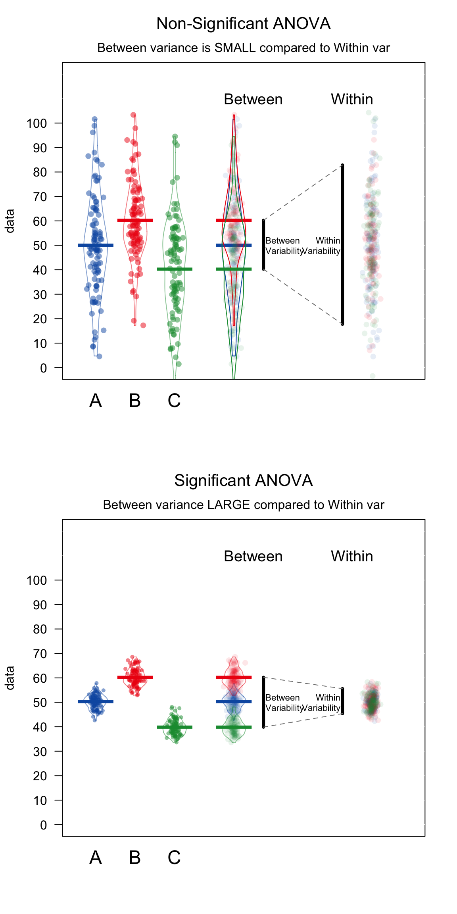

# Topic - Linear Models

```{r,  eval=T, warning=F, message=F}
library(Hmisc)
library(corrplot)
library(MASS)
library(car)
library(interactions)
library(yarrr)
library(tidyr)
library(readr)
library(lme4)
library (lmerTest)
library(nlme)
```


## Simple linear regression

### `rairuoho` case study

A simple correlation among two variables

```{r,  eval=T, warning=F, message=F}
rairuoho<-read.table('Data/rairuoho.txt',header=T, sep="\t", dec=".")
cor.test(rairuoho$day6, rairuoho$day7)
```

Pearson coefficient matrix

```{r,  eval=T, warning=F, message=F}
corr<-cor(rairuoho[,1:6])
corr # cor.test does not work on Matrix
```          

Together with their significance in a better visualization

```{r,  eval=T, warning=F, message=F}
p.val<-rcorr(as.matrix(rairuoho[,1:6]))$P
corrplot(corr,type='upper',method='color', addCoef.col = "black", p.mat=as.matrix(p.val), sig.level = 0.05,title = "Correlation Matrix", mar = c(2,0,2,0), diag=F)
```

The 'relationship' (a linear model `lm`) between two variables can be added to a xy plot using the function `abline` 

```{r,  eval=T, warning=F, message=F}
plot(rairuoho$day6, rairuoho$day7)
abline(lm(rairuoho$day7~rairuoho$day6), col="red", lwd=2)
# remember `ggplot`
# ggplot(rairuoho, aes(x = day6, y = day7)) + 
#  geom_point() +
#  stat_smooth(method = "lm", col = "red")
```

Our correlation derived from a simple __linear regression__. It is used predict a quantitative outcome $y$ on the basis of one single predictor variable $x$. The goal is to build a mathematical model (or formula) that defines y as a function of the x variable.

Once, we built a statistically significant model, it’s possible to use it for predicting future outcome on the basis of new x values.

### Formula and basics

The mathematical formula of the linear regression can be written as $$ y = \beta_0 + \beta_1*x + \epsilon $$

where:

+ $\beta_0$ and $\beta_1$ are known as the regression __beta coefficients__ or __parameters__:
  + $\beta_0$ is the __intercept__ of the regression line; that is the predicted value when _x = 0_.
  + $\beta1$ is the __slope__ of the regression line.
  
+ $\epsilon$ is the __error term__ (also known as the __residual errors__)

The figure below illustrates the linear regression model, where:

+ the best-fit regression line is in blue
+ the intercept ($\beta_0$) and the slope ($\beta_1$) are shown in green
+ the error terms ($\epsilon$) are represented by vertical red lines


From the scatter plot above, it can be seen that not all the data points fall exactly on the fitted regression line. Some of the points are above the blue curve and some are below it; overall, the residual errors ($\epsilon$) have approximately mean zero.

The sum of the squares of the residual errors are called the __Residual Sum of Squares__ or __RSS__.

The average variation of points around the fitted regression line is called the __Residual Standard Error (RSE)__. This is one the metrics used to evaluate the overall quality of the fitted regression model. The lower the RSE, the better it is.

Since the mean error term is zero, the outcome variable y can be approximately estimated as follow:

$$y= \beta_0+\beta_1*x$$

Mathematically, the beta coefficients ($\beta_0$ and $\beta_1$) are determined so that the RSS is as minimal as possible. This method of determining the beta coefficients is technically called __least squares__ regression or __ordinary least squares__ (OLS) regression.

Once, the beta coefficients are calculated, a t-test is performed to check whether or not these coefficients are significantly different from zero. A non-zero beta coefficients means that there is a significant relationship between the predictors ($x$) and the outcome variable ($y$).

### Computation

The simple linear regression tries to find the best line to predict $y$ on the basis of $x$.

In our `iris` data set, a linear model equation can be written as follow: $Petal.Width = \beta_0 + \beta_1 * Petal.Length$

The R function `lm` can be used to determine the beta coefficients of the linear model:

```{r,  eval=T, warning=F, message=F}
model1 <- lm(Petal.Width ~ Petal.Length, data = iris)
model1
```
The results show the intercept ($\beta_0$) and the slope ($\beta_1$), i.e. the  beta coefficients for the `Petal.Length` variable

```{r,  eval=T, warning=F, message=F}
ggplot(iris, aes(x = Petal.Length, y = Petal.Width)) +
  geom_point() +
  stat_smooth(method = "lm", col = "blue")
```

### Interpretation

From the output above:

+ the estimated regression line equation can be written as follow: $Petal.Width = -0.3631 + 0.4158*Petal.Length$

+ the intercept ($\beta_0$) is $-0.3631$. It can be interpreted as the predicted width of petal for a length of petal equal to zero. Regression through the origin is when you force the intercept of a regression model to equal zero. It’s also known as fitting a model without an intercept (e.g., the intercept-free linear model $y = \beta_1*x$ is equivalent to the model $y = \beta_0 + \beta_1*x$ with $\beta_0=0$). Knowing that the true relationship between your predictors and the expected value of your dependent variable has to pass through the origin would be a good reason for forcing the estimated relationship through the origin if you knew for certain what the true relationship was (very rare cases where it is justified).


+ the regression beta coefficient for the variable `Petal.Length` ($\beta1$), also known as the slope, is $0.4158$. This means that, for one unit of $Petal.Length$, we can expect an increase of $0.4158$ units in $Petal.Width$. 

### Model assessment

Before using our model to predict $Petal.Width$, you should make sure that this model is statistically significant, that is:

+ there is a statistically significant relationship between the predictor and the outcome variables

+ the model that we built fits very well the data in our hand.

### Model summary

```{r,  eval=T, warning=F, message=F}
summary(model1)
```

The summary outputs shows 6 components, including:

+ **Call** shows the function call used to compute the regression model.
+ **Residuals** provide a quick view of the distribution of the residuals, which by definition have a mean zero. Therefore, the median should not be far from zero, and the minimum and maximum should be roughly equal in absolute value.
+ **Coefficients** shows the regression beta coefficients and their statistical significance. Predictor variables, that are significantly associated to the outcome variable, are marked by stars.
+ **Residual standard error** (RSE), **R-squared** (R2) and the **F-statistic** are metrics that are used to check how well the model fits to our data.

#### Coefficients significance

The coefficients table, in the model statistical summary, shows:

+ the estimates of the **beta coefficients**
+ the **standard errors** (SE), which defines the accuracy of beta coefficients. For a given beta coefficient, the SE reflects how the coefficient varies under repeated sampling. It can be used to compute the confidence intervals and the t-statistic.
+ the **t-statistic** and the associated **p-value**, which defines the statistical significance of the beta coefficients.


**t-statistic and p-values**

For a given predictor, the t-statistic (and its associated p-value) tests whether or not there is a statistically significant relationship between a given predictor and the outcome variable, that is whether or not the beta coefficient of the predictor is significantly different from zero.

The statistical hypotheses are as follow:

+ Null hypothesis (H~0~): the coefficients are equal to zero (i.e., no relationship between x and y)
+ Alternative Hypothesis (H~1~): the coefficients are not equal to zero (i.e., there is some relationship between $x$ and $y$)

Mathematically (no need to remember), for a given beta coefficient ($\beta$), the t-test is computed as $t = (\beta - 0)/SE(\beta)$, where $SE(\beta)$ is the SE of the coefficient $\beta$. The t-statistic measures the number of standard deviations that $\beta$ is away from 0. Thus a large t-statistic will produce a small p-value.

The higher the t-statistic (and the lower the p-value), the more significant the predictor. The symbols to the right visually specifies the level of significance. The line below the table shows the definition of these symbols; one star means 0.01 < p < 0.05. The more the stars beside the variable’s p-value, the more significant the variable.

A statistically significant coefficient indicates that there is an association between the predictor ($x$) and the outcome ($y$) variable.

The t-statistic is a very useful guide for whether or not to include a predictor in a model. High t-statistics (which go with low p-values near 0) indicate that a predictor should be retained in a model, while very low t-statistics indicate a predictor could be dropped (Bruce and Bruce 2017).

**Standard errors and confidence intervals**

The standard error measures the variability/accuracy of the beta coefficients. It can be used to compute the confidence intervals of the coefficients.

For example, the 95% confidence interval for the coefficient $\beta1$ is defined as $\beta1 +/- 2*SE(\beta1)$, where:

the lower limits of $\beta_1 = \beta_1 - 2*SE(\beta_1) = 0.415 - 2*0.009 = 0.397$

the upper limits of $\beta1 = \beta1 + 2*SE(\beta1) = 0.415 - 2*0.009 = 0.435$

That is, there is approximately a 95% chance that the interval [0.397, 0.435] will contain the true value of $\beta1$. Similarly the 95% confidence interval for $\beta0 can be computed as $\beta1 +/- 2*SE(\beta1)$.

To get these information, simply type:

```{r,  eval=T, warning=F, message=F}
confint(model1)
```

#### Model accuracy


Once you identified that, at least, one predictor variable is significantly associated the outcome, you should continue the diagnostic by checking how well the model fits the data. This process is also referred to as the *goodness-of-fit*

The overall quality of the linear regression fit can be assessed using the following three parameters, displayed in the model summary:

1. **The Residual Standard Error (RSE)**

The **RSE** (also known as the model sigma) is the **residual variation**, representing the average variation of the observations points around the fitted regression line. This is the **standard deviation of residual errors**.

RSE provides an absolute measure of patterns in the **data that can’t be explained by the model**. When comparing two models, the model with the small RSE is a good indication that this model fits the best the data.

Dividing the RSE by the average value of the outcome variable will give you the prediction error rate, which should be as small as possible.

In our example, RSE = `0.2065`, meaning that the observed Petal.width values deviate from the true regression line by approximately `0.2065` units in average.

Whether or not an RSE of `0.2065` units is an acceptable prediction error is subjective and depends on the problem context. However, we can calculate the percentage error. In our data set, the mean value of Petal.Width is 1.1993, and so the percentage error is 0.2065/1.1993 = 17%.

```{r,  eval=T, warning=F, message=F}
sigma(model1)*100/mean(iris$Petal.Width)
```

2. **The R-squared ($R^2$)**

The **R-squared** $R^2$ ranges from 0 to 1 and represents the **proportion of information (i.e. variation) in the data that can be explained by the model**. The **adjusted R-squared adjusts for the degrees of freedom**.

The $R^2$ measures, how well the model fits the data. For a simple linear regression, $R^2$ is the square of the **Pearson correlation coefficient**.

A high value of R2 is a good indication. However, as the value of $R^2$ tends to increase when more predictors are added in the model, such as **in multiple linear regression model, you should mainly consider the adjusted R-squared**, which is a penalized $R^2$ for a higher number of predictors.

+ An (adjusted) $R^2$ that is close to 1 indicates that a large proportion of the variability in the outcome has been explained by the regression model.

+ A number near 0 indicates that the regression model did not explain much of the variability in the outcome.

3. **F-statistic**

The **F-statistic** gives the overall significance of the model. It assess whether **at least one predictor variable has a non-zero coefficient**.

In a simple linear regression, this test is not really interesting since it just duplicates the information in given by the t-test, available in the coefficient table. In fact, the F test is identical to the square of the t-test: $1882 = (43.387)^2$. This is true in any model with 1 degree of freedom.

The F-statistic becomes **more important** once we start **using multiple predictors** as in multiple linear regression.

A large F-statistic will corresponds to a statistically significant p-value (p < 0.05). In our example, the F-statistic equal 1882 producing a p-value of < 2.2e-16, which is highly significant.

## Multiple linear regression

**Multiple linear regression** is just an **extension of simple linear regression** used to predict an outcome variable ($y$) on the basis of multiple distinct predictor variables ($x$).

With three predictor variables ($x$), the prediction of $y$ is expressed by the following equation:

$$y = \beta_0 + \beta_1*x_1 + \beta_2*x_2 + \beta_3*x_3$$

The “$\beta$” values are called the regression weights (or beta coefficients). They measure the association between the predictor variable and the outcome. “$\beta_j$” can be interpreted as the average effect on $y$ of a one unit increase in “$x_j$”, holding all other predictors fixed.

### Building our model

We want to build a model for estimating `Petal.Width` based on data we get on `Petal.Length`, `Sepal.Length`, and `Sepal.Width`. 


$$Petal.Width = \beta_0 + \beta_1*Petal.Length + \beta_2*Sepal.Length + \beta_3*Sepal.Width$$
You can compute the model in R as follow:


```{r,  eval=T, warning=F, message=F}
model2 <- lm(Petal.Width ~ Petal.Length + Sepal.Width + Sepal.Length, data = iris)
summary(model2)
```

### Interpretation

The first step in interpreting the multiple regression analysis is to examine the F-statistic and the associated p-value, at the bottom of the model summary.

In our example, it can be seen that p-value of the F-statistic is `p-value: < 2.2e-16`, which is highly significant. This means that, at least, one of the predictor variables is significantly related to the outcome variable.

To see which predictor variables are significant, you can examine the coefficients table, which shows the estimate of regression beta coefficients and the associated t-statistic p-values:

```{r,  eval=T, warning=F, message=F}
summary(model2)$coefficient
```

For a given  predictor, the t-statistic evaluates whether or not there is significant association between this predictor and the outcome variable, that is whether the beta coefficient of the predictor is significantly different from zero.

It can be seen that, changes in `Petal.Length`,  `Sepal.Width` and `Sepal.Length`  are all significantly associated to changes in `Petal.Width`. For a given predictor variable, the coefficient ($\beta$) can be interpreted as the average effect on $y$ of a one unit increase in predictor, holding all other predictors fixed.

For example, for a fixed values of `Sepal.Width` and `Sepal.Length`, and increase of one unit of `Petal.Length` increase `Petal.Width` of `0.52408` unit on average (vs. `0.415755` unit in our example using a simple linear regression)

If a predictor was not significant in our multiple regression model, it means that its change will not significantly affect `Petal.Width`. Therefore, it is possible to remove it from the model. The selection can be done **forward** or **backward**.

As we saw earlier, the confidence interval of the model coefficient can be extracted as follow:  

```{r,  eval=T, warning=F, message=F}
confint(model2)
```

### Model accuracy assessment

As we have seen in simple linear regression, the overall quality of the model can be assessed by examining the R-squared ($R^2$) and Residual Standard Error (RSE).

1. **The R-squared ($R^2$)**

In multiple linear regression, the $R$ represents the correlation coefficient between the observed values of the outcome variable ($y$) and the fitted (i.e., predicted) values of $y$. For this reason, the value of $R$ will always be positive and will range from zero to one.

$R^2$ represents the proportion of variance, in the outcome variable y, that may be predicted by knowing the value of the $x$ variables. An $R^2$ value close to 1 indicates that the model explains a large portion of the variance in the outcome variable.

A problem with the $R^2$, is that, it will always increase when more variables are added to the model, even if those variables are only weakly associated with the response (James et al. 2014). A solution is to adjust the $R^2$ by taking into account the number of predictor variables.

The adjustment in the “Adjusted R-Squared” value in the summary output is a correction for the number of $x$ variables included in the prediction model.

2. **The Residual Standard Error (RSE).**

As mentioned earlier, the RSE estimate gives a measure of error of prediction. The lower the RSE, the more accurate the model (on the data in hand).

The error rate can be estimated by dividing the RSE by the mean outcome variable:

```{r,  eval=T, warning=F, message=F}
sigma(model2)/mean(iris$Petal.Width)
```

Which only slightly increase our prediction in comparison with using a single predictor, the 'Petal.Length` (16 vs 17 %). A parcimonial choice may be to retain  fewer  predictors if the information they bring is not important enough in our prediction.

### Model selection 

To compute multiple regression using all of the predictors in the data set, simply type this:

```{r,  eval=T, warning=F, message=F}
model3 <- lm(Petal.Width ~., data = iris[,1:4])
# the "." means: take all variable except as predictors exept Petal.Width which is our response variable
```

If you want to perform the regression using all of the variables except one, say `Sepal.Width`, type this:

```{r,  eval=T, warning=F, message=F}
model4 <- lm(Petal.Width ~. -Sepal.Width, data = iris[,1:4])
```

Alternatively, you can use the update function:

```{r,  eval=T, warning=F, message=F}
model5 <-  update(model2,  ~. -Sepal.Length)
```

**Information Criteria: AIC/BIC **

 An information criterion balances the fitness of a model with the number of predictors employed. Hence, it determines objectively the best model as the one that minimizes the information criterion. Two common criteria are the **Bayesian Information Criterion (BIC)** and the **Akaike Information Criterion (AIC)**. Both are based on a **balance between the model fitness and its complexity**:

$BIC(model)=-2*logLik(model) + npar(model) * log(n)$

where $Lik(model)$  is the likelihood of the model (how well the model fits the data) and $npar(model)$ is the number of parameters of the model, $k+2$ in the case of a multiple linear regression model with $k$ predictors.The AIC replaces $log(n)$
by $2$, so it penalizes less complex models. This is one of the reasons why BIC is preferred by some practitioners for model comparison. Also, because is consistent in selecting the true model: if enough data is provided, the BIC is guaranteed to select the data-generating model among a list of candidate models.

Both BIC and AIC can be computed in `R` through the functions `BIC` and `AIC`. They take a model as the input. The lower the better with a rule of thumb = 2 


```{r,  eval=T, warning=F, message=F}
BIC(model3); BIC(model4);BIC(model5)
model3 <- lm(Petal.Width ~., data = iris[,1:4])
AIC(model3); AIC(model4);AIC(model5)
```

Let’s go back to the selection of predictors. If we have $k$  predictors, a naive procedure would be to check all the possible models that can be constructed with them and then select the best one in terms of BIC/AIC. The problem is that there are $2^{k+1}$  possible models! Fortunately, the stepwise procedure helps us navigating this ocean of models. The function takes as input a model employing all the available predictors.

```{r,  eval=T, warning=F, message=F}
#Stepwise Selection based on AIC
step <- stepAIC(model3, direction='backward')
summary(step)

#Stepwise Selection with BIC
n = dim(iris[,1:4])[1]
stepBIC = stepAIC(model3,k=log(n), direction='backward')
summary(stepBIC)
```

When applying `stepAIC` for BIC/AIC, different final models might be selected depending on the choice of direction. This is the interpretation:

+ `“backward”`: starts from the full model, removes predictors sequentially.
+ `“forward”`: starts from the simplest model, adds predictors sequentially.
+ `“both”` (default): combination of the above.

The advice is to try several of these methods and retain the one with minimum BIC/AIC. Set trace = 0 to omit lengthy outputs of information of the search procedure.

### Model diagnostics and multicolinearity


Checking the assumptions of the multiple linear model through the data scatterplots becomes tricky even when $k=2$. To solve this issue, a series of diagnostic plots have been designed in order to evaluate graphically and in a simple way the validity of the assumptions. 

Our best model is: 

```{r,  eval=T, warning=F, message=F}
model3 <- lm(Petal.Width ~., data = iris[,1:4])
```

A ["diagnostic"](http://strata.uga.edu/8370/rtips/regressionPlots.html) can be printed by plotting this model (follow the link for more details on those diagnostics plots)

```{r,  eval=F, warning=F, message=F}
plot(model3)
```


1. **Residuals vs. fitted values plot** This plot serves mainly to check the linearity, although lack of homoscedasticity or independence can also be detected. 

```{r,  eval=T,echo=F, warning=F, message=F}
plot(model3,1)
```

Under linearity, we expect the red line (a nonlinear fit of the mean of the residuals) to be almost flat. This means that the trend of $Y_1,...,Y_n$
is linear with respect to the predictors. Heteroscedasticity can be detected also in the form of irregular vertical dispersion around the red line. The dependence between residuals can be detected (harder) in the form of non randomly spread residuals.


2. **QQ-plot**. Check the normality 

```{r,  eval=T,echo=F, warning=F, message=F}
plot(model3,2)
```

Under normality, we expect the points (sample quantiles of the standardized residuals vs. theoretical quantiles of a  $N(0,1)$ **to align with the diagonal line**, which represents the ideal position of the points if those were sampled from a $N(0,1)$. It is usual to have larger departures from the diagonal in the extremes than in the center, even under normality, although these departures are more clear if the data is non-normal.

3. **Scale-location plot**. Serves for checking the **homoscedasticity**. It is similar to the first diagnostic plot, but now with the residuals standardized and transformed by a square root (of the absolute value). This change transforms the task of spotting heteroskedasticity by looking into irregular vertical dispersion patterns into spotting for nonlinearities, which is somehow simpler.

```{r,  eval=T,echo=F, warning=F, message=F}
plot(model3,3)
```

**Under homoscedasticity, we expect the red line to be almost flat.** If there are consistent nonlinear patterns, then there is evidence of heteroscedasticity.

4. **Standardized residuals against leverage** to detect outlier and check for the normality

```{r,  eval=T,echo=F, warning=F, message=F}
plot(model3,5)
```

On this plot, you want to see that the red smoothed line stays close to the horizontal gray dashed line and that no points have a large Cook’s distance (i.e, >0.5). 


A common problem that arises in multiple linear regression is the **multicollinearity**. This is the situation when two or more predictors are highly linearly related between them. Multicollinearitiy has important effects on the fit of the model:

+ It reduces the precision of the estimates. As a consequence, signs of fitted coefficients may be reversed and valuable predictors may appear as non significant.

+ It is difficult to determine how each of the highly related predictors affects the response, since one masks the other. This may result in numerical instabilities.

An approach is to detect multicollinearity is to compute a correlation matrix between the predictors as we learned earlier

```{r,  eval=T, echo=F, warning=F, message=F}
corr<-cor(iris[,1:3])
p.val<-rcorr(as.matrix(rairuoho[,1:3]))$P
corrplot(corr,type='upper',method='color', addCoef.col = "black", p.mat=as.matrix(p.val), sig.level = 0.05,diag=F)
```

Here we can see what we already knew that `Sepal.Length` and `Petal.Length` are highly linearly related. One could be removed. However, it is not enough to inspect pair by pair correlations in order to get rid of multicollinearity.A better approach is to compute the **Variance Inflation Factor** (VIF) of each coefficient $\beta_j$. This is measure of how linearly dependent is $X_j$ with the rest of predictors:


$$\text{VIF}(\beta_j)=\frac{1}{1-R^2_{X_j|X_{-j}}}$$

where $R^2_{X_j|X_{-j}}$ is the $R^2$ from a regression of $X_j$ into the remaining predictors. The next rule of thumb gives direct insight into which predictors are multicollinear:

 + **VIF close to 1**: absence of multicollinearity.
 + **VIF larger than 5 or 10**: multicolinearity **problematic**.  Advised to remove the predictor with largest VIF.


VIF is called by function `vif` and takes as an argument a linear model

```{r,  eval=T, warning=F, message=F}
vif(model3)
#remove Petal.Length
model6 <- lm(Petal.Width ~. -Petal.Length, data = iris[,1:4])
vif(model6)
plot(model6)
```      

That's our best model for today :)

**References:**

Bruce, Peter, and Andrew Bruce (2017). Practical Statistics for Data Scientists. [O’Reilly Media](https://www.amazon.com/Practical-Statistics-Data-Scientists-Essential/dp/149207294X).

James, Gareth, Daniela Witten, Trevor Hastie, and Robert Tibshirani. 2014. An Introduction to Statistical Learning: With Applications in R. Springer Publishing Company, Incorporated.

## Anova models

Difference between linear regression, linear model, and ANOVA? Fundamentally, they’re all fundamentally the same thing!

Linear regression and linear model are complete synonyms, and we usually use these terms when we’re quantifying the effect of a **continuous** explanatory variable on a **continuous** response variable: the change in $Y$ for a 1 unit change in $X$? We  did this using the `iris` data set: what is the increase of $Petal.width$ when $Sepal.Length$ and $Sepal.width$ increase?


Now arrives the **ANOVA**, which stands for **Analysis of Variance**. We usually talk about an ANOVA when we’re quantifying the effect of a **discrete**, or **categorical** explanatory variable on a **continuous** response variable. How does the mean $Petal.Width$ vary depending on the iris $Species$ category? It is also a linear model, but instead of getting a slope that allows us to predict the $Petal.width$ for any value of $Sepal.Length$ or $Sepal.width$, we get an estimate of the $Petal.width$ for each $Species$.

ANOVA is a linear regression. You can run the `anova` function on a linear model object and see how you get the same p-value.


```{r,  eval=T, warning=F, message=F}
iris.lm<-lm(Petal.Width ~ Species, data=iris)
summary(iris.lm)
anova(iris.lm)
```

An ANOVA tests the effect of one or more nominal (aka **factor**) **independent** variable(s) on a numerical **dependent** variable. A nominal (factor) variable is one that contains a finite number of categories with no inherent order.

If you only include one independent variable, this is called a **One-way ANOVA**. If you include two independent variables, this is called a **Two-way ANOVA**. If you include three independent variables, this is called (...), etc. 

The `poopdeck` data set (package `yarrrr`, Phillips 2018) is a dataframe containing the amount of time it took to clean both `parrot` and `shark` poop from the deck of a boat using three different cleaning agents `a`, `b`, `c`. That's daily measurement.


```{r,  eval=T, warning=F, message=F}
pirateplot(formula = time ~ cleaner + type,
           data = poopdeck,
           ylim = c(0, 150),
           xlab = "Cleaner",
           ylab = "Cleaning Time (minutes)",
           main = "poopdeck data",
           back.col = gray(.97), 
           cap.beans = TRUE, 
           theme = 2)
```

Using those data, we can use ANOVA to answer four separate questions:

Question|Analysis|Formula
--------|--------|-------
Is there a difference between the different cleaning agents on the cleaning time (ignoring poop type)?|One way ANOVA|`time ~ cleaner`
Is there a difference between the different poop types on cleaning time (ignoring which cleaning agent is used)|One-way ANOVA|`time ~ type`
Is there a *unique* effect of the cleaning agent or poop types on cleaning time?|Two-way ANOVA|`time ~ cleaner + type`
Does the effect of cleaning agent depend on the poop type?|Two-way ANOVA with *interaction* term|`time ~ cleaner * type`


### Full-factorial between-subjects ANOVA

There are many types of ANOVAs that depend on the type of data you are analyzing. In fact, there are so many types of ANOVAs that there are entire books explaining differences between one type and another.
Here, we’ll cover just one type of ANOVAs called **full-factorial, between-subjects ANOVAs**. These are the simplest types of ANOVAs (and easiest to explain) which are used to analyze a standard experimental design. In a full-factorial, between-subjects ANOVA, observations (data) are  assigned to a unique combination of factors – where a combination of factors means a specific experimental condition. In the `poopdeck` dataset, 2 species and 3 cleaning agents give us 2 x 3 blocks with observations. This full-factorial between-subjects ANOVAs are the **standard** ANOVAs.
 
**Concepts**

As we mentioned, ANOVA stands for analysis of **variance**. It may sound like a strange name to give to a test that you use to find differences in **means**, not differences in **variances**. However, ANOVA actually uses variances to determine whether or not there are real differences in the means of groups. Specifically, it looks at how variable data are within groups and compares that to the variability of data between groups. If the **between-group variance** is large compared to the **within-group variance**, the ANOVA will conclude that the groups **differ** in their means. If the **between-group variance** is small compared to the **within-group variance**, the ANOVA will conclude that the groups are all the **same**. 



*ANOVA compares the variability between groups (i.e.; the differences in the group means) to the variability within groups (i.e.; how much individuals generally differ from each other). If the variability between groups is small compared to the variability between groups, ANOVA will return a non-significant result – suggesting that the groups are not really different. If the variability between groups is large compared to the variability within groups, ANOVA will return a significant result – indicating that the groups are really different.*

### ANOVA in 4 steps

A standard ANOVA can be summarized in 4 steps:

1. Create an ANOVA object using the `aov` function. In the `aov` function, specify the independent and dependent variable(s) with a formula with the format `y ~ x1 + x2` where y is the dependent variable, and x1, x2 … are one (more more) factor independent variables. The function `aov` combines `lm` and `anova` functions together. 

```{r,  eval=F, warning=F, message=F}
# Step 1: Create an aov object
mod.aov <- aov(formula = y ~ x1 + x2 + ..., data = data)
```

2. Create a summary ANOVA table by applying the `summary` function to the ANOVA object you created in Step 1.

```{r,  eval=F, warning=F, message=F}
# Step 2: Look at a summary of the aov object
summary(mod.aov)
```

3. If necessary, calculate post-hoc tests by applying a post-hoc testing function like `TukeyHSD` to the ANOVA object you created in Step 1.

```{r,  eval=F, warning=F, message=F}
# Step 3: Calculate post-hoc tests
TukeyHSD(mod.aov)
```

4.If necessary, interpret the nature of the group differences by going back to a linear regression object using `lm` using the same arguments you used in the `aov` function in Step 1.

```{r,  eval=F, warning=F, message=F}
# Step 4: Look at coefficients
mod.lm <- lm(formula = y ~ x1 + x2 + ..., data = data)
summary(mod.lm)
```

### One-way ANOVA

We’ll set cleaning `time` as the dependent variable and the `cleaner` agent type  as the independent variable. We can represent the data as follow, which help at examining the group we are comparing:

```{r,  eval=T, warning=F, message=F}
pirateplot(time ~ cleaner, 
                  data = poopdeck, 
                  theme = 2, 
                  cap.beans = TRUE,
                  main = "formula = time ~ cleaner")
```

Just from the plot, it is obvious that the cleaning agents `a` and `b` are about the same, and it looks a little bit faster when using the cleaning agent `c`. This is just visual, to test it. We’ll create an ANOVA object with `aov`. Because time is the dependent variable and cleaner is the independent variable, we’ll set the formula to `formula = time ~ cleaner`. Our hypotheses are the following: *H_0*, no difference in time between cleaning agents | *H_1*, at least one difference in time between cleaning agents.

```{r,  eval=T, warning=F, message=F}
# Step 1: aov object with time as DV and cleaner as IV
cleaner.aov <- aov(formula = time ~ cleaner, data = poopdeck)
```

Now, to see a full ANOVA summary table of the ANOVA object, apply the `summary` to the ANOVA object from Step 1:

```{r,  eval=T, warning=F, message=F}
# Step 2: Look at the summary of the anova object
summary(cleaner.aov)
```

The main result from our table is that we have a significant effect of cleaner on cleaning time. H_0 is rejected and we accepted H_1. The results of an ANOVA are usually reported as following. F(2, 597) = 5.29, p = 0.005.  Carefully examine the degrees of freedom, they tell you a lot about your data set!

However, the ANOVA table does not tell us which levels of the independent variable differ. In other words, we don’t know which cleaning agent is better than which ones. To answer this, we need to conduct a **post-hoc** test.

If you’ve found a significant effect of a factor, you can then do **post-hoc** tests to test the difference between all pairs of levels of the independent variable. There are many types of **pairwise comparisons** that rely on different assumptions. One of the most common post-hoc tests for standard ANOVAs is the Tukey **Honestly Significant Difference (HSD)** test. To do an HSD test, apply the `TukeyHSD` function to your ANOVA object as follows:


```{r,  eval=T, warning=F, message=F}
# Step 3: Conduct post-hoc tests
TukeyHSD(cleaner.aov)
```

This table shows us the pair-wise differences between each group pair. The `diff` column shows us the **mean differences between groups** (of course, identical to what we found in the summary of the regression object before), a **confidence interval** for the difference, and a **p-value** testing the null hypothesis that the group differences are not different.

it is always helpful to combine an **ANOVA summary** table with a **regression summary** table. Because ANOVA is just a special case of regression (where all the independent variables are factors), you’ll get the same results with a regression object as you will with an ANOVA object. However, the format of the results are different and frequently easier to interpret using an ANOVA tables.

To create a regression object, go back to a `lm` function. 

```{r,  eval=T, warning=F, message=F}
# Step 4: Create a regression object
cleaner.lm <- lm(formula = time ~ cleaner, data = poopdeck)
summary(cleaner.lm)
```

As you can see, the regression table does not give us tests for each variable like the ANOVA table does. Instead, it tells us how different each level of an independent variable is from a default value. You can tell which value of an independent variable is the default variable just by seeing which value is missing from the table. In this case, I don’t see a coefficient for cleaning agent `a`, so that must be the default value.

The intercept in the table tells us the mean of the default value. In this case, the mean time of cleaner a was **66.02**. The coefficients for the other levels tell us that cleaner b is, on average **0.42** minutes faster than cleaner a, and cleaner c is on average **6.94** minutes faster than cleaner a. Not surprisingly, these are the same differences we saw in the Tukey HSD test!


### Two-way ANOVA

To conduct a two-way ANOVA (or more), just include additional independent variables in the regression model formula with the `+` sign as we did earlier in our regression models. That’s it. All the steps are the same. Let’s conduct a two-way ANOVA with both `cleaner` and `type` as independent variables. To do this, we’ll set `formula = time ~ cleaner + type`.


```{r,  eval=T, warning=F, message=F}
# Step 1: aov object with time as DV and cleaner and type as IV
cleaner.type.aov <- aov(formula = time ~ cleaner + type, data = poopdeck)
```

```{r,  eval=T, warning=F, message=F}
# Step 2: Get ANOVA table with summary()
summary(cleaner.type.aov)
```

It looks like we found significant effects of both independent variables.

```{r,  eval=T, warning=F, message=F}
# Step 3: Conduct post-hoc tests
TukeyHSD(cleaner.type.aov)
```

The only non-significant group difference we found is between cleaner b and cleaner a. All other comparisons were significant.

```{r,  eval=T, warning=F, message=F}
# Step 4: Look at regression coefficients
cleaner.type.lm <- lm(formula = time ~ cleaner + type, data = poopdeck)
summary(cleaner.type.lm)
```

Now we need to interpret the results in respect to two default values (here, cleaning agent = `a` and type = `parrot`). The intercept means that the average time for cleaning agent `a` on `parrot` poop was 54.36 minutes. Additionally, the average time to clean `shark` poop was 23.33 minutes slower than when cleaning `parrot` poop.

**Interactions** 

Adding an interaction term in your regression model can be important, but you need to carefully think if it is justified and what you could expect about it. Interactions between variables test whether or not the effect of one variable depends on another variable. For example, we could use an interaction to answer the question: *Does the effect of cleaning agent depend on the type of poop they are used to clean?* To include interaction terms in an ANOVA, just use an asterix (`*`) instead of the plus (`+`) between the terms in your formula. Note that when you include an interaction term in a regression object, R will automatically include the main effects as well.

Let’s repeat our previous ANOVA with two independent variables, but now we’ll include the interaction between cleaning agent and poop type. To do this, we’ll set the formula to `time ~ cleaner * type`.

```{r,  eval=T, warning=F, message=F}
# Step 1: Create ANOVA object with interactions
cleaner.type.int.aov <- aov(formula = time ~ cleaner * type, data = poopdeck)
# Step 2: Look at summary table
summary(cleaner.type.int.aov)
```

Looks like we did indeed find a significant interaction between cleaner and type. In other words, the effectiveness of a cleaner depends on the type of poop it’s being applied to. This makes sense given our plot of the data at the beginning of the chapter.

To understand the nature of the difference, we’ll look at the regression coefficients from a regression object:

```{r,  eval=T, warning=F, message=F}
# Step 4: Calculate regression coefficients
cleaner.type.int.lm <- lm(formula = time ~ cleaner * type, data = poopdeck)
summary(cleaner.type.int.lm)
```

Again, to interpret this table, we first need to know what the default values are. We can tell this from the coefficients that are ‘missing’ from the table. Because you don’t see terms for `cleanera` or `typeparrot`, this means that cleaning agent `a` and  `parrot` poop type are the defaults. Again, we can interpret the coefficients as differences between a level and the default. It looks like for `parrot` poop, cleaning agents `b` and `c` both take more time than agent `a` (the default). Additionally, `shark` poop tends to take much longer than `parrot` poop to clean (the estimate for `typeshark` is positive).

The interaction terms tell us how the effect of `cleaner` changes when one is cleaning shark poop. The negative estimate (-16.96) for `cleanerb:typeshark` means that cleaner b is, on average 16.96 minutes `faster` when cleaning shark poop compared to parrot poop. Because the previous estimate for the cleaning agent `b` (for `parrot` poop) was just 8.06, this suggests that the efficacy  of the cleaner `b` is less than agent `a` on `parrot` poop, but higher than agent `a` on `shark` poop. Same thing for cleaner `c` which simply has stronger effects in both directions. 

You can see, it becomes quickly much more complicated to interpret. Therefore you should carefully think if interactions are justified (literature, understanding, etc). The package `interaction` provides several functions that can help at looking at the coefficients and to interpret in a more easy way the results.

```{r,  eval=T, warning=F, message=F}
cat_plot(cleaner.type.int.lm, pred = cleaner, modx = type, interval = TRUE)
```

> RP15: Analysis of Co-variance. Interpret the following interaction plot after looking at the corresponding linear model. Build your an Anova table - reverse your factors in your `lm` and try it again. Compare F-values and level of significance.   

```{r,  eval=F, warning=F, message=F}
interact_plot(fitiris, pred = Petal.Length, modx = Species, plot.points=T)
```


```{r class.source = "fold-hide",  eval=F}
fitiris <- lm(Petal.Width ~   Petal.Length*Species, data = iris)
# In evaluating an ANCOVA model, we want to sequentially ask first whether there is a difference in slope, then if there is not, look for differences in intercept. 
# In addition, there is variety of way to calculate the sum of squares. Here (but this debatable), we would prefer a type 3 Anova especially since we have an interaction term in our Ancova (see Homogeneity of slope assumption in ANCOVA)
car::Anova(fitiris, type = 3)
```

### Type I, II, and III ANOVAs

https://besjournals.onlinelibrary.wiley.com/doi/pdf/10.1111/j.1365-2656.2009.01634.x

It turns out that there is not just one way to calculate ANOVAs. In fact, there are three different types - called, Type 1, 2, and 3 (or Type I, II and III). These types differ in how they calculate variability (specifically the **sums of of squares**). If your data is relatively **BALANCED**, meaning that there are relatively equal numbers of observations in each group, then all three types will give you the same answer. However, if your data are **UNBALANCED**, meaning that some groups of data have many more observations than others, then you need to use Type II or Type III. The **ANCOVA** model is an expection wher this issue must be considered.


The standard `aov` function in `base` package uses **Type I** sums of squares. Therefore, it is appropriate when your data are **BALANCED**. If your data are **UNBALANCED**, you should consider an ANOVA with Type II or Type III sums of squares. To do this, you can use the `Anova` function in the `car` package. The `Anova` function has an argument called type that allows you to specify the type of ANOVA you want to calculate.

First, create a regression object with `lm`. As you’ll see, the `Anova` function requires you to enter a regression object as the main argument, and not a formula and dataset. That is, you need to first create a regression object from the data with `lm` (or `glm`), and then enter that object into the `Anova` function. 

```{r class.source = "fold-show",  eval=T}
# Step 1: Calculate regression object with lm()
time.lm <- lm(formula = time ~ type + cleaner, data = poopdeck)
```

Now that I’ve created the regression object `time.lm`, I can calculate the three different types of ANOVAs by entering the object as the main argument to either `aov` for a Type I ANOVA, or `Anova` in the `car` package for a Type I II or  III ANOVA:


```{r,  eval=T, warning=F, message=F}
# Type I ANOVA - aov()
time.I.aov <- aov(time.lm)
# or anova(time.lm)

# Type II ANOVA - Anova(type = 2)
time.II.aov <- car::Anova(time.lm, type = 2)

# Type III ANOVA - Anova(type = 3)
time.III.aov <- car::Anova(time.lm, type = 3)
```

As it happens, the data in the `poopdeck` dataframe are perfectly balanced (so we’ll get exactly the same result for each ANOVA type. However, if they were not balanced, then we should not use the Type I ANOVA calculated with the `aov` function.

To see if your data are balanced, you can use the function:
 
```{r,  eval=T, warning=F, message=F}
# Are observations in the poopdeck data balanced?
with(poopdeck, table(cleaner, type)) 
```

As you can see, in the `poopdeck` data set, the observations are perfectly balanced (see previously the justifcation for **full-factorial, between-subjects ANOVAs**) , so it doesn’t matter which type of ANOVA we use to analyze the data.

For more detail on the different types, check out [here](https://mcfromnz.wordpress.com/2011/03/02/anova-type-iiiiii-ss-explained/) for a techincal discussion. Also check [Hector et al. (2010)](https://besjournals.onlinelibrary.wiley.com/doi/pdf/10.1111/j.1365-2656.2009.01634.x) for a discussion on the topic in the field of ecology and evolution.
 

**A quick summary**

 
### Additional information and assumption

You can get a lot of interesting information from ANOVA objects. To see everything that’s stored in one ANOVA, run `names` on an ANOVA object. For example, here’s what’s in our last ANOVA object (note the `contrasts` that may be important to know when applying Type II, or III ANOVA):

```{r,  eval=T, warning=F, message=F}
names(cleaner.type.int.aov)
```

For example, the `fitted.values` contains the model fits for the dependent variable (`time`) for every observation in our dataset. We can add these fits back to the dataset. For example, let’s get the model fitted values from both the interaction model (`cleaner.type.aov`) and the non-interaction model (`cleaner.type.int.aov`) and assign them to new columns in our dataframe:

```{r,  eval=T, warning=F, message=F}
poopdeck$int.fit <- cleaner.type.int.aov$fitted.values
poopdeck$me.fit <- cleaner.type.aov$fitted.values
```

Now, we can calculate how far each model’s fits were from the true data as follows:

```{r,  eval=T, warning=F, message=F}
mean(abs(poopdeck$int.fit - poopdeck$time))
mean(abs(poopdeck$me.fit - poopdeck$time))
```

As you can see, the **interaction model** was off from the data by `15.35` minutes on average, while the **main effects model** was off from the data by `16.54` on average. This is not surprising as the interaction model is more complex than the main effects only model. However, b careful, just because the interaction model is better at fitting the data doesn’t necessarily mean that the interaction is either meaningful or reliable.

#### Model assumptions 

The `residuals` are available in your anova object. We previously saw how to examine graphically those residuals for **normality** and **homoscedasticity**. Let's test them here from our anova object:

```{r,  eval=T, warning=F, message=F}
shapiro.test(cleaner.type.int.aov$residuals) # test our residuals vs a normal distribution
bartlett.test(cleaner.type.int.aov$residuals ~ interaction(cleaner, type), data = poopdeck) # test variance of our residuals in the different groups.
```

The null hypothesis of **normal distribution** and **homoscedasticity** are accepted: there is no significant difference (p > 0.05) from a normal distribution and no significant heterogeneity

#### Transformations

Checking the assumptions of regression models is critical to look at possible issues in our models. The response variable can be transformed in order to: 

+ **stabilize** the variance (e.g. log transformation such as `log(Petal.Width)` in our `lm`) - data not normally distributed around their average

+ **accomodate** strictly positive variable using Box-Cox Transformations

In addition to transformation of the response variable, we can also consider transformations of predictor variables. Sometimes these transformations can help with violation of model assumptions, and other times they can be used to simply fit a more flexible model (e.g. log, polynomials). 

Below is a linear model equation where the original dependent variable $y$, has been natural log transformed. That is, the natural log has been taken of each individual value of $y$ and that is being used as the dependent variable.

$$ln(y_i) = \beta_0 + \beta_1x_1 + \beta_1x_1 + \beta_2x_2 + ... + \epsilon_i$$ 
The linear model with the log transformation is providing an equation for an individual value of ln(y). We could also write it as follows, where we are modeling the mean of $ln(y)$ (note the error term is no longer present):

$$\mu_{ln(y)} = \beta_0 + \beta_1x_1 + \beta_1x_1 + \beta_2x_2 + ... $$
This makes the difference a bit clearer. When we transform the data in a linear model, we are no longer claiming that $y$ is normally distributed around a mean, given the $x$ values — we are claiming that our new outcome variable, $ln(y_i)$, is normally distributed.

This topic is extensively cover in online documentation in order for your model to meet the assumptions of normality and homoscedasticity. In addition,  a violation of thes assumption may originate because your data simpy does not belong to a Gaussian family


## Data distribution and link function

Here is a brief summary of the data distributions you might encounter most often (especially in ecology):

+ Gaussian - **Continuous** data (**normal** distribution and **homoscedasticity** assumed)

+ Poisson - **Count** abundance data (integer values, **zero-inflated** data, **left-skewed** data)

+ Binomial - **Binary** variables (TRUE/FALSE, 0/1, presence/absence data)

Choosing the right **family**  for your analysis is important and should you should think carefully about it before building your model. It could be frustrating to spend tons of time running models, plotting their results and writing them up only to realise that all along you should have used *e.g.* a Poisson distribution instead of a Gaussian one.


**Generalized linear models (GLM)**  — and generalized linear mixed models —are called generalized linear because they connect a model’s outcome to its predictors in a linear way. The function used to make this connection is called a link function. Link functions sounds like an exotic term, but they’re actually much simpler than they sound.

For example, **Poisson regression** (commonly used for outcomes that are counts) makes use of a natural log link function as follows:

$$ln(\mu_y) = \beta_0 + \beta_1x_1 + \beta_1x_1 + \beta_2x_2 + ...$$ 

Clearly, there is not a direct linear relationship of the $x$ variables to the average count, but there is a “sort of linear” relationship happening: a function of the mean of $y$ is related to a linear combination of $x$ variables. In other words, the linear model has now been generalized to a bigger type of situation.

This can lead to confusion, though, because on the surface it looks very similar to what happens when we transform the dependent variable in a linear model, like a linear regression as previously mentioned

The key thing to understand is that the **natural log link function** is a function of the **mean of $y$**, not the **$y$ values** themselves as previously mentioned


**General linear model** met all the assumptions: normal distribution, homoscedasticity, etc. However, quite often in ecology and environmental science that is not the case and then we use different data distributions. Here we will talk about **Poisson** and **binomial** distribution. To use them, we need to run **generalised linear models** using the function `glm`.

### A model with a Poisson distribution

Import the `shagLPI` dataset and check it’s summary using `summary(shagLPI)`. The data represent population trends for European Shags on the Isle of May and are available from the [Living Planet Index](https://livingplanetindex.org/home/index).


```{r,  eval=T, warning=F, message=F}
shag <- read.csv("Data/shagLPI.csv", header = TRUE)
shag$year <- as.numeric(shag$year)  #  year should be a numeric variable
shag.hist <- ggplot(shag, aes(pop)) + geom_histogram() 
shag.hist
```

Our pop variable represents count abundance data, *i.e.* integer values (whole European Shags) so a Poisson distribution is appropriate here. Often count abundance data are zero-inflated and skewed towards the right. Here our data are not like that, but if they were, a Poisson distribution would still have been appropriate.

```{r,  eval=T, warning=F, message=F}
shag.m <- glm(pop ~ year, family = poisson, data = shag)
summary(shag.m)
```

From the summary of our model we can see that European Shag abundance varies significantly based on the predictor year. Let’s visualise how European Shag abundance has changed through the years:

```{r,  eval=T, warning=F, message=F}
shag.p <- ggplot(shag, aes(x = year, y = pop)) +
    geom_point(colour = "#483D8B") +
    geom_smooth(method = glm, colour = "#483D8B", fill = "#483D8B", alpha = 0.6) +
    scale_x_continuous(breaks = c(1975, 1980, 1985, 1990, 1995, 2000, 2005)) +
    labs(x = " ", y = "European Shag abundance")
shag.p
```

*European shag abundance on the Isle of May, Scotland, between 1970 and 2006. Points represent raw data and model fit represents a generalised linear model with 95% confidence intervals.*

### A model with a binomial distribution

We will now work this the `Weevil_damage`. We can examine if damage to Scot’s pine by weevils (a binary, `TRUE`/`FALSE` variable) varies based on the block in which the trees are located. You can imagine that different blocks represent different Scot’s pine populations, and perhaps some of them will be particularly vulnerable to weevils? Because of the binary nature of the response variable (true or false), a binomial model is appropriate here.


```{r,  eval=T, warning=F, message=F}
Weevil_damage <- read.csv("Data/Weevil_damage.csv")
Weevil_damage$block <- as.factor(Weevil_damage$block) # Making block a factor
weevil.m <- glm(damage_T_F ~ block, family = binomial, data = Weevil_damage)
summary(weevil.m)
```

The probability of a pine tree enduring damage from weevils does vary significantly based on the block in which the tree was located. 

You won’t get a R squared value to assess the goodness of fit of your model, but you can get at that by looking at the difference between the Null deviance (variability explained by a null model, *e.g.* `glm(damage_T_F ~ 1, family = binomial, data = Weevil_damage)` and the Residual deviance, *e.g.* the amount of variability that remains after you’ve explained some away by your explanatory variable. In short, the bigger the reduction in deviance, the better a job your model is doing at explaining a relationship.


## Taking Account of the Random Effects

A **random effect** can be used in the case of **paired data** or **repeated measures**. As an example, if we are measuring the **length** of several **individual** plants, the measurements are paired within each individual.  That is, we want to statistically match the length at different days of one individual, since we supposed we may have difference in the initial length and therefore different growth. Therefore, in this case, the variable 'individual' must be include in the model as a random variable. Often, we want to disregard the effect of this random factor (e.g. individual difference) to focus on another one (e.g. growth itself). Each Individual could be thought of has a block including a measurement for the length.

The concept of random variables is not easy to get, so it is okay to not completely understand the full concept at this point. Whether a variable should be considered a **fixed** or **random** variable will also depend on the interpretation of the person doing the analysis, adding sometime one layer of subjectivity.

**Mixed effects models**

When a model includes both fixed effects and random effects, it is called a *mixed effects model*.

For more complex models, specifying random effects can become difficult.  Random effects can be **crossed** with one another or can be **nested** within one another.  Also, **correlation structures** for the random effects can be specified.  However, here, we will just keep it simple using an example with our `rairuoho` data set.

```{r,  eval=T, warning=F, message=F}
rairuoho<-read.table('Data/rairuoho.txt',header=T, sep="\t", dec=".")
rairuoho$ID<-rownames(rairuoho)
rai<-rairuoho %>% pivot_longer(day3:day8, names_to = "day", values_to = "length")
rai$day<-parse_number(rai$day)
rai
```

We want to examine the length of the plant ($y$) as a function of the day ($x$). In this case, the initial size of the plant varies. It become obvious that the growth of each pant should be examined individually.

#### Mixed model with `lmer`

One way to construct a mixed effects model for interval/ratio data is with the function `lmer` from the package `lme4` package. However you will not get the **p-value** of the overall model, because you need to carefully think on how to extract this information because of the complexity of the input you can have.

Notice the grammar in the `lmer` function that defines the model:  the term `(1|Individual)` is added to the model to indicate that `Individual` is the random term.

As a technical note, the 1 indicates that an intercept is to be fitted for each level of the random variable. As another technical note, `REML` stands for restricted maximum likelihood.  It is a method of fitting the model, and is often considered better than fitting with a conventional ML (maximum likelihood) method.

```{r,  eval=T, warning=F, message=F}
lmer.rai<-lmer(length ~ day + (1|ID), data=rai, REML=TRUE) # REML default
summary(lmer.rai)
```

One way to extract the p-value is by using the `lmerTest` package to produce an analysis of variance with *p*-values for model effects.


```{r,  eval=T, warning=F, message=F}
anova(lmer.rai)
```

The `rand` function from the `lmerTest` package will test the random effects in the model

```{r,  eval=T, warning=F, message=F}
rand(lmer.rai)
```

In addition,  The `lmerTest` package is used to produce an analysis of variance with p-values for model effects. However, in our case, a simple linear regression with a random factor, we will use another function to extract the p-value from our model.

#### Mixed model with `nlme`

We will use the function `lme` form the package `nlme`

Notice the grammar in the `lme` function that defines the model is slightly different form the previous example:  the option `random = ~1|ID` is added to the model to indicate that `ID` is the random term.

```{r,  eval=T, warning=F, message=F}
lme.rai = lme(length ~ day, random=~1|ID, data=rai)
summary(lme.rai)
```

The random effects in the model can be tested by comparing the model to a model fitted with just the fixed effects and excluding the random effects. 

```{r,  eval=T, warning=F, message=F}
lm.rai<-lm(length ~ day, data= rai)
anova (lme.rai, lm.rai)
```

**Random Intercept and slope model** 

the "~1" specifies the random intercept and "Day|ID" would allow the slope to vary among  individuals. However,it starts to be much more advanced. You may find entire book on mixed effect model in R.  


