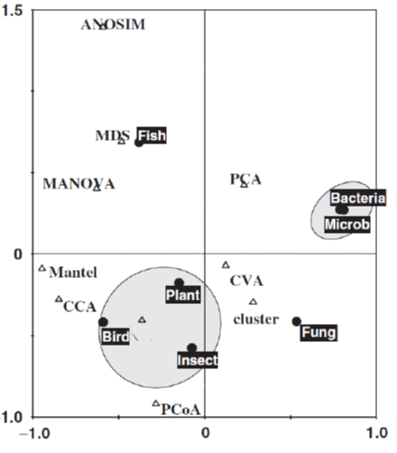
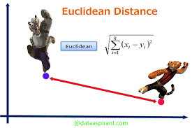
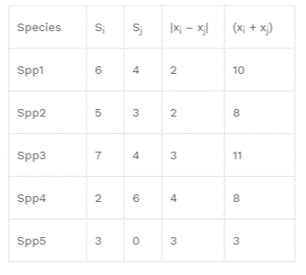
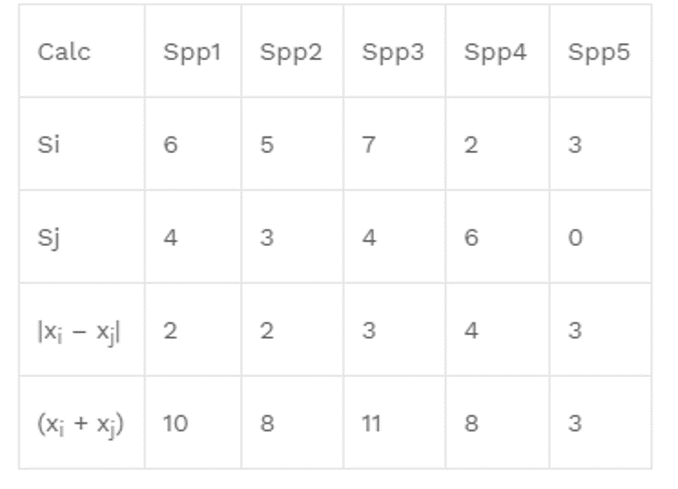
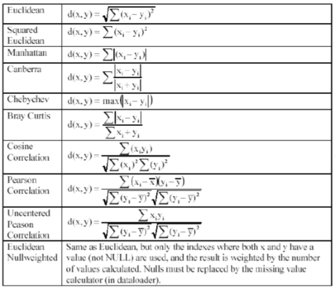
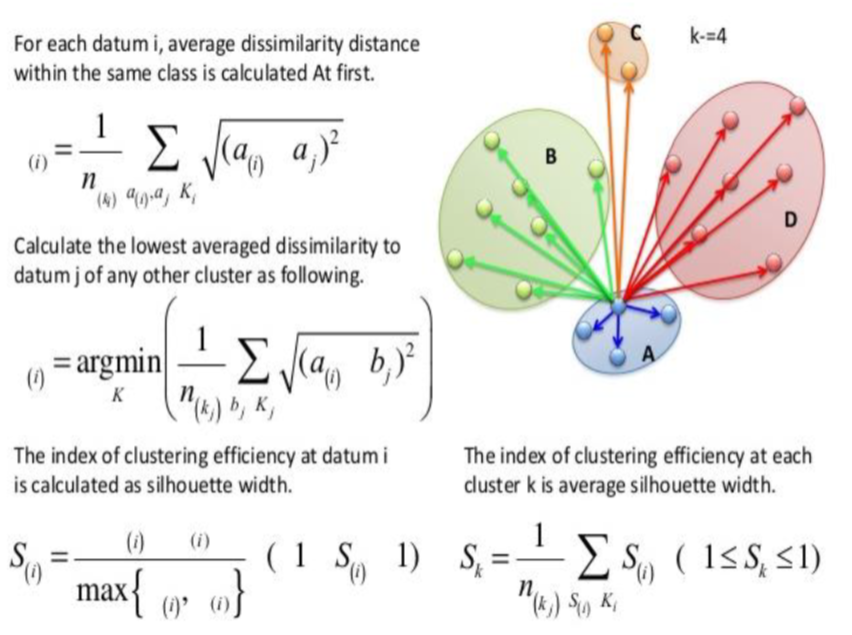
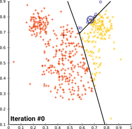
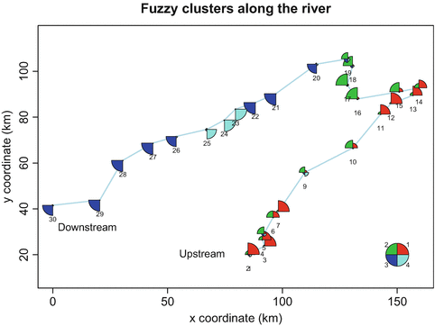
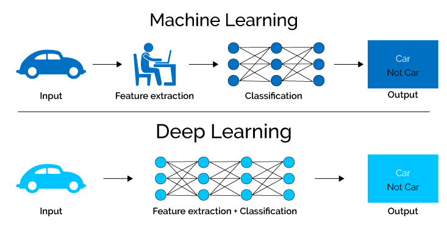

# Topic 8 - Multivariate analyses

```{r,  eval=T, warning=F, message=F}
library(vegan)
library(ade4)
library(gclus)
library(qgraph)
library(factoextra)
library(fpc)
library(ggplot2)
library(gridExtra)
library(e1071)
library(corrplot)
library(tree)
library(rpart)
library(rattle)
library(randomForest)
library(devtools)
library(caret)
library(mvpart) # install_github("cran/mvpart", force = T) after devtools
library(MVPARTwrap) # install_github("cran/MVPARTwrap", force = T) after devtools
```

```{r eval = TRUE,  message=F, warning=F, purl=F, results="hide"}
knitr::purl("Topic_8_multivariate.Rmd", documentation = F)
```

Ecological phenomena are inherently complex, and it is rare that a single variable is sufficient to describe an ecological system. Therefore, it is common to deal with:

+ __multiple response variable__

+ multiple explanatory variables

Multivariate analyses may reveal patterns that would not be detectable by combination of univariate methods.


## Applications

Five types of scientific inquiries usually suit to the application of multivariate methods.

+ **Data reduction or structural simplification**: summarize multiple variables through a comparatively smaller set of 'synthetic' variables. *Ex: Principal Component Analysis (PCA)*

+ **Sorting and grouping**: many ecological questions are concerned with the similarity or dissimilarity. *Ex:Cluster analysis, non Metric Dimensional Scaling (nMDS)*

+ **Investigation of the dependence among variables**: dependence among response variables, among explanatory variables, or among both. *Ex: Redundancy analysis and other constrained analysis* </span>

+ **Prediction**: once the dependence detected and characterized multivariate models may be constructed in a very similar as we did before with univariate models.

+ **Hypothesis testing**: detect and test pattern in the data (be careful of data dredging) . *Ex: MANOVA, PERMANOVA, ANOSIM* </span>




## Typical Data Structure

In ecology, 'typical' data structure will be: 

+ objects in row (e.g. samples can be sites, time periods, etc.)

+ measured variables for those objects in columns (e.g. species, environmental parameters, etc.)


*Important note*: observations on object are not necessarily __independent__ on those made on another object, and a mixture of dependent and independent objects is possible e.g. site and year  

## Data transformation

Measured variables can be binary, quantitative, qualitative, rank-ordered, or even a mixture of them. 

If variables do not have uniform scale (e.g. environmental parameters measured in different units or scales), they usually have to be transformed before performing further analyses.

 - **Standardization**: provides dimensionless variables and removes the influence of magnitude differences between scales and units

- **Normalization**: aims at correcting the distribution shapes of certain variables. 

  + `arcsin (x)` *family of transformations for percentage and  proportions*

  + `log (x + constant)` *for variables departing moderately from normal distribution*

  + `sqrt (x + constant) `*for variables departing slightly from normal distribution*

  + **Hellinger transformation** to make data containing many zeros suitable for PCA or RDA, the 'double zeros' problem. 

  + **Chord transformation** to give less weight to rare species (especially when rare species are not truly rare)

  + ...

The function `decostand` from the `vegan` package offers an easy way to transform your data. The `varespec` data frame has **24 rows** and **44 columns**. Columns are estimated cover values of **44 lichen species**. The variable names are formed from the scientific names, and are self explanatory for anybody familiar with vegetation type / lichen species. 

```{r,  eval=T}
# ?varespec
data (varespec)
varespec[1:5,1:5]
```

```{r,  eval=T, warning=F}
# log,  hellinger, and presence/absence transformations
varespec.log<-decostand(varespec,'log')
varespec.hell<-decostand(varespec,'hellinger')
varespec.pa<-decostand(varespec,'pa')
varespec.pa [1:5,1:5]
```

## Ressemblance

+ Most methods of multivariate analysis are **explicitly** or **implicitly** based on the comparison of all possible pairs of objects or descriptors.

+ Comparison takes the form of association measures which are assembled in a square and symmetrical association matrix of dimension $n$ x $n$ when objects are compared, or $p$ x $p$ when variables are compared. The choice of a suitable **association coefficient** is crucial for further analysis.

+ When pairs of objects are compared, the analysis is said to be in **Q mode**.When pairs of descriptors are compared, the analysis is said to be in **R mode**.


### Q mode

Virtually, all distance or similarity measures used in ecology are symmetric: the coefficient between pairs of objects is the same! 

But whatto deal with **double-zeros**?

- the **zero value** has the **same meaning** as any other values (*e.g. 0mg/L of O2 in deep anoxic layer of a lake*)

- the **zero value** in matrix of species abundances (or presence-absence) can **not** always be counted as an indication of **resemblance** (presence has an ecological meaning, but no conclusions on the absence: e.g. *is the absence of a given nationality in this class means that no students from this specific country are in NTU? And is it an element to evaluate the similarity with other university (high similarity because many nationalities probably absent ? No, but at same sample size 1/0 becomes informative*)

Because of the **double-zeros** problem, 2 classes of association measures exist based on how they deal with this issue". 

+ The **symmetrical coefficients** will consider the information from the double-zero (also called 'negative matched'). 


+ The **asymmetrical coefficients** will ignore the information send from the double-zero. 

When analyzing species data, it is often recommended to use asymmetrical coefficients unless you have reason to consider each double absence in the matrix (*e.g. controlled experiment with known community composition or ecologically homogenous areas with disturbed zones*)


#### **Presence/absence-based dissimilarity metrics**

We use **Jaccard Similarity (S~7~)** to find similarities between sets. So first, let’s learn the very basics of sets.


Now going back to Jaccard similarity.The Jaccard similarity measures similarity between finite sample sets, and is defined as the cardinality of the intersection of sets divided by the cardinality of the union of the sample sets. Suppose you want to find jaccard similarity between two sets A and B it is the ration of cardinality of A ∩ B and A ∪ B.


Other distances applying to presence-Absence data: Sørensen (S~8~), Ochiai (S~14~) 


#### **Abundance-based dissimilarity metrics**

When your community data samples include abundance information (as opposed to simple presence-absence) you have a wider choice of metrics to use in calculating (dis)similarity. 

When you have abundance data your measures of (dis)similarity are a bit more “refined” and you have the potential to pick up patterns in the data that you would otherwise not see using presence-absence data.

There are many metrics that you might use to explore (dis)similarity. Four of them are particularly common:

+ Bray-Curtis
+ Canberra
+ Manhattan
+ Euclidean

You can get the spreadsheet [here](Data/Distance-metrics.xlsx) to examine how to compute them in details


**Euclidean distance (D~2~)** is the most commonly-used of our distance measures. For this reason, Euclidean distance is often just to referred to as “distance”. When data is dense or continuous, this is the best proximity measure. The Euclidean distance between two points is the length of the path connecting them.This distance between two points is given by the Pythagorean theorem.




Here the abundance of a species from one sample is subtracted from its counterpart in the other sample. Instead of ignoring the sign, the result is squared (which gives a positive value):

$E_d=\sqrt{\sum (x_i-y_j)^2}$

**Manhattan distance** is a metric in which the distance between two points is the sum of the absolute differences of their Cartesian coordinates. In simple way of saying it is the absolute sum of difference between the x-coordinates and y-coordinates. Suppose we have a Point A and a Point B: if we want to find the Manhattan distance between them, we just have to sum up the absolute x-axis and y–axis variation. We find the Manhattan distance between two points by measuring along axes at right angles.


This is the simplest dissimilarity metric to compute:

$CB_d = \sum|x_i-x_j|$


**Bray-Curtis (D~14~)** dissimilarity is the **golden** ditance metric in ecology.At first, you subtract the abundance of one species in a sample from its counterpart in the other sample but ignore the sign. The second component is the abundance of a species in one sample added to the abundance of its counterpart in the second sample. If a species is absent, then its abundance should be recorded as 0 (zero). 

$BC_d =  \frac {\sum |x_i-x_j|}{\sum(x_i+x_j)}$



The **Canberra** dissimilarity uses the same components as Bray-Curtis but the components are summed differently:


$C_d =  \sum \frac { |x_i-x_j|}{(x_i+x_j)}$



Many other 'distances' exist, each with their code



Those distance can be computed from am un-transformed or transformed matrix.

#### Computation

The functions `vegdist` from the `vegan`package and `dist` from the `stats` package compute  dissimilarity indices useful and popular among community ecologists.

```{r,  eval=T}
# using varespec dataset
spe<-varespec

# quantitative data
# Bray-Curtis dissimilarity matrix on raw data
spe.db <- vegdist(spe)
head(spe.db)
# Bray-Curtis dissimilarity matrix on log-transformed data
spe.dbln <- vegdist(log1p(spe)) # log(x+1)
head(spe.dbln)
# Chord distance matrix
spe.norm<-decostand(spe,'nor')
spe.dc <- vegdist(spe.norm)
head(spe.dc)
# Hellinger distance matrix
spe.hel<-decostand(spe,'hel')
spe.dh <- vegdist(spe.hel)
head(spe.dh)

# quantitative data with a clear interpretation of double zeros use Euclidean distance D1
# using environmental dataset varechem
data(varechem)
env <- varechem
env.st<-decostand(env,'stan') # standardized using decostand or scale(env)
env.de<-vegdist(env.st,method='euc') # then compute D1

# binary data
# Jaccard dissimilarity matrix using vegdist()
spe.dj1 <- vegdist(spe,'jac',binary=T)# binary perform presence/absence standardization before analysis
head(spe.dj1)
# Jaccard dissimilarity matrix using dist()
spe.dj2 <- dist(spe,'binary') 
head(spe.dj2)
# Sorensen dissimilarity matrix using vegdist()
spe.ds<-vegdist(spe,binary=T)
head(spe.ds)
# also see Ochiai dissimilarity matrix with dist.binary() from the ade4 package
spe.och<-dist.binary(spe, method=7)
head(spe.och)
```

#### Matrix visualization

Using the package `gclus`</span> and the function `coldiss` (Borcard et al. 2011) dissimilarities can be easily visualized in a heat map
 
```{r,  eval=T}
library(gclus)
source('https://www.dipintothereef.com/uploads/3/7/3/5/37359245/coldiss.r') # import coldiss () function  (Borcard et al. 2011) 
coldiss(spe.db,byrank=F,diag=T) # for the bc dissimilarity on raw data 
coldiss(spe.dbln,byrank=F,diag=T) # for the bc dissimilarity on log-transformed data
coldiss(env.de, diag=T) # for the environmental data
```

In the untransformed distance matrix, the small differences in abundant species have the same importance as small differences in species with few individuals

Distance matrices are also commonly visualized through a network:

```{r,  eval=T}
qgraph(1-spe.db, layout='spring', vsize=4)
```


**Note 1**: In **Q mode** similarity from binary data can be interpret by a simple matching coefficient **S~1~**: for each pair of sites, it is the ratio between the number of double 1s plus double 0s and the total number of variables.
 

**Note 2**: For mixed types variables, including categorical or qualitative multiclass variables use **Gower's similarity (S~15~)**. It is easily computed in R using `daisy` function built in the `cluster` package. Avoid `vegdist` with `method='gower'`, which is appropriate for quantitative and presence-absence, but not for multiclass variables. Overall, `gowdis` from the package `FD` is the most complete function to compute Gower's coefficient in R, and commonly used in **trait-based approach** analyses. 


### R mode

Correlation type coefficents are commonly used to compare variable in R mode. Remember: 

+ Parametric (*Pearson coefficient*)

+ Non-parametric (*Spearman, Kendall for quantitative or semi-quantitative data*)

+ *Chi-square* statistic + its derived forms for qualitative variables

+ Binary coefficient such as *Jaccard*, *Sorensen*, and *Ochiai* for presence-absence data

+ ...

```{r,  eval=FALSE}
spe.t <- t(spe)# transpose species matrix
spe.t.chi <- decostand(spe.t,'chi.square') # Chi-square transformation
spe.t.D16 <-dist(spe.t.chi)# euclidean distance
coldiss(spe.t.D16, diag=T) # visualization
```


In R mode, the use of *Pearson* coefficient is very common. Applied on binary variables, r *Pearson* is called the **point correlation coefficient**. Using the function `panelutils` (Borcard et al. (2011):


```{r,  eval=T}
#  Pearson r linear correlation among env. variable
env.pearson <- cor(env) # default method = 'pearson')
env.pearson <- round(env.pearson,2)
# re-order the variables prior to plotting
env.o<-order.single(env.pearson)
# need panelutils () on ceiba
source ('https://www.dipintothereef.com/uploads/3/7/3/5/37359245/panelutils.r')
pairs (env[,env.o], lower.panel=panel.smooth, upper.panel=panel.cor,diag.panel=panel.hist, main='Pearson Correlation Matrix')
```


> *<span style="color: green">RP16:  Load  `tikus` data set from the package `mvabund`. Extract coral species and environmental (years) data, and  select samples from year 1981, 1983, and 1985 only. </span>* 

+ *<span style="color: green"> From the species data, calculate two distance matrices: (1) one using Bray-Curtis and, (2) one using Euclidean distance on log-transformed data</span>*

+ *<span style="color: green"> Plot heat maps of respective matrix and compare. Briefly explain the differences.</span>*

```{r,  eval=T, warning=F}
library(mvabund)
data(tikus)
```


```{r class.source = "fold-hide",  eval=F}
# past code
```


## Cluster analysis


We often aim to recognize discontinuous **subsets** in an environment which is  represented by discrete (taxonomy) changes but  perceived as continuous changes in ecology.

**Clustering** consists in partitioning the collection of objects (or descriptors in R-mode). Clustering **does not test** any hypothesis.

**Clustering** is an explanatory procedure which helps to understand data with complex structure and multivariate relationships, and is a very useful method to extract knowledge and information especially from large datasets.

Many **clustering** approaches rely on association matrix, which stresses on the **importance** of the chhoice of a appropriate association coefficient.

### Families

1. **Sequential** or **Simultaneous** algorithms (most of the clustering algorithm)

2. **Agglomerative** or **Divisive**

3. **Monothetic** (common prop.) versus **Polythetic** 
4. **Hierarchical** versus **Non-hierarchical** (flat)

5. **Probabilistic** (decision tree) versus **non-probabilistic** methods

6. **Hard** and **Soft** (may overlap)


Calculate numerical classification requires two arguments: matrix of distances among samples (ecological resemblance, D) and the method: name of clustering algorithm.

Common hierarchical clustering methods are available through the function `hclust` from the `stats` package. Be careful of:

+ **Data dredging** clustering produces tree-like structure. You don't choose clustering method according to how your tree looks like.

+ The suitable method is usually carefully **selected** and/or **evaluated** accoding to the data set you are dealing with and your hypotheses.


### Hierarchical Clustering

* **Single linkage agglomerative clustering** (neighbor sorting)

  + commonly produced chain dendrograms: a pair is linked to a third object
  
  + agglomerates objects on the basis of their shortest pairwise distance
  
  + partitions difficult to interpret, but gradients quite clear
  
  
*e.g. Single linkage agglomerative clustering computed on chord distance matrix*


```{r class.source = "fold-show", eval=T, warning=F}
# Step 1: chord distance = normalization + euclidean
spe.norm<-decostand(spe,'normalize') 
spe.ch<-vegdist(spe.norm,'euc') 
```

```{r class.source = "fold-show", eval=T, warning=F}
# Step 2: single linkage agglomerative clustering
spe.ch.single <-hclust(spe.ch,method='single') 
# plot function
plot(spe.ch.single, main='Single linkage agglomerative clustering' ) 
```

Single linkage allows object to agglomerate easily to a group since a link to a single object of the group suffices to induce fusion. **This is the 'closest' friend' procedure**.

* **Complete linkage agglomerative clustering** (furthest neighbor sorting)

  + dendrograms look a bit like rakes – some cluster merge together at the highest dissimilarity

  + allow an object (or a group) to agglomerate with another group only at the distance corresponding to that of the most distant pair of objects 


*e.g. Complete linkage agglomerative clustering computed on chord distance matrix*

```{r class.source = "fold-show", eval=T, warning=F}
spe.ch.complete<-hclust(spe.ch,method='complete') 
plot(spe.ch.complete, main='Complete linkage agglomerative clustering') 
```

A group admits a new member only at the distance corresponding to the furthest object of the group: **one could say that the admission requires unanimity of the group**.

* **Average agglomerative clustering**

  + it is the method the **most common** in ecology (species data)

  + this family comprises **four methods** that are based on **average** dissimilarities among objects or on the **centroids** of cluster,


*e.g. Average agglomerative clustering (UPGMA) computed on chord distance matrix*

```{r class.source = "fold-show", eval=T, warning=F}
spe.ch.UPGMA<-hclust(spe.ch,method='average') 
plot(spe.ch.UPGMA, main='Average (UPGMA) agglomerative clustering') 
```

* **Ward's Minimum Variance clustering**

 + **Ward** method is also a favorite  clustering method
 
 + it is based on linear model criterion of least square: within-group sum of square (i.e. the square error of ANOVA) is minimized.
 
**Note**: Ward method is based on Euclidean model. It should not be combined with distance measures, which are not strictly metric such as the popular Bray-Curtis distance.

```{r class.source = "fold-show", eval=T, warning=F}
spe.ch.ward<-hclust(spe.ch,method='ward.D') 
plot(spe.ch.ward, main='Ward clustering') 
```

* **Flexible clustering**

`hclust` is called in this algorithm, but flexible clustering is available in the R package `cluster` with the function `agnes`

  + *Beta flexible* methods

  + Model encompassing all the clustering methods seen before, which are obtained by changing the values of four parameters

**Clustering Quality**

There are many ways to evaluate the overall quality of the chose clustering algorithm and therefore their representations.

* the **cophenetic correlation** related distances extracted from the dendrogram (function `cophenetic` on a `hclust` object) with ditances in our original distance matrices. A higher correlation means a better representation of the initial matrix. 

```{r class.source = "fold-show", eval=T, warning=F}
# Single linkage clustering
spe.ch.single.coph <- cophenetic (spe.ch.single)
cor(spe.ch,spe.ch.single.coph)

# complete linkage clustering
spe.ch.complete.coph <- cophenetic (spe.ch.complete)
cor(spe.ch,spe.ch.complete.coph)

# Average clustering
spe.ch.UPGMA.coph <- cophenetic (spe.ch.UPGMA)
cor(spe.ch,spe.ch.UPGMA.coph)

# Ward clustering
spe.ch.ward.coph <- cophenetic (spe.ch.ward)
cor(spe.ch,spe.ch.ward.coph)
```


* the **shepard-like diagram** is a plot that represents orginal distances against the cophentic distances. Can be combined with cophentic correlation seen above. 


```{r class.source = "fold-show", eval=T, warning=F}
par(mfrow=c(2,2))

plot(spe.ch,spe.ch.single.coph,xlab='Chord distance',ylab='Chophenetic distance',asp=1, main=c('Single linkage',paste('Cophenetic correlation',round(cor(spe.ch,spe.ch.single.coph),3))))
abline (0,1)
lines(lowess(spe.ch,spe.ch.single.coph),col='red')

plot(spe.ch,spe.ch.complete.coph,xlab='Chord distance',ylab='Chophenetic distance',asp=1, main=c('Complete linkage',paste('Cophenetic correlation',round(cor(spe.ch, spe.ch.complete.coph),3))))
abline (0,1)
lines(lowess(spe.ch, spe.ch.complete.coph),col='red')

plot(spe.ch,spe.ch.UPGMA.coph,xlab='Chord distance',ylab='Chophenetic distance',asp=1, main=c('UPGMA',paste('Cophenetic correlation',round(cor(spe.ch,spe.ch.UPGMA.coph),3))))
abline (0,1)
lines(lowess(spe.ch,spe.ch.UPGMA.coph),col='red')

plot(spe.ch,spe.ch.ward.coph,xlab='Chord distance',ylab='Chophenetic distance',asp=1, main=c('Ward clustering',paste('Cophenetic correlation',round(cor(spe.ch,spe.ch.ward.coph),3))))
abline (0,1)
lines(lowess(spe.ch,spe.ch.ward.coph),col='red')

dev.off()
```

* the **Fusion Level Values**. Examine values where a fusion between two branches of a dendrogram occurs. This graph is useful whenver you want to define an interpretable cutting levels.

```{r class.source = "fold-show", eval=T, warning=F}
plot(spe.ch.UPGMA$height, nrow(spe):2, 
     type='S',main='Fusion levels - chord - UPGMA',
     ylab='k (number of clusters)', xlab='h (node height)', col='grey')
text (spe.ch.UPGMA$height,nrow(spe):2, nrow(spe):2, col='red', cex=0.8)
```

The graph of fusion level values shows clear jump after each fusion between 2 and 6 groups Let's cut our dendrogram at the corresponding distance Do the groups makes sense? Do you obtain groups containing a substantial number of sites?

```{r class.source = "fold-show", eval=T, warning=F}
plot(spe.ch.UPGMA)
rect.hclust(spe.ch.UPGMA, k=6) # number of group
rect.hclust(spe.ch.UPGMA, h=0.79) # with height
```

Let's repeat the same for all the clustering methods:

```{r class.source = "fold-show", eval=T, warning=F}

par(mfrow=c(2,2))
# fusion level - single linkage clustering
plot(spe.ch.single$height, 
     nrow(spe):2, type='S',main='Fusion levels - chord - single',
     ylab='k (number of clusters)', xlab='h (node height)', col='grey')
text (spe.ch.single$height,nrow(spe):2, nrow(spe):2, col='red', cex=0.8)

# fusion level - complete linkage clustering
plot(spe.ch.complete$height, 
     nrow(spe):2, type='S',main='Fusion levels - chord - complete',
     ylab='k (number of clusters)', xlab='h (node height)', col='grey')
text (spe.ch.complete$height,nrow(spe):2, nrow(spe):2, col='red', cex=0.8)

# fusion level - UPGMA clustering
plot(spe.ch.UPGMA$height, nrow(spe):2, 
     type='S',main='Fusion levels - chord - UPGMA',
     ylab='k (number of clusters)', xlab='h (node height)', col='grey')
text (spe.ch.UPGMA$height,nrow(spe):2, nrow(spe):2, col='red', cex=0.8)

# fusion level - the ward clustering
plot(spe.ch.ward$height, nrow(spe):2,
     type='S',main='Fusion levels - chord - Ward',
     ylab='k (number of clusters)', xlab='h (node height)', col='grey')
text (spe.ch.ward$height,nrow(spe):2, nrow(spe):2, col='red', cex=0.8)
```

All graphs look a but different: there is no single 'truth' among these solution and each may provide insight onto the data. However the Chord UPGMA received the best supported in both the cophenetic correlation and sheppard-like diagram. Therefore, fusion levels may have have a stronger support examined with this cluster approach.

One can compared classification by cutting tree `cutree` and comparing grouping using contingency tables:

```{r class.source = "fold-show", eval=T, warning=F}
k<-5 # Number of groups (conscensus) 
spe.ch.single.g <- cutree(spe.ch.single, k)
spe.ch.complete.g <- cutree(spe.ch.complete, k)
spe.ch.UPGMA.g <- cutree(spe.ch.UPGMA, k)
spe.ch.ward.g <- cutree(spe.ch.ward, k)

table(spe.ch.single.g,spe.ch.complete.g) # Single vs complete
```

If two classifications provided the same group contents, the contingency table would show only non zero frequency value in each row and each column0 It is never the case here.

* the **Silhouette** widths indicator.

  + The silhouette width is a measure of the **degree of membership of an
object to its cluster** based on the average distance between this object
and all objects of the cluster to which is belongs, compared to the same
measure for the next closest cluster.

  + Silhouette widths range from 1 to 1 and can be averaged over all objects of a partition

  + The greater the value is, the greater the better the object is clustered Negative values mean that the corresponding objects have probably placed in the wrong cluster (intra group variation inter group variation). 



```{r class.source = "fold-show", eval=T, warning=F}
cutg<-cutree(spe.ch.UPGMA, k=3)
sil<-silhouette (cutg,spe.ch)
plot(sil)
```

* the **Mantel** test

  + Compares the original distance matrix to binary matrices
computed from dendrogram cut at various level

  + Chooses the level where the matrix ( correlation
between the two is the highest

  + The Mantel correlation is in its simplest sense, i.e. the
equivalent of a Pearson r correlation between the values in
the distance matrices

Comparison between the distance matrix and binary matrices representing partitions

```{r class.source = "fold-show", eval=T, warning=F}
## Mantel test
# Optimal number of clusters
# according to mantel statistic 
# Function to compute a binary distance matrix from groups
grpdist<-function(x){
  require (cluster)
  gr<-as.data.frame(as.factor(x))
  distgr<-daisy(gr,'gower')
  distgr
}
# run based on the UPGMA clustering
kt<-data.frame(k=1:nrow(spe),r=0)
for (i in 2:(nrow(spe)-1)){
  gr<-cutree(spe.ch.UPGMA,i)
  distgr<-grpdist(gr)
  mt<-cor(spe.ch,distgr, method='pearson')
  kt[i,2] <- mt
}
k.best <- which.max (kt$r)
plot(kt$k,kt$r, 
     type='h', main='Mantel-optimal number of clusters - UPGMA',
     xlab='k (number of groups)',ylab="Pearson's correlation")
axis(1,k.best, 
     paste('optimum', k.best, sep='\n'), col='red',font=2, col.axis='red')
points(k.best,max(kt$r),pch=16,col='red',cex=1.5)
```

* the **Elbow** method

  + This method looks at the percentage of variance explained (SS) as a function of the number of cluster

  + One should choose a number of clusters so that adding another cluster doesn't give much better explanation

At some point the marginal gain will drop, giving an angle in
the graph. The number of clusters is chosen at this point,
hence the "elbow criterion" (wss) .


```{r class.source = "fold-show", eval=T, warning=F}
fviz_nbclust(spe.norm, hcut, diss=dist(spe.norm, method='euclidean'),method = "wss",hc_method = "average")
#fviz_nbclust(spe.norm, hcut, diss=dist(spe.norm, method='euclidean'),method = "silhouette",hc_method = "average")
```

* And many others indicators

**Clustering options** 

* Visualize groupings

```{r class.source = "fold-show", eval=T, warning=F}
plot(spe.ch.UPGMA, main='Average linkage')
rect.hclust(spe.ch.UPGMA, k=3)
rect.hclust(spe.ch.UPGMA, k=8, border = 'blue')
```

* Spatial clustering (example)


```{r class.source = "fold-show", eval=T, warning=F}
# ?doubs
data(doubs)
doubs.spe<-doubs$fish
doubs.spa<-doubs$xy
# remove empty sample 8 from both datasets
doubs.spe <- doubs.spe[-8,]
doubs.spa <- doubs.spa[-8,]
# Calculates hierarchical cluster analysis of species data 
eucl.ward <- hclust (d = dist (doubs.spe), method = 'ward.D')
# Dendrogram with the observed groups
par(mfrow=c(1,2))
plot (eucl.ward)
rect.hclust (eucl.ward, k = 4, border = 1:4)
# Spatial distribution of samples with projection of hierarchical classification
eucl.ward.cluster <- cutree (eucl.ward, k = 4)
plot (y ~ x, data = doubs.spa, pch = eucl.ward.cluster, col = eucl.ward.cluster, type = 'b', main = 'Euclidean distance - Ward method')
dev.off()
```

* Heat map & clustering visualization (example)

We must reorder objects (function `reorder.hclust`) so that their order in the dissimilarity matrix is respected . This does not affect the topology of the dendrogram.

```{r class.source = "fold-show", eval=T, warning=F}
spe.chwo<-reorder.hclust(spe.ch.ward,spe.ch)
dend<-as.dendrogram(spe.chwo) 
heatmap(as.matrix(spe.ch),Rowv=dend,symm=TRUE, margin=c(3,3))
```

> *<span style="color: green">RP17:  On  `tikus` data</span>* 

  + *<span style="color: green"> Using Bray-Curtis dissimilarity, compute the four common clustering methods and compare them using cophenetic correlation and Shepard-like diagram</span>* 

  + *<span style="color: green"> Choose method with the highest cophenetic correlation and produce a heat map of the distance matrix reordered with the dendrogram </span>*

### Non-Hierarchical Clustering

(NOTE ON FUZZY)

+ Create partition, without hierarchy.

+ Determine a partition of the objects into k groups, or clusters, such as the objects within each cluster are more similar to one other than to objects in the other clusters.

+ It require an initial configuration (user usually determine the number of groups, _k_), which will be optimized in a recursive process (often random). If random, the initial configuration is run a large number of times with different initial configurations in order to find the best solution.

The most known and commonly used non-hierarchical **partitioning algorithms** is **_k_-means clustering** (MacQueen, 1967), in which, each cluster is represented by the center or means of the data points belonging to the cluster.


Three  crital steps:

  + **Initialization** (various Methods: Lloyd's algorithm is the mots common): _k_ observations from the dataset are used as the initial means. The **random partition** method first randomly assigns a cluster to each observation and then proceeds to the update step, thus computing the initial mean to be the centroid of the cluster's randomly assigned points. 

  + **Assignment step** Assign each observation to the cluster with the nearest mean: that with the least squared Euclidean distance (Mathematically, this means partitioning the observations according to the Voronoi diagram generated by the means) 
  
  + **Update step** Recalculate means (centroids) for observations assigned to each cluster.
  

The algorithm has **converged** when the assignments no longer change. The algorithm is not always guaranteed to find the optimum.




The algorithm is often presented as assigning objects to the nearest cluster by distance. Using a different distance function other than (squared) Euclidean distance may prevent the algorithm from converging. Various modifications of _k_-means such as **_k_-medoids** [**PAM (Partitioning Around Medoids**, Kaufman & Rousseeuw, 1990] have been proposed to allow using other distance measures. In this case, cluster is represented by one of the objects in the cluster.

*Note: if variable in the data table are not dimensionally homogenous, they must be standardized prior to partitioning*

Let's play card to simply illustrated what is going one:
check [here](https://www.youtube.com/watch?v=zHbxbb2ye3E)


#### **Implementing _k_-means/PAM partitioning in R**

The aims is to identify **high-density regions** in the data. To do so, the method iteratively minimizes an objective function the **total error sum of squares (TESS or SSE)**, which is the sum of the within groups sums-of squares. *It is basically the sum, over the _k_ groups, of the sums of squared distance among the objects in the group, each divided by the number of objects in the group.*


With a pre-determined number of groups, recommended function is: `kmeans` from the `stats` package. Argument `nstart` will repeat the analysis a large number of time using different initial configuration until finding the best solution.

*Note: do not forget to normalized your data*

```{r,  eval=T, message=F}
# k-means partitioning of the pre-transformed species data
spe.kmeans <- kmeans(spe.norm, centers=5, nstart=100)
# k-means group number of each observation spe.kmeans$cluster 
spe.kmeans$cluster
# Comparison with the 5-group classification derived from UPGMA clustering
comparison<-table(spe.kmeans$cluster,spe.ch.UPGMA.g)
comparison
# Visualize k-means clusters 
fviz_cluster(spe.kmeans, data = spe.norm,geom = "point",
             stand = FALSE, ellipse.type = "norm") 
```

#### **Best partition**

**Evaluating** partition using elbow and silouette indicators:

```{r,  eval=T, message=F}
# elbow, UPGMA, chord
fviz_nbclust(spe.norm, hcut, diss=dist(spe.norm, method='euclidean'),method = "wss",hc_method = "average")

# silhouette, UPGMA, chord
fviz_nbclust(spe.norm, hcut, diss=dist(spe.norm, method='euclidean'),method = "silhouette",hc_method = "average")

# elbow, kmeans, chord
fviz_nbclust(spe.norm, kmeans, method = "wss")

# silhouette, kmeans, chord
fviz_nbclust(spe.norm, kmeans, method = "silhouette")
```

Function `cascadeKM` in `vegan` package is a wrapper for the `kmeans` function

+ creates several partitions forming a cascade from small (argument `inf.gr` to large values of *k* (argument `sup.gr`)

+ the cascade proposes the 'best solution' for
partitioning using the `calinski` or `ssi` criterion

```{r,  eval=T, message=F}
spe.KM.cascade<-cascadeKM(spe.norm,inf.gr=2,sup.gr=10,iter=100,criterion='calinski')
plot(spe.KM.cascade,sortg=TRUE)
```

For `pam` clustering  (package `cluster`):

```{r,  eval=T, message=F}
fviz_nbclust (spe.norm , pam, method = "silhouette") 
fviz_nbclust (spe.norm , pam, method = "wss")
pamk(spe.norm, krange=2:10, criterion='asw')$nc
pam6<-pam(spe.norm, 6)
pam3<-pam(spe.norm, 3)
plot(silhouette(pam6))
plot(silhouette(pam3))
# plot1<-fviz_nbclust(spe.norm, hcut, method = "silhouette", hc_method = "average")
# plot2 < - fviz_nbclust (spe.norm , pam, method = "silhouette")
# plot3<-fviz_nbclust(spe.norm, kmeans, method = "silhouette")
# grid.arrange(plot1, plot2,plot3, ncol=3)
```

#### **Visualizing partitions**

```{r,  eval=T, message=F}
pam.res<-pam(spe.norm, k=6)
km.res <- kmeans(spe.norm, centers=3)
plot4 <-fviz_cluster(km.res,spe.norm, stand = FALSE,geom = "point",ellipse.type = "norm") 
plot5 <-fviz_cluster(pam.res,spe.norm, stand = FALSE,geom = "point",ellipse.type = "norm")
grid.arrange(plot4, plot5, ncol=2)
```           
             
#### **Fuzzy clustering**

The **fuzzy clustering** is considered as soft clustering ors or soft _k_-means, in which each element has a probability of belonging to each cluster. In other words, each element has a set of membership coefficients corresponding to the degree of being in a given cluster. In fuzzy clustering, points close to the center of a cluster, may be in the cluster to a higher degree than points in the edge of a cluster. The degree, to which an element belongs to a given cluster, is a numerical value varying from 0 to 1.


This is fundamnetally different from _k_-means and _k_-medoid clustering, where each object is affected exactly to one cluster. _k_-means and _k_-medoids clustering are known as hard or non-fuzzy clustering.

In other words, in non-fuzzy clustering an apple can be red or green (hard clustering). Here, the apple can be red AND green (soft clustering). The apple will be red to a certain degree [red = 0.5] as well as green to a certain degree [green = 0.5].

The **fuzzy c-means (FCM)** algorithm is one of the most widely used fuzzy clustering algorithms. The centroid of a cluster is calculated as the mean of all points, weighted by their degree of belonging to the cluster. The function `fanny` [`cluster` package] can be used to compute fuzzy clustering. 'FANNY' stands for *fuzzy analysis clustering*.

```{r,  eval=T, message=F}
set.seed(123)
res.fanny<-fanny(spe.norm, 3)
fviz_cluster(res.fanny, ellipse.type = "norm", repel = TRUE,
             palette = "jco", ggtheme = theme_minimal(),
             legend = "right")
res.fanny # details on membership
```

```{r,  eval=T, message=F}
fviz_silhouette(res.fanny, palette = "jco",
                ggtheme = theme_minimal())
```


Another example using the function `cmeans` from the package `e1071` and a dataset on the criminality in `USArrests` 


```{r,  eval=T, message=F}
set.seed(123)
# Load the data
data("USArrests")
# Subset of USArrests
ss <- sample(1:50, 20)
df <- scale(USArrests[ss,])
# Compute fuzzy clustering
cm <- cmeans(df, 4)
# Visualize using corrplot
corrplot(cm$membership, is.corr = FALSE)
```




> *<span style="color: green">RP18:  Let's go back to our flowers and the   `iris` dataset. The data set contains variable sepal length, sepal width, petal length, and petal width of flowers of different species</span>*

```{r,  eval=T, message=F}
library(ggplot2)
my_cols <- c("#00AFBB", "#E7B800", "#FC4E07")  
pairs(iris[,1:4], pch = 19,  cex = 0.5,
      col = my_cols[iris$Species],
      lower.panel=NULL)
```

  + *<span style="color: green"> Using k-means cascade and silhouette width indicator determine the optimal number of clusters?</span>*
  
 + *<span style="color: green"> Since, we know that that there are 3 species are involved, we ask the algorithm to group the data into 3 clusters (common sense). How many points are wrongly classified? Plot the results</span>* 
  
```{r class.source = "fold-hide",  eval=F}
fviz_nbclust(iris[, 1:4], kmeans, method = "silhouette")
spe.KM.cascade<-cascadeKM(iris[,1:4],inf.gr=2, sup.gr=10, iter=100, criterion='calinski')
plot(spe.KM.cascade,sortg=TRUE)

set.seed(1)
irisCluster<-kmeans(iris[, 1:4], 3, nstart= 20)
table(irisCluster$cluster, iris$Species)
irisCluster$cluster<-as.factor(irisCluster$cluster)

plot7<-ggplot(iris, aes(Petal.Length, Petal.Width, color = irisCluster$cluster + geom_point()

plot8<-ggplot(iris, aes(Petal.Length, Petal.Width, color = Species)) + geom_point()

grid.arrange(plot7, plot8, ncol=2)
```


### Decision trees

[Here](https://www.youtube.com/watch?v=7VeUPuFGJHk&ab_channel=StatQuestwithJoshStarmer) for a basic understanding of decision trees: 

#### Classification And Regression Trees (CART)

The function `ctree` builds decision trees ([recursive partitioning algorithm](https://cran.r-project.org/web/packages/partykit/vignettes/ctree.pdf)). The first parameter is a formula, which defines a target variable and a list of independent variables.

```{r class.source = "fold-show",  eval=T}
tree1<-tree(Species~Sepal.Length + Sepal.Width + Petal.Length + Petal.Width, data=iris)
summary(tree1 )
plot(tree1)
text(tree1)
```

Another fancier option with the package `rpart`:

```{r class.source = "fold-show",  eval=T}
tree2 <- rpart(Species ~ ., data=iris, method="class")
fancyRpartPlot(tree2, main="Iris")
```

One of the disadvantages of decision trees may be **overfitting** i.e. continually creating partitions to achieve a relatively homogeneous population. This problem can be alleviated by **pruning** the tree (CART), which is basically removing the decisions from the bottom up. Another way is to **combine several trees** and obtain a consensus, which can be done via a process called **random forests** (bootstrapped version of CART - many trees built based on subsets of the data, in addition not all predictor variables are used every time, rather a random subset).

```{r class.source = "fold-show",  eval=F}
# Extra to exciting your curiosity
iris.rf=randomForest(Species~., data=iris, importance=TRUE, proximity=TRUE, ntree=500)
# Required number of trees gives errors for each species and the average for all species (black):
plot(iris.rf,lty=2)
# Misclassification error rates:
iris.rf$confusion
# Importance of individual predictor variables for classification (the further the value is on the right of the plot, the more important):
varImpPlot(iris.rf)
# The membership of a particular class as a function of a variable value can be displayed with this
partialPlot(iris.rf,iris,Petal.Width,"setosa")
# we can predict unclassified observations. We make up some sample new observations from the original dataset to save some time importing (the first three rows are P. setosa, lets see if RandomForest gets that right:
newobs=iris[1:3,1:4]
predict(iris.rf,newobs)
# This last plot conveys the confidence in your predictions for each individual sample. Colors represent species and points are samples. In this case, many samples can be predicted with great certainty (1) and only few classifications are questionable (approaching 0)
plot(margin(iris.rf))
```

#### Multivariate Regression Trees: constrained clustering

**Multivariate regression trees** (MRT; De’ath 2002) are an extension of univariate regression trees, a method allowing the recursive partitioning of a quantitative response variable under the control of a set of quantitative or categorical explanatory variables (Breiman et al. 1984). Such a procedure is sometimes called **constrained** or **supervised** clustering.The result is a tree whose “leaves” (terminal groups of sites) are composed of subsets of 'sites' chosen to minimize the within-group sums of squares (as in a _k_-means clustering), but where each successive partition is defined by a threshold value or a state of one of the explanatory variables.


The only package implementing a complete and handy version of MRT is `mvpart`. Unfortunately, this package is no longer supported by the R Core Team, so that no updates are available for R versions posterior to R 3.0.3. Nevertheless, `mvpart` can still be installed via github.


```{r class.source = "fold-show",  eval=T}
data(doubs)
spe.norm<-decostand(doubs$fish[-8,], 'nor')
env<-doubs$env[-8,]

# par(mfrow=c(1,2))
spe.ch.mvpart <-
  mvpart(data.matrix(spe.norm)~.,
         env,
         margin = 0.08,
         cp=0,
         xv='min', # try 'pick' best number, '1se'
         xval=nrow(spe),
         xvmult = 100
         )
```


#### Hello World to Machine Learning


Create a **Validation Dataset** We will split `iris` dataset into two, 80% of which we will use to train our models and 20% that we will hold back as a validation dataset. 

```{r class.source = "fold-show",  eval=T}
# create a list of 80% of the rows in the original dataset that we can use for training
validation_index <- createDataPartition(iris$Species, p=0.80, list=FALSE)
# select 20% of the data for validation
validation <- iris[-validation_index,]
# use the remaining 80% of data to training and testing the models
idataset <- iris[validation_index,]
```

You now have training data in the dataset variable and a validation set we will use later in the validation variable.

**Evaluate Algorithm** it is time to create some models of the data and estimate their accuracy on unseen data. 

 + Step 1: set-up the test harness to use 10-fold cross validation.
 We will 10-fold crossvalidation to estimate accuracy.This will split our dataset into 10 parts, train in 9 and test on 1 and release for all combinations of train-test splits. We will also repeat the process 3 times for each algorithm with different splits of the data into 10 groups, in an effort to get a more accurate estimate

```{r class.source = "fold-show",  eval=T}
# Run algorithms using 10-fold cross validation
control <- trainControl(method="cv", number=10)
metric <- "Accuracy"
```

We are using the metric of “Accuracy” to evaluate models. This is a ratio of the number of correctly predicted instances in divided by the total number of instances in the dataset multiplied by 100 to give a percentage (e.g. 95% accurate). We will be using the metric variable when we run build and evaluate each model next.

  + Step 2: Build Models. We don’t know which algorithms would be good on this problem or what configurations to use, let's evaluate 3 different algorithms:

    * Classification and Regression Trees (CART) - non linear algorithm
    * k-Nearest Neighbors (kNN)  - non linear algorithm
    * Linear Discriminant Analysis (LDA) - linear algorithm
    * Random Forest (RF)  - advanced algorithms

```{r class.source = "fold-show",  eval=T}
# lda
set.seed(7)
fit.lda <- train(Species~., data=idataset, method="lda", metric=metric, trControl=control)
# CART
set.seed(7)
fit.cart <- train(Species~., data=idataset, method="rpart", metric=metric, trControl=control)
# kNN
set.seed(7)
fit.knn <- train(Species~., data=idataset, method="knn", metric=metric, trControl=control)
# Random Forest
set.seed(7)
fit.rf <- train(Species~., data=idataset, method="rf", metric=metric, trControl=control)
```

 + Step 3: Build Models. We don’t know which algorithms would be good on this problem or what configurations to use, let's evaluate 3 different algorithms:

We now have 4 models and accuracy estimations for each. We need to compare the models to each other and select the most accurate.

We can report on the accuracy of each model by first creating a list of the created models and using the summary function.

```{r class.source = "fold-show",  eval=T}
# summarize accuracy of models
results <- resamples(list(lda=fit.lda, cart=fit.cart, knn=fit.knn, rf=fit.rf))
summary(results)$statistics$Accuracy
```

We can see that the most accurate model in this case was LDA:


```{r class.source = "fold-show",  eval=T}
# summarize Best Model
print(fit.lda)
```

This gives a nice summary of what was used to train the model and the mean and standard deviation (SD) accuracy achieved, specifically 97.5% accuracy +/- 4%


**Prediction**

The LDA was the most accurate model. Now we want to get an idea of the accuracy of the model on our validation set.

This will give us an independent final check on the accuracy of the best model. It is valuable to keep a validation set just in case you made a slip during such as overfitting to the training set or a data leak. Both will result in an overly optimistic result.

We can run the LDA model directly on the validation set and summarize the results in a confusion matrix.

```{r class.source = "fold-show",  eval=T}
# estimate skill of LDA on the validation dataset
predictions <- predict(fit.lda, validation)
confusionMatrix(predictions, validation$Species)
```

We can see that the accuracy is 100%. It was a small validation dataset (20%), but this result is within our expected margin of 97% +/-4% (Accuracy +/- SD of lda model) suggesting we may have an accurate and a reliably accurate model.

*See more* https://machinelearningmastery.com/machine-learning-in-r-step-by-step/


Basically, we learn about one **neurone** in a network. You are only one step toward Deep Learning.   


