# Topic 8 - Multivariate analyses


```r
library(vegan)
library(ade4)
library(gclus)
```

Ecological phenomena are inherently complex, and it is rare that a single variable is sufficient to describe an ecological system. Therefore, it is common to deal with:

+ __multiple response variable__

+ multiple explanatory variables

Multivariate analyses may reveal patterns that would not be detectable by combination of univariate methods.

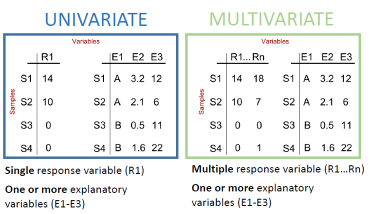

## Applications

Five types of scientific inquiries usually suit to the application of multivariate methods.

+ **Data reduction or structural simplification**: summarize multiple variables through a comparatively smaller set of 'synthetic' variables. *Ex: Principal Component Analysis (PCA)*

+ **Sorting and grouping**: many ecological questions are concerned with the similarity or dissimilarity. *Ex:Cluster analysis, non Metric Dimensional Scaling (nMDS)*

+ **Investigation of the dependence among variables**: dependence among response variables, among explanatory variables, or among both. *Ex: Redundancy analysis and other constrained analysis* </span>

+ **Prediction**: once the dependence detected and characterized multivariate models may be constructed in a very similar as we did before with univariate models.

+ **Hypothesis testing**: detect and test pattern in the data (be careful of data dredging) . *Ex: MANOVA, PERMANOVA, ANOSIM* </span>

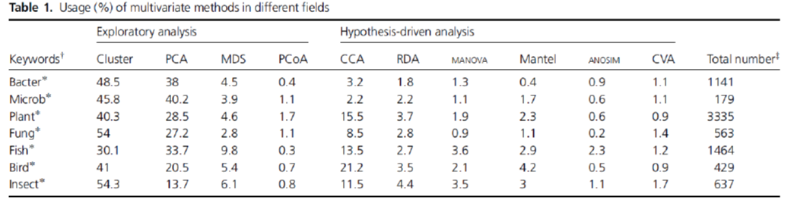


## Typical Data Structure

In ecology, 'typical' data structure will be: 

+ objects in row (e.g. samples can be sites, time periods, etc.)

+ measured variables for those objects in columns (e.g. species, environmental parameters, etc.)


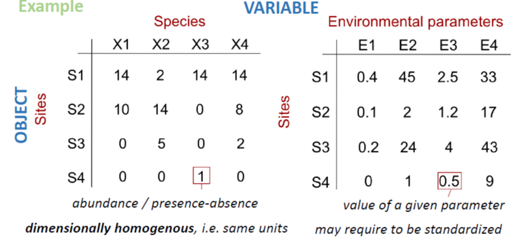
*Important note*: observations on object are not necessarily __independent__ on those made on another object, and a mixture of dependent and independent objects is possible e.g. site and year  

## Data transformation

Measured variables can be binary, quantitative, qualitative, rank-ordered, or even a mixture of them. 

If variables do not have uniform scale (e.g. environmental parameters measured in different units or scales), they usually have to be transformed before performing further analyses.

 - **Standardization**: provides dimensionless variables and removes the influence of magnitude differences between scales and units

- **Normalization**: aims at correcting the distribution shapes of certain variables. 

  + `arcsin (x)` *family of transformations for percentage and  proportions*

  + `log (x + constant)` *for variables departing moderately from normal distribution*

  + `sqrt (x + constant) `*for variables departing slightly from normal distribution*

  + **Hellinger transformation** to make data containing many zeros suitable for PCA or RDA, the 'double zeros' problem. 

  + **Chord transformation** to give less weight to rare species (especially when rare species are not truly rare)

  + ...

The function `decostand` from the `vegan` package offers an easy way to transform your data. The `varespec` data frame has **24 rows** and **44 columns**. Columns are estimated cover values of **44 lichen species**. The variable names are formed from the scientific names, and are self explanatory for anybody familiar with vegetation type / lichen species. 


```r
?varespec
```

```
## starting httpd help server ... done
```

```r
data (varespec)
varespec[1:5,1:5]
```

```
##    Callvulg Empenigr Rhodtome Vaccmyrt Vaccviti
## 18     0.55    11.13     0.00     0.00    17.80
## 15     0.67     0.17     0.00     0.35    12.13
## 24     0.10     1.55     0.00     0.00    13.47
## 27     0.00    15.13     2.42     5.92    15.97
## 23     0.00    12.68     0.00     0.00    23.73
```


```r
# log,  hellinger, and presence/absence transformations
varespec.log<-decostand(varespec,'log')
varespec.hell<-decostand(varespec,'hellinger')
varespec.pa<-decostand(varespec,'pa')
varespec.pa [1:5,1:5]
```

```
##    Callvulg Empenigr Rhodtome Vaccmyrt Vaccviti
## 18        1        1        0        0        1
## 15        1        1        0        1        1
## 24        1        1        0        0        1
## 27        0        1        1        1        1
## 23        0        1        0        0        1
```

## Ressemblance

+ Most methods of multivariate analysis are **explicitly** or **implicitly** based on the comparison of all possible pairs of objects or descriptors.

+ Comparison takes the form of association measures which are assembled in a square and symmetrical association matrix of dimension $n$ x $n$ when objects are compared, or $p$ x $p$ when variables are compared. The choice of a suitable **association coefficient** is crucial for further analysis.

+ When pairs of objects are compared, the analysis is said to be in **Q mode**.When pairs of descriptors are compared, the analysis is said to be in **R mode**.

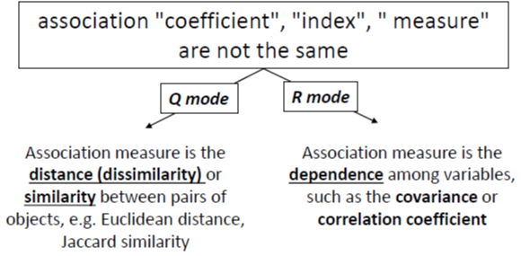

### Q mode

Virtually, all distance or similarity measures used in ecology are symmetric: the coefficient between pairs of objects is the same! 

But whatto deal with **double-zeros**?

- the **zero value** has the **same meaning** as any other values (*e.g. 0mg/L of O2 in deep anoxic layer of a lake*)

- the **zero value** in matrix of species abundances (or presence-absence) can **not** always be counted as an indication of **resemblance** (presence has an ecological meaning, but no conclusions on the absence: e.g. *is the absence of a given nationality in this class means that no students of this sppecific country are in NTU? And is it a element of similarity with other University (high similarity because many nationalities probably absent ? No, but at same sample size 1/0 becomes informative*)

Because of the **double-zeros** problem, 2 classes of association measures exist based on how they deal with this issue". 

+ The **symmetrical coefficients** will consider the information from the double-zero (also called 'negative matched'). 


+ The **asymmetrical coefficients** will ignore the information send from the double-zero. 

When analyzing species data, it is often recommended to use asymmetrical coefficients unless you have reason to consider each double absence in the matrix (*e.g. controlled experiment with known community composition or ecologically homogenous areas with disturbed zones*)


#### **Presence/absence-based dissimilarity metrics**

We use **Jaccard Similarity (S~7~)** to find similarities between sets. So first, let’s learn the very basics of sets.

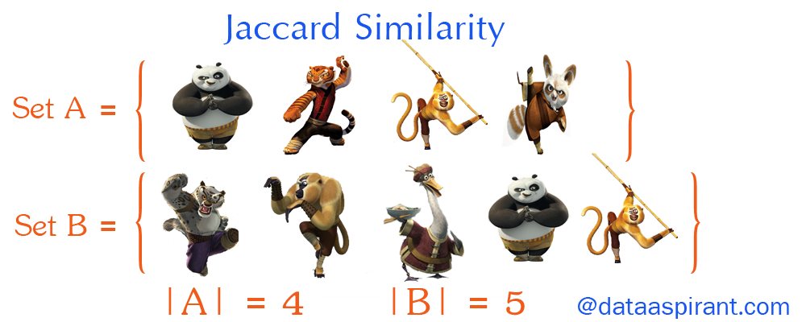

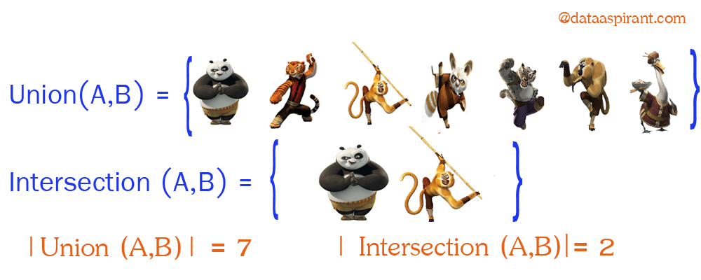

Now going back to Jaccard similarity.The Jaccard similarity measures similarity between finite sample sets, and is defined as the cardinality of the intersection of sets divided by the cardinality of the union of the sample sets. Suppose you want to find jaccard similarity between two sets A and B it is the ration of cardinality of A ∩ B and A ∪ B.

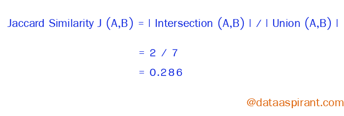

Other distances applying to presence-Absence data: Sørensen (S~8~), Ochiai (S~14~) 


#### **Abundance-based dissimilarity metrics**

When your community data samples include abundance information (as opposed to simple presence-absence) you have a wider choice of metrics to use in calculating (dis)similarity. 

When you have abundance data your measures of (dis)similarity are a bit more “refined” and you have the potential to pick up patterns in the data that you would otherwise not see using presence-absence data.

There are many metrics that you might use to explore (dis)similarity.

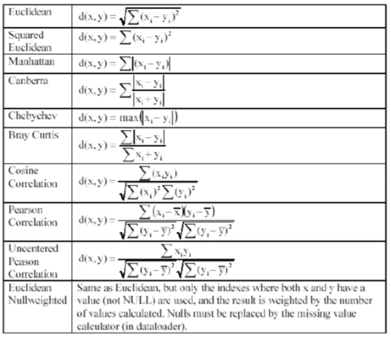


Four of them are particularly common:

+ Bray-Curtis
+ Canberra
+ Manhattan
+ Euclidean

You can get the spreadsheet [here](Data/Distance-metrics.xlsx) to examine how to compute them in details


**Euclidean distance (D~2~)** is the most commonly-used of our distance measures. For this reason, Euclidean distance is often just to referred to as “distance”. When data is dense or continuous, this is the best proximity measure. The Euclidean distance between two points is the length of the path connecting them.This distance between two points is given by the Pythagorean theorem.


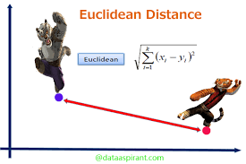

Here the abundance of a species from one sample is subtracted from its counterpart in the other sample. Instead of ignoring the sign, the result is squared (which gives a positive value):

$E_d=\sqrt{\sum (x_i-y_j)^2}$

**Manhattan distance** is a metric in which the distance between two points is the sum of the absolute differences of their Cartesian coordinates. In simple way of saying it is the absolute sum of difference between the x-coordinates and y-coordinates. Suppose we have a Point A and a Point B: if we want to find the Manhattan distance between them, we just have to sum up the absolute x-axis and y–axis variation. We find the Manhattan distance between two points by measuring along axes at right angles.

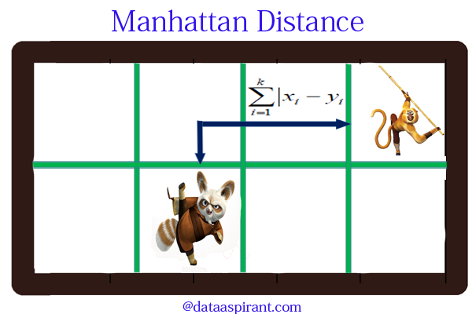

This is the simplest dissimilarity metric to compute:

$CB_d = \sum|x_i-x_j|$


**Bray-Curtis (D~14~)** dissimilarity is the **golden** ditance metric in ecology.At first, you subtract the abundance of one species in a sample from its counterpart in the other sample but ignore the sign. The second component is the abundance of a species in one sample added to the abundance of its counterpart in the second sample. If a species is absent, then its abundance should be recorded as 0 (zero). 

$BC_d =  \frac {\sum |x_i-x_j|}{\sum(x_i+x_j)}$

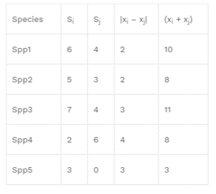

The **Canberra** dissimilarity uses the same components as Bray-Curtis but the components are summed differently:


$C_d =  \sum \frac { |x_i-x_j|}{(x_i+x_j)}$

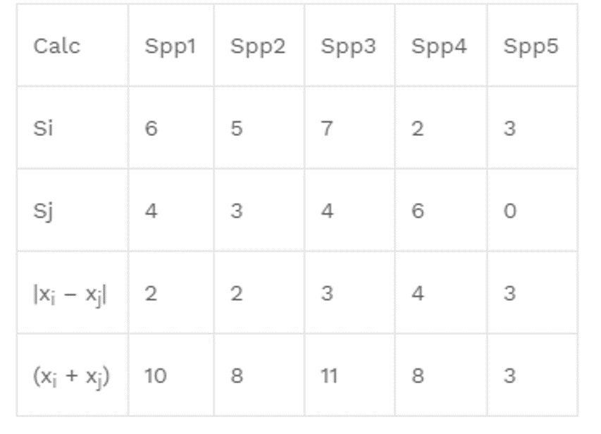

Many other 'distances' exist, each with their code


Those distance can be computed from am un-transformed or transformed matrix.

#### Computation

The functions `vegdist` from the `vegan`package and `dist` from the `stats` package compute  dissimilarity indices useful and popular among community ecologists.


```r
# using varespec dataset
spe<-varespec

# quantitative data
# Bray-Curtis dissimilarity matrix on raw data
spe.db <- vegdist(spe)
head(spe.db)
```

```
## [1] 0.5310021 0.6680661 0.5621247 0.3747078 0.5094738 0.6234419
```

```r
# Bray-Curtis dissimilarity matrix on log-transformed data
spe.dbln <- vegdist(log1p(spe)) # log(x+1)
head(spe.dbln)
```

```
## [1] 0.3619358 0.4969291 0.3853004 0.3145055 0.3152830 0.3932524
```

```r
# Chord distance matrix
spe.norm<-decostand(spe,'nor')
spe.dc <- vegdist(spe.norm)
head(spe.dc)
```

```
## [1] 0.5518126 0.6834930 0.5978450 0.3793678 0.4968567 0.6448499
```

```r
# Hellinger distance matrix
spe.hel<-decostand(spe,'hel')
spe.dh <- vegdist(spe.hel)
head(spe.dh)
```

```
## [1] 0.3613332 0.5038012 0.4264724 0.3032106 0.3319945 0.4187854
```

```r
# quantitative data with a clear interpretation of double zeros use Euclidean distance D1
# using environmental dataset varechem
data(varechem)
env <- varechem
env.st<-decostand(env,'stan') # standardized using decostand or scale(env)
env.de<-vegdist(env.st,method='euc') # then compute D1

# binary data
# Jaccard dissimilarity matrix using vegdist()
spe.dj1 <- vegdist(spe,'jac',binary=T)# binary perform presence/absence standardization before analysis
head(spe.dj1)
```

```
## [1] 0.3333333 0.4705882 0.5000000 0.3333333 0.4166667 0.4000000
```

```r
# Jaccard dissimilarity matrix using dist()
spe.dj2 <- dist(spe,'binary') 
head(spe.dj2)
```

```
## [1] 0.3333333 0.4705882 0.5000000 0.3333333 0.4166667 0.4000000
```

```r
# Sorensen dissimilarity matrix using vegdist()
spe.ds<-vegdist(spe,binary=T)
head(spe.ds)
```

```
## [1] 0.2000000 0.3076923 0.3333333 0.2000000 0.2631579 0.2500000
```

```r
# also see Ochiai dissimilarity matrix with dist.binary() from the ade4 package
spe.och<-dist.binary(spe, method=7)
head(spe.och)
```

```
## [1] 0.4458781 0.5504882 0.5757576 0.4458781 0.5128786 0.4995210
```

#### Matrix visualization

Using the package `gclus`</span> and the function `coldiss` (Borcard et al. 2011) dissimilarities can be easily visualized in a heat map
 

```r
library(gclus)
source('https://www.dipintothereef.com/uploads/3/7/3/5/37359245/coldiss.r') # import coldiss () function  (Borcard et al. 2011) 
coldiss(spe.db,byrank=F,diag=T) # for the bc dissimilarity on raw data 
```


```r
coldiss(spe.dbln,byrank=F,diag=T) # for the bc dissimilarity on log-transformed data
```


```r
coldiss(env.de, diag=T) # for the environmental data
```


In the untransformed distance matrix, small differences in abundant species
have the same importance as small differences in species with few individuals

**Note 1**: In **Q mode** similarity from binary data can be interpret by a simple matching coefficient **S~1~**: for each pair of sites, it is the ratio between the number of double 1s plus double 0s and the total number of variables.
 

**Note 2**: For mixed types variables, including categorical or qualitative multiclass variables use **Gower's similarity (S~15~)**. It is easily computed in R using `daisy` function built in the `cluster` package. Avoid `vegdist` with `method='gower'`, which is appropriate for quantitative and presence-absence, but not for multiclass variables. Overall, `gowdis` from the package `FD` is the most complete function to compute Gower's coefficient in R, and commonly used in **trait-base appraoch** analyses. 


### Rmode

Correlation type coefficents are commonly used to compare variable in R mode. Remember: 

+ Parametric (*Pearson coefficient*)

+ Non-parametric (*Spearman, Kendall for quantitative or semi-quantitative data*)

+ *Chi-square* statistic + its derived forms for qualitative variables

+ Binary coefficient such as *Jaccard*, *Sorensen*, and *Ochiai* for presence-absence data

+ ...


```r
spe.t <- t(spe)# transpose species matrix
spe.t.chi <- decostand(spe.t,'chi.square') # Chi-square transformation
spe.t.D16 <-dist(spe.t.chi)# euclidean distance
coldiss(spe.t.D16, diag=T) # visualization
```


In R mode, the use of *Pearson* coefficient is very common. Applied on binary variables, r *Pearson* is called the **point correlation coefficient**. Using the function `panelutils` (Borcard et al. (2011):


```r
#  Pearson r linear correlation among env. variable
env.pearson <- cor(env) # default method = 'pearson')
env.pearson <- round(env.pearson,2)
# re-order the variables prior to plotting
env.o<-order.single(env.pearson)
# need panelutils () on ceiba
source ('https://www.dipintothereef.com/uploads/3/7/3/5/37359245/panelutils.r')
pairs (env[,env.o], lower.panel=panel.smooth, upper.panel=panel.cor,diag.panel=panel.hist, main='Pearson Correlation Matrix')
```


> *<span style="color: green">RP16:  Load  `tikus` data set from the package `mvabund`. Extract coral species and environmental (years) data, and  select samples from year 1981, 1983, and 1985 only. </span>* 

+ *<span style="color: green"> From the species data, calculate two distance matrices: (1) one using Bray-Curtis and, (2) one using Euclidean distance on log-transformed data</span>*

+ *<span style="color: green"> Plot heat maps of respective matrix and compare. Briefly explain the differences.</span>*


```r
library(mvabund)
data(tikus)
```
