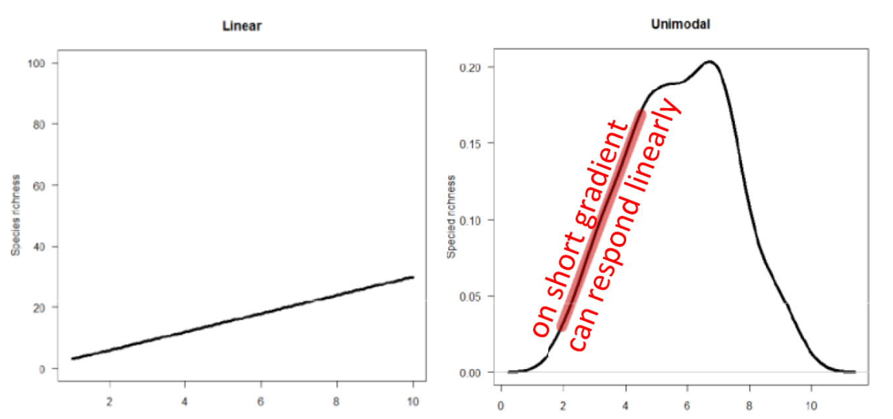
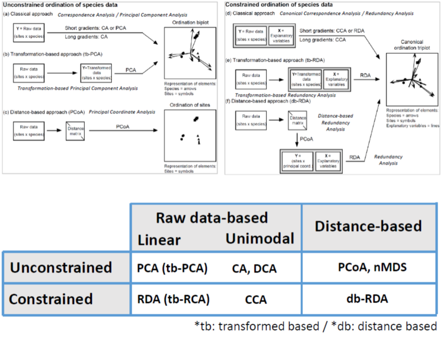
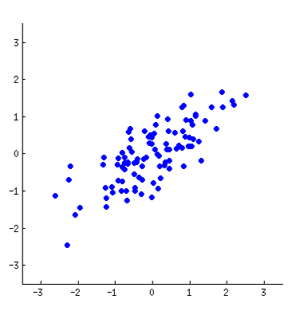
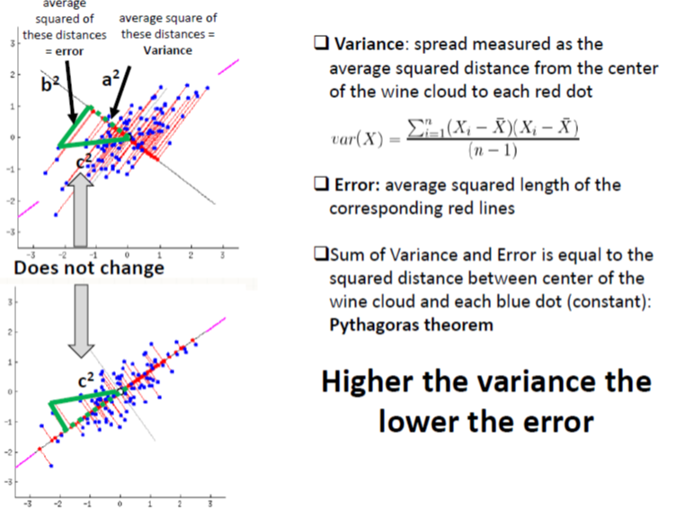
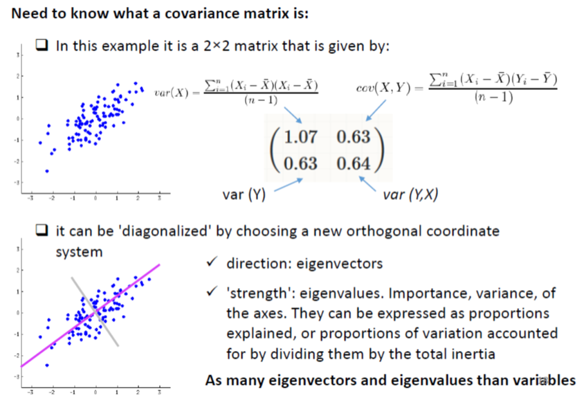

# Topic 9 - Multivariate analyses - Part B: Ordination

Packages & Customized Functions:

```{r,  eval=T, warning=F, message=F}
library(vegan)
library(ade4)
library(ape)
source ('https://www.dipintothereef.com/uploads/3/7/3/5/37359245/cleanplot.pca.r')
source ('https://www.dipintothereef.com/uploads/3/7/3/5/37359245/evplot.r')
```

Extract R code:

```{r eval = TRUE,  message=F, warning=F, purl=F, results="hide"}
knitr::purl("Topic_8_multivariate.Rmd", documentation = F)
```


## Background

[GUSTA ME](https://mb3is.megx.net/gustame) provides a guide to statistical analysis (community-focused) in Microbial Ecology. Very useful to help in the choice of the relevant analysis according to the type of data you are dealing with.

### Multidimensional space

The aim of ordination methods is to represent the data along a reduced number of orthogonal axes, constructed in such way that they represent, in decreasing order, the **main trends of the data**

 + The renders can be **interpreted visually or in association with other methods** such as clustering or regression

 + Most ordination methods (except nMDS) are based on the extraction of the **eigenvectors** of an association matrix

### Families

Two big families of ordination analyses exist according to how they are dealing with  environmental matrix (if any):

+ **unconstrained ordination** (indirect gradient analysis, ordination not constrained by environmental factors).They are descriptive methodologies and describe patterns. It generates hypotheses but cannot test them.

    * uncover main compositional gradients in the species data, 	structuring the community, and these gradients can be 	interpreted by known (estimated or measured) 	environmental factors
    
    * environmental variables can be used a posteriori, after the analysis
    
+ **constrained ordination** (direct gradient analysis, ordination axes are constrained by environmental factors). It tests directly  hypotheses about the influence of environmental factors on species composition*

    * relates the **species composition directly to the 	environmental variables** and extracts the variance in species 	composition which is directly related to these variable*

    * regarding environmental factors, it offers several interesting options such as **step-wise selection** of important environmental 	variables (and excluding those which are not relevant for species composition), test of **significance of the variance 	explained by environmental factors**	and **partitioning variance explained by particular environmental variables**

### Types

In addition, based on data input, two types of ordination analyses exist. 

  + **raw data**: based on analysis of raw sample-species matrices with abundance or presence/absence data. Two categories recognized, differing by assumption of species response along environmental gradient:
  
    + **linear**, species response linearly along env. gradient, which could be true for rather homogenous ecological data, where ecological gradients are not too long. **Short gradient**.

    + **unimodal**, species response unimodally along gradient, having its optima at certain gradient position. More close to reality of ecological data, more suitable for heterogenous dataset (long gradients + many zeros and turnover). **Long gradient**.
    
  


+ **distances**: distance matrix  computed by similarity/dissimilarity measures, and projecting these distances into two or more dimensional diagrams</span>

### Framework 



The selection toward linear or unimodal ordination appraoch is commonly determined by a rule of thumb by performing a Detrended Correspondance Analysis (DCA) `decorana` on the dataset, then to check the length of the 1st DCA axis. Typically, it says: 

+ **length>4**, data are heterogenous and you should use unimodal methods

+ **length<3**, data are homogenous and you should use linear methods

There is a **grey zone** between **3 and 4** where both methods are okay - in addition if your data are heterogenous, you still can use PCA/RDA using Hellinger's transformation of species data* (tbPCA)

```{r,  eval=T, message=F}
data(varespec)
decorana(varespec)
data(doubs)
doubspec<-doubs$fish[-8,]
decorana(doubspec)
```

## Unconstrained ordinations

+ **Principal Component Analysis (PCA)**: the main eigenvector-based method (and the most famous). Works on raw, quantitative data. Preserve the **Euclidean** distance among sites. 

+ **Correspondance Analysis (CA)**: works on data that must be frequency or frequency-like, dimensionnally homogenous, and non-negative. Preserve the **Chi-square** distance among rows and columns. Applied in ecology to analyze species data.

+ **Principal Coordinate Analysis (PCoA, also called MDS)**: devoted to the ordination of distance matrix, most often in Q mode. Great flexibility in the choice of association measures. Common in trait-based approach because of it.

+ **non-metric Multi-Dimensional Scaling (nMDS)** unlike the three others, this is not an eigenvector-based method. nMDS tries to represent the set of objects along a predetrmined number of axes (usually 2) while preserving the ordering relationship among them.

### Principal Component Analysis (PCA)

A PCA carries out a **rotation system of axes** defined by the variables, such as new axes (called principal component) are orthogonal to one another, and correspond to the successive dimensions of maximum variance of the scatter plot.

A PCA will find the "best" line (first principal component) according to two different criteria of what is the "best": maximize the variance & minimize the error.

Applied to a 2D example on wine testing, this is like to identify a new property of wine by a combination of two variables (alcohol content and wine darkness) by drwaing a line through the center of the wine cloud. 





It corresponds to a simple application of the Pythagora theorem



The direction is given by eigenvector, and the strength by the eigenvalues. 



Check it  [here](http://setosa.io/ev/principal-component-analysis/) for a very simple explanation of how PCA works, and [here](https://www.youtube.com/watch?v=9DPiXrN2pEg) for a simple example, and [here](https://www.youtube.com/watch?v=FgakZw6K1QQ) for a more detailed example.


#### Computation


In R, a **PCA** can be computed with the function `rda` from the `vegan`among many other options.

```{r,  eval=T, message=F}
# PCA on on the full data varechem dataset
# arg scale =T, standardize our variables within the rda function
data(varechem)
env<-varechem
env.pca<-rda(env, scale=T) 
env.pca
summary(env.pca) # default scaling 2
```


**Inertia**: in `vegan`’s language, this is the general term for “variation” in the data

**Constrained and unconstrained**: In PCA, the analysis is unconstrained, i.e. not constrained by a set of explanatory variables, and so are the results

**Eigenvalues**, symbolized λj: these are measures of the importance (variance) of the PCA axes. They can be expressed as Proportions Explained, or proportions of variation accounted for by the axes, by dividing each eigenvalue by the “total inertia”.

**Scaling**: not to be confused with the argument “scale” calling for standardization of variables. “Scaling” refers to the way ordination results are projected in the reduced space for graphical display. There is no single way of optimally displaying objects and variables together in a PCA biplot, i.e., a plot showing two types of results, here the sites and the variables. Two main types of scaling are generally used. Each of them has properties that must be kept in mind for proper interpretation of the biplots. Here we give the essential features of each scaling. Please refer to Legendre and Legendre (2012) for a complete desciption.

+ **Scaling 1** = distance biplot: the eigenvectors are scaled to unit length. (1) **Distances among objects in the biplot are approximations of their Euclidean distances in multidimensional space**. (2) The angles among descriptor vectors do not reflect their correlations.

+ **Scaling 2** = correlation biplot: each eigenvector is scaled to the square root of its eigenvalue. (1) Distances among objects in the biplot are not approximations of their Euclidean distances in multidimensional space. (2) **The angles between descriptors in the biplot reflect their correlations.**

+ The compromise **Scaling 3** has no clear interpretation rules, and
therefore we will not discuss it further.

Bottom line: if the main interest of the analysis is to interpret the relationships among **objects**, choose **scaling 1**. If the main interest focuses on the relationships among descriptors, choose **scaling 2**.

```{r,  eval=T, message=F}
# Plots using biplot
# To help memorize the meaning of the scalings, vegan now accepts argument scaling = "sites" for scaling 1 and scaling="species" for scaling 2. This is true for all vegan functions involving scalings
par(mfrow = c(1, 2))
biplot(env.pca, scaling = 1, main = "PCA - scaling 1")
biplot(env.pca, main = "PCA - scaling 2") # Default scaling 2

# Plots using cleanplot.pca
cleanplot.pca(env.pca)
dev.off()
```

**Species scores**: coordinates of the arrowheads of the variables. For historical reasons, response variables are always called “species” in vegan, no matter what they represent, because `vegan` is built for vegetation analysis.

```{r,  eval=T, message=F}
summary(env.pca)$species
```

**Site scores**: coordinates of the sites in the ordination diagram. Objects are always called “Sites” in vegan output files.

```{r,  eval=T, message=F}
summary(env.pca)$site
```

#### Eigenvalues

Examine eigenvalues is important to decide how many axes to retain. Usually, the user examines the eigenvalues, and decides how many axes are worth representing and displaying on the basis of the amount of variance explained. The decision can be completely arbitrary (for
instance, interpret the number of axes necessary to represent 75% of the variance of the data), or assisted by one of several procedures proposed to set a limit between the axes that represent interesting variation of the data and axes that merely display the remaining, essentially random variance. 


One of these procedures consists in computing a **broken stick model**, which randomly divides a stick of unit length into One of these procedures consists in computing a broken stick model, which randomly divides a stick of unit length into the same number of pieces as there are PCA eigenvalues. One interprets only the axes whose eigenvalues are larger than the length of the corresponding piece of the stick, or, alternately, one may compare the sum of eigenvalues, from 1 to k, to the sum of the values from 1 to k predicted by the broken stick model.

```{r,  eval=T, message=F}
screeplot(env.pca, bstick = TRUE, npcs = length(env.pca$CA$eig))
```

#### Intepretation

The proportion of variance accounted for by the two axes is about 60 %: relative high value makes us confident that our interpretation of the first pair of axes extracts most relevant information from the data


```{r,  eval=T, message=F}
par(mfrow = c(1, 2))
cleanplot.pca(env.pca)
dev.off()
```

**Scaling 1**: Gradient from left to right with a group of sites displaying higher values of Ca, Mg, K, Zn, S. Gradient from top to down  with humpdepth and baresoil.

**Scaling 2**: Humdepth, Baresoil are very highly positively correlated. Those two variables are very highly negatively correlated with pH and Fe.


#### Adding cluster

```{r,  eval=T, message=F}
# combining clustering and ordination results
biplot(env.pca, main='PCA - scaling 1',scaling=1) 
ordicluster(env.pca, 
            hclust(dist(scale(env)), 'ward.D'), 
            prune=3, col = "blue", scaling=1)
```

#### PCA on transformed species data (tb-PCA)

PCA being a linear method preserving the Euclidean distance among sites, it is not naturally adapted to the analysis of species abundance data. Hellinger pre-transformation of the data can solve this problem. 

```{r,  eval=T, message=F}
# Hellinger pre-transformation of the species data
data(varespec)
spe<-varespec
spe.h<-decostand(spe,'hellinger')

# DCA + RDA
decorana (spe.h)
spe.h.pca<-rda(spe.h)
screeplot(spe.h.pca,bstick = TRUE, npcs = length(spe.h.pca$CA$eig))

# plot PCA
cleanplot.pca (spe.h.pca)
```

**Note**: It is possible to get a passive (*post hoc*) explanation of axes using environmental variables. Although there are means of incorporating explanatory variables directly in the ordination process (canonical ordination), one may be interested in interpreting a simple ordination by means of external variables.

```{r,  eval=T, message=F}
#A posteriori projection of environmental variables in a PCA
# A PCA scaling 2 plot is produced in a new graphic window.
biplot(spe.h.pca, main = "PCA fish abundances-scaling 2")
# Scaling 2 is default
(spe.h.pca.env <- envfit(spe.h.pca, env, scaling = 2))
# Plot significant variables with a user -selected colour
plot(spe.h.pca.env, p.max = 0.05, col = 3)
# This has added the significant environmental variables to the
# last biplot drawn by R.
# BEWARE: envfit() must be given the same scaling as the plot to 
# which its result is added!
```

`envfit`  proposes permutation tests to assess the significance of the R^2^ of each explanatory variable regressed on the two axes of the biplot. But this is not, by far, the best way to test the effect of explanatory variables on a table of response variables.

#### More on PCA

Conditions of applications:

+ PCA must be computed on **dimensionally homogenous** variables

+ data matrix **not transposed** since covariance or correlations among objects are meaningless

+ PCA can be applied to **binary** data

+ Species Presence-Absence data can be subject to a **Hellinger or chord transformation** prior PCA 

+ Interpretation relationship variable based on **angles**


> *<span style="color: green">RP19:   Using environmental dataset `carp.chemistry` from Carpathian wetland (mainly chemistry) </span>* 

```{r,  eval=T, message=F}
chem<-read.table ('https://www.dipintothereef.com/uploads/3/7/3/5/37359245/carp.chemistry.txt',header=T, sep=",",row.names=1)
```

+ *<span style="color: green"> remove the variable slope, which is not a chemical variable</span>*

+ *<span style="color: green"> perform a PCA, and evaluate importance of ordination axes using the broken stick criterion </span>*

+ *<span style="color: green"> make a biplots using scaling=1 and scaling 2, and interpret results? </span>*


+ *<span style="color: green"> Repeat the same for the species data associates </span>*

```{r,  eval=T, message=F}
chem<-read.table ('https://www.dipintothereef.com/uploads/3/7/3/5/37359245/carp.chemistry.txt',header=T, sep=",",row.names=1) 
```

*<span style="color: green">You can play a bit by adding cluster, post-hoc interpretation using environmental variables, etc.</span>* 

```{r class.source = "fold-hide",  eval=F, message=F}
#environmental data and RDA
chem$slope<-NULL
stand.chem <- scale (chem)
PCA1 <- rda (stand.chem) 

# broken stick
screeplot(PCA1,bstick = TRUE, npcs = length(PCA1$CA$eig))

# Keiser-Guttman Criteron (above average eigen value)
ev<-PCA1$CA$eig
barplot(ev, main='Eigenvalues',col='bisque',las=2)
abline(h=mean(ev),col='red') # average eigenvalue
legend('topright','Average eigenvalue',lwd=1,col=2,bty='n')

#biplot
clean.plot (PCA1)
```


### Correspondance Analysis (CA)

+ Data submitted to CA must be **frequencies or frequency-like, dimensionally homogeneous and non-negative**; that is the case of species counts or presence-absence data. 

+ Accodingly, for a long time, **CA has been one of the favorite tools for the analysis of species presence-absence or abundance data** 

+ The raw data are first transformed into a matrix Q of cell-by-cell contributions to the **Pearson Chi-square statistic**, and the resulting table is submitted to a singular value decomposition to compute its  eigenvalues and eigenvectors

+ The result is an ordination, where it is the **Chi-square distance (D16)** that is **preserved** among sites **instead of the Euclidean distance D1**.

+ **Chi-square distance is not influenced by the double zeros**. Therefore, CA is a method adapted to the analysis of species abundance data without pre-transformation. 

#### Graphical representation

Accordingly, in a CA, both objects and species are represented by points in the ordination diagram (compared to PCA where species/descriptors are vectors and sites are points). 

***Note 1**: Chi-square gives high weight to rare species, so usually considered as one the least suitable distance measures for ecological data.*

***Note 2**: Suffers from an artefact called **arch effect**, which is caused by non-linear correlation between the first and higher axes. Popular, even though clumsy way how to remove this artefact is to use **Detrending Correspondance Analysis (DCA)***


Similarly to PCA, two type of scaling are possible: 

+ **scaling 1**: the distances **among objects (sites)** in the reduced ordination space approximate their chi-square distance; any object found near the point representing a species is likely to contain a high contribution of that species.

+ **scaling 2**: the distances **among descriptors (species)** in the reduced space approximate their chi-square distances; any species that lies close to the point representing an object is more likely to be found in that object or to have higher frequency there. 
 
Both  The **broken stick model** and **Kaiser-Guttman criterion** applied for guidance on CA axes to retain.
 
#### Computation

Correspondance analysis can be computed using the function `cca` (library `vegan`). If the environmental matrix is not specified, `cca` calculates an unconstrained correspondence analysis. 

You can apply the functions `screeplot` or `evplot` (Borcard et al. 2011), in order to select important ordination axes based on Kaiser-Guttman or broken stick model.

```{r class.source = "fold-show",  eval=T, message=F}
spe.ca<-cca(spe) #default summary for "scaling = 2" 
screeplot(spe.ca, bstick = TRUE, npcs = length(spe.ca$CA$eig))
ev2<-spe.ca$CA$eig # extract eigen value
evplot(ev2)
```

It is time to draw the CA biplots of this analysis. Let us compare the two scalings.

```{r,  eval=T, message=F}
# CA biplots
par(mfrow=c(1,2))
# Scaling 1: sites are centroids of species
plot(spe.ca,scaling=1,main='CA - biplot scaling 1')
# Scaling 2: species are centroids of species
plot(spe.ca,main='CA - biplot scaling 2')
```

Another option using function `ordplot`

```{r,  eval=T, message=F}
# CA biplots
par(mfrow=c(1,2))
# Scaling 1: sites are centroids of species
ordiplot(spe.ca,scaling=1,main='CA - biplot scaling 1')
# Scaling 2: species are centroids of species
ordiplot(spe.ca,main='CA - biplot scaling 2')
dev.off()
```

#### Passive (Post Hoc) explanation of axes using environmental parameters

Here again you can use `envfit` from the `vegan` package: finds vectors or factors average of environmental variables. The projections of points onto vectors have maximum correlation with corresponding environmental variables, and the factors show the averages of factor levels.


```{r,  eval=T, message=F}
# A posteriori projection of environmental variables in a CA
# The last plot produced (CA scaling 2) must be active
plot(spe.ca,main='CA- biplot scaling 2')
spe.ca.env <-envfit(spe.ca,env)
plot(spe.ca.env)
# It added the environment variables to the last biplot drawn
```

```{r,  eval=T, message=F}
plot(spe.ca, main = "CA - scaling 2",
sub = "Fitted curves: humdepth (red), Baresoil (green)")
spe.ca.env <- envfit(spe.ca ~ Humdepth + Baresoil, env)
plot(spe.ca.env) # Two arrows
ordisurf(spe.ca, env$Humdepth, add = TRUE)
ordisurf(spe.ca, env$Baresoil, add = TRUE, col = "green")
```

#### Arch effect and Detrended Correspondance Analysis (DCA)

Long environmental gradients often support a succession of species. Since the species that are controlled by environmental factors tend to have unimodal distribution, a long gradient may encompass sites that, at both ends of the gradient, have no species in common: their distance reaches a maximum value (or their similarity is 0). But if we look at either side of the succession, contiguous sites continue to grow more different from each other. Therefore, instead of linear trend on PCA, the gradient is represented on the pair of CA axes as an arch. 

**Detrending is the process of removing the arch effect**: DCA does it by dividing the first axis into segments  (or polynomial relationship), and then by centering the second axis on zero. Watch [here](https://www.youtube.com/watch?v=OHMf42Sy6KM) 

**Detrended Correspondance Analysis (DCA)** is often criticized and not recommended. Howver, DCA is still one of the most widely used unconstrained ordination methods among vegetation ecologist (zoologist are biased toward nMDS). 

```{r,  eval=T, message=F}
doubs.dca<-decorana(doubspec)
plot(doubs.dca)
```

> *<span style="color: green">RP20: Using Ellenberg's Danube meadow dataset (data `mveg`, package `dave`): </span>* 


+ *<span style="color:green; font-size: 12pt"> Compare the results of CA and DCA </span>*

+ *<span style="color:green; font-size: 12pt"> Try (more challenging) to combine the results of both  CA and DCA in the same ordination plot. Results should look similar to this: </span>*


*<span style="color:green; font-size: 10pt">(1) You may need functions `cca`, `decorana`, `ordiplot`, `scores` and `text`.</span>*

*<span style="color:green; font-size: 10pt"> (2) First calculate both CA and DCA on Danube data and draw CA ordination scatterplot (to draw only sites, in ordiplot use argument `display = 'sites'`).</span>*

*<span style="color:green; font-size: 10pt"> (3) To add sites from DCA, you need to shift their scores along the second (vertical) axis, otherwise they will be clustered together with CA samples. Add constant (e.g. 2) to the scores along the second axis. To extract scores, use the function scores on object DCA with argument `display = 'sites'` ).</span>*

*<span style="color:green; font-size: 10pt"> (4) To add sites from DCA into CA ordination plot, use low-level graphical function text on matrix of scores from DCA, with corrected second axis.</span>*

*<span style="color:green; font-size: 10pt"> (5) To avoid overlap of labels in text function, employ also the argument labels, which should contain values from rownames of DCA scores.</span>*


### Principal Coordinate Analysis (PCoA)

Also called **Multi-Dimensional Scaling (MDS)**

+ PCA and CA both impose the preservation of  a distance among objects: the Euclidean distance and the chi-squared distance, respectively. 

+ If you want to ordinate objects on the basis of **another distance measure**, then PCoA is the method of choice

+ PCoA provides a **Euclidean** representation of a set of objects whose relationships are measured by any similarity or distance measured chosen by the user.PCoA should be reserved to situations where no Euclidean measure is preserved.

+ Like PCA and CA, PCoA produces a set of orthogonal axes whose importance is measured by eigenvalues. Since it is based on an association matrix , it can directly represent the relationships either among objects (Q mode matrix) or variables (R mode matrix).

+ If non-Euclidean association coefficient, PCoA may produce several negative eigenvalues in addition to the positive one: can be remediate by adding a constant (**Lingoes** or **Caillez** correction)

+ Can also project variables (*e.g.* species) on a PCoA *a posteriori*

_**Note**: Computing Euclidean distance among sites and running a PCoA yields the exact same results as running a PCA of the same data and looking at the scaling 1 ordination results._

#### Computation

+ `cmdscale` (library `vegan`) – calculates PCoA of distance among samples (this could be calculated e.g. by function `vegdist`). Use function `ordiplot` to project ordination.
    
+ `pcoa` (library `ape`) – another way to achieve PCoA analysis. Use `biplot.pcoa` function to project ordination
    
The ordination axes of a PCoA can be interpreted like those of a PCA or CA: proximity of objects represents similarity in the sense of the association measured used

```{r,  eval=T, message=F}
# PCoA on a Bray-Curtis dissimilarity matrix of fish species
spe.bray<-vegdist(spe)
spe.b.pcoa<-cmdscale(spe.bray, eig=TRUE, add=T)
# Plot of the sites and weighted average projection of species
ordiplot(spe.b.pcoa, type='t', main='PCoAwith species')
abline(h=0,lty=3)
abline(v=0, lty=3)
# add species (weighted average species abundance)
spe.wa<-wascores(spe.b.pcoa$points[,1:2],spe)
text (spe.wa,rownames(spe.wa),cex=0.7,col='red')
```

#### `doubs` data with `pcoa`

```{r,  eval=T, message=F}
doubspec.bray<-vegdist(doubspec)
doubspec.bray.pcoa<-pcoa(doubspec.bray)
biplot.pcoa(doubspec.bray.pcoa,doubspec)
abline(h=0,lty=3)
abline(v=0,lty=3)
```


### non-metric Multidimensional Scaling (nMDS)

+ If priority is not to preserve the exact distances among objects in an ordination diagram, but rather to represent as well as possible the ordering relationship among objects in a small and specified number of axes

+ Like PCoA, nMDS can produce ordinations of objects from any distance matrix

+ Method can cope with missing distances, as long  as there are enough measures left to position each object with respect to each other.

This is **NOT** a eigenvalue based ordination method, and does not maximize the variability associated with individual axes of the ordination.


#### Procedure

Very simple:

+ specify the number m of axes (dimensions) – usually 2 !

+ construct an initial configuration of the objects in the m dimensions, to be used as a starting point of an iterative adjustment process. This is a tricky step, since the end-results may depend on the starting configuration.

+ an iterative procedure tries to position the objects in the requested number of dimensions in such was as to minimize a stress function (scaled from 0 to 1), which measures how far the distances in the reduced-space configuration are from being monotonic to the original distance in the association matrix

+ the adjustment goes on until the stress value can no more be lowered, or predetermined value (sometimes never reached)

#### Computation

Functions:

+ `metaMDS` (library `vegan`) – advanced function, composed of many sub-routine  steps. Species points are added to the ordination plot using `wascores`

+ `isoMDS` (library `MASS`) if missing values in the distance matrix and `bestnmds` package `labdsv`

```{r,  eval=T, message=F}
spe.nmds<-metaMDS(spe,distance='bray',trymax=999)
spe.nmds
spe.nmds$stress
plot(spe.nmds,type='t',main=paste('NMDS/Bray–Stress =',round(spe.nmds$stress,3)))
```

#### Quality and stress

+ A useful way to assess the appropriateness of an nMDS is to compare, in a *Shepard diagram*, the distance among objects in the ordination with the original distances.

+ `stressplot` (library `vegan`) – draws *Shepard stress* plot, which is the relationship between real distances between samples in resulting *m* dimensional ordination solution, and their particular dissimilarities.

```{r,  eval=T, message=F}
stressplot(spe.nmds, main='Shepard plot')
```

+ In addition, the goodness-of-fit of the ordination is measured as the R^2^  of either a linear or a non-linear regression of the NMDS distances on the original ones

```{r,  eval=T, message=F}
# goodness of fit
gof<-goodness(spe.nmds)
plot(spe.nmds,type='t',main='Goodness of fit')
points(spe.nmds, display='sites', cex=gof*90)
```

#### Adding cluster

```{r,  eval=T, message=F}
# Add colours from a clustering results to an NMDS plot
# Ward clustering of Bray-Curtis dissimilarity matrix
spe.bray.ward <- hclust(spe.bray,'ward.D')
spe.bw.groups <- cutree(spe.bray.ward,k=4)
grp.lev <- levels(factor(spe.bw.groups))

# combination with NMDS result 
sit.sc <- scores(spe.nmds)
p <- ordiplot (sit.sc, type='n', main='NMDS/BRAY – clusters Ward/Bray')
for (i in 1:length(grp.lev)) {
  	points(sit.sc[spe.bw.groups==i,],pch=(14+	i),cex=2, col=i+1)
	}
text(sit.sc,row.names(spe),pos=4,cex=0.7)
#add the dendrogram
ordicluster(p,spe.bray.ward,col='dark grey')
#
# legend(locator(1), paste('Group',c(1:length(grp.lev))),pch=14+c(1:length(grp.lev)), col=1+c(1:length(grp.lev)),pt.cex=2)
#
# using locator you need to point out where you want to put the legend
```

#### `ordihull`& `ordispider`

```{r,  eval=T, message=F}
data(dune)
data(dune.env)
attach(dune.env)
NMDS.dune<-metaMDS(dune,distance='bray')
plot(NMDS.dune,type='t',main=paste('NMDS/Bray – Stress =',round(NMDS.dune$stress,3)))
pl<-ordihull(NMDS.dune, Management, scaling = 3, draw='polygon',col='grey')
ordispider(pl, col="red", lty=3, label = TRUE)
# ?anosim
# ?adonis
```

#### `ordisurf`

Fits a smooth surface for given variable and plots the result on ordination diagram (Generalized Additive Model)

```{r,  eval=T, message=F}
data(varespec)
data(varechem)
vare.dist <- vegdist(varespec)
vare.mds <- metaMDS(vare.dist)
ordisurf(vare.mds ~ Baresoil, varechem, bubble = 5)
```

> *<span style="color: green">RP21:   Use Tikus dataset (library `mvabund`) and load data from coral reefs - selected samples from year 1981, 1983 and 1985 (you need both species data in tikus.spe and environmental data in tikus.env, which contain the year of sampling) </span>* 

+ *<span style="color:green; font-size: 12pt"> From species data, calculate two distance matrices: one using Bray-Curtis index, and the second using Euclidean distances (data should be log transformed) </span>*

+ *<span style="color:green; font-size: 12pt"> Use each of the matrices to calculate two nMDS. Project each nMDS into 2D ordination diagrams (you will have two ordination diagrams, one for NMDS on Bray-Curtis dissimilarities, one for NMDS on Euclidean distances). In these diagrams use different symbols for samples from different years. Draw also the legend to the upper right corner of the diagram. Compare species compossition among years using `adonis` (?adonis). </span>*

## Constrained ordinations

Pending ....