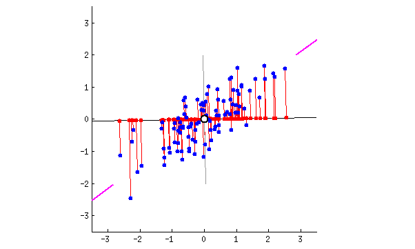

# Topic 9 - Multivariate analyses - Part B: Ordination

```{r,  eval=T, warning=F, message=F}
library(vegan)
library(ade4)
source ('https://www.dipintothereef.com/uploads/3/7/3/5/37359245/cleanplot.pca.r')
```

```{r eval = TRUE,  message=F, warning=F, purl=F, results="hide"}
knitr::purl("Topic_8_multivariate.Rmd", documentation = F)
```


## Background

[GUSTA ME](https://mb3is.megx.net/gustame) provides a guide to statistical analysis (community-focused) in Microbial Ecology. Very useful to help in the choice of the relevant analysis according to the type of data you are dealing with.

### Multidimensional space

The aim of ordination methods is to represent the data along a reduced number of orthogonal axes, constructed in such way that they represent, in decreasing order, the **main trends of the data**

 + The rends can be **interpreted visually or in association with other methods** such as clustering or regression </span>

 + Most ordination methods (except nMDS) are based on the extraction of the **eigenvectors** of an association matrix

### Families

Two big families of ordination analyses exist according to how they are dealing with  environmental matrix (if any):

+ **unconstrained ordination** (indirect gradient analysis, ordination not constrained by environmental factors).They are descriptive methodologies and describe patterns. It generates hypotheses but cannot test them.

    * uncover main compositional gradients in the species data, 	structuring the community, and these gradients can be 	interpreted by known (estimated or measured) 	environmental factors
    
    * environmental variables can be used a posteriori, after the analysis
    
+ **constrained ordination** (direct gradient analysis, ordination axes are constrained by environmental factors). It tests directly  hypotheses about the influence of environmental factors on species composition*

    * relates the **species composition directly to the 	environmental variables** and extracts the variance in species 	composition which is directly related to these variable*

    * regarding environmental factors, it offers several interesting options such as **step-wise selection** of important environmental 	variables (and excluding those which are not relevant for species composition), test of **significance of the variance 	explained by environmental factors**	and **partitioning variance explained by particular environmental variables**

### Types

In addition, based on data input, two types of ordination analyses exist. 

  + **raw data**: based on analysis of raw sample-species matrices with abundance or presence/absence data. Two categories recognized, differing by assumption of species response along environmental gradient:
  
    + **linear**, species response linearly along env. gradient, which could be true for rather homogenous ecological data, where ecological gradients are not too long. **Short gradient**.

    + **unimodal**, species response unimodally along gradient, having its optima at certain gradient position. More close to reality of ecological data, more suitable for heterogenous dataset (long gradients + many zeros and turnover). **Long gradient**.
    
  


+ **distances**: distance matrix  computed by similarity/dissimilarity measures, and projecting these distances into two or more dimensional diagrams</span>

### Framework 


The selection toward linear or unimodal ordination appraoch is commonly determined by a rule of thumb by performing a Detrended Correspondance Analysis (DCA) `decorana` on the dataset, then to check the length of the 1st DCA axis. Typically, it says: 

+ **length>4**, data are heterogenous and you should use unimodal methods

+ **length<3**, data are homogenous and you should use linear methods

There is a **grey zone** between **3 and 4** where both methods are okay - in addition if your data are heterogenous, you still can use PCA/RDA using Hellinger's transformation of species data* (tbPCA)

```{r,  eval=T, message=F}
data(varespec)
decorana(varespec)
data(doubs)
doubspec<-doubs$fish[-8,]
decorana(doubspec)
```

## Unconstrained ordinations

+ **Principal Component Analysis (PCA)**: the main eigenvector-based method (and the most famous). Works on raw, quantitative data. Preserve the **Euclidean** distance among sites. 

+ **Correspondance Analysis (CA)**: works on data that must be frequency or frequency-like, dimensionnally homogenous, and non-negative. Preserve the **Chi-square** distance among rows and columns. Applied in ecology to analyze species data.

+ **Principal Coordinate Analysis (PCoA, also called MDS)**: devoted to the ordination of distance matrix, most often in Q mode. Great flexibility in the choice of association measures. Common in trait-based approach because of it.

+ **non-metric Multi-Dimensional Scaling (nMDS)** unlike the three others, this is not an eigenvector-based method. nMDS tries to represent the set of objects along a predetrmined number of axes (usually 2) while preserving the ordering relationship among them.


### Principal Component Analysis (PCA)

A PCA carries out a **rotation system of axes** defined by the variables, such as new axes (called principal component) are orthogonal to one another, and correspond to the successive dimensions of maximum variance of the scatter plot.</span>

A PCA will find the "best" line (first principal component) according to two different criteria of what is the "best": maximize the variance & minimize the error.

Applied to a 2D example on wine testing, this is like to identify a new property of wine by a combination of two variables (alcohol content and wine darkness) by drwaing a line through the center of the wine cloud. 



It corresponds to a simple application of the Pythagora theorem


The direction is given by eigenvector, and the strength by the eigenvalues. 


Check it  [here](http://setosa.io/ev/principal-component-analysis/) for a very simple explanation of how PCA works, and [here](https://www.youtube.com/watch?v=9DPiXrN2pEg) for a simple example, and [here](https://www.youtube.com/watch?v=FgakZw6K1QQ) for a more detailed example.

In R, a **PCA** can be computed with the function `rda` from the `vegan`among many other options.

```{r,  eval=T, message=F}
# PCA on on the full data varechem dataset
# arg scale =T, standardize our variables within the rda function
data(varechem)
env<-varechem
env.pca<-rda(env, scale=T) 
env.pca
summary(env.pca) # default scaling 2
```


**Inertia**: in `vegan`’s language, this is the general term for “variation” in the data

**Constrained and unconstrained**: In PCA, the analysis is unconstrained, i.e. not constrained by a set of explanatory variables, and so are the results

**Eigenvalues**, symbolized λj: these are measures of the importance (variance) of the PCA axes. They can be expressed as Proportions Explained, or proportions of variation accounted for by the axes, by dividing each eigenvalue by the “total inertia”.

**Scaling**: not to be confused with the argument “scale” calling for standardization of variables. “Scaling” refers to the way ordination results are projected in the reduced space for graphical display. There is no single way of optimally displaying objects and variables together in a PCA biplot, i.e., a plot showing two types of results, here the sites and the variables. Two main types of scaling are generally used. Each of them has properties that must be kept in mind for proper interpretation of the biplots. Here we give the essential features of each scaling. Please refer to Legendre and Legendre (2012) for a complete desciption.

+ **Scaling 1** = distance biplot: the eigenvectors are scaled to unit length. (1) **Distances among objects in the biplot are approximations of their Euclidean distances in multidimensional space**. (2) The angles among descriptor vectors do not reflect their correlations.

+ **Scaling 2** = correlation biplot: each eigenvector is scaled to the square root of its eigenvalue. (1) Distances among objects in the biplot are not approximations of their Euclidean distances in multidimensional space. (2) **The angles between descriptors in the biplot reflect their correlations.**

+ The compromise **Scaling 3** has no clear interpretation rules, and
therefore we will not discuss it further in this book.

Bottom line: if the main interest of the analysis is to interpret the relationships among **objects**, choose **scaling 1**. If the main interest focuses on the relationships among descriptors, choose **scaling 2**.

```{r,  eval=T, message=F}
# Plots using biplot
# To help memorize the meaning of the scalings, vegan now accepts argument scaling = "sites" for scaling 1 and scaling="species" for scaling 2. This is true for all vegan functions involving scalings
par(mfrow = c(1, 2))
biplot(env.pca, scaling = 1, main = "PCA - scaling 1")
biplot(env.pca, main = "PCA - scaling 2") # Default scaling 2

# Plots using cleanplot.pca
cleanplot.pca(env.pca)
dev.off()
```

**Species scores**: coordinates of the arrowheads of the variables. For historical reasons, response variables are always called “species” in vegan, no matter what they represent, because `vegan` is built for vegetation analysis.

**Site scores**: coordinates of the sites in the ordination diagram. Objects are always called “Sites” in vegan output files.


<span style="color: #e1d9d7"> Plot the eigenvalues of our PCA: </span> 

```{r,  eval=T, message=F}
# plot partial results from PCA output
ev<-env.pca$CA$eig
barplot(ev, main='Eigenvalues',col='bisque',las=2)
abline(h=mean(ev),col='red') # average eigenvalue
legend('topright','Average eigenvalue',lwd=1,col=2,bty='n')
```

<span style="color: #e1d9d7"> PCA biplot of sites and variables usually shows objects as points and variables as arrows: </span> 

```{r,  eval=T, message=F}
# two PCA biplots: scaling 1 and scaling 2
par(mfrow=c(1,2))
biplot(env.pca, scaling=1, main='PCA - scaling 1')
biplot(env.pca, main='PCA - scaling 2')
```

<span style="color: #e1d9d7"> Equilibrium contribution circle means, using the function cleanplot.pca (Borcard et al. 2011, availbale on the website): </span> 


```{r,  eval=T, message=F}
# import the function

# correlation circle
cleanplot.pca (env.pca)
```

<span style="color: #e1d9d7"> Interpretation: the proportion of variance accounted for by the two axes is about **60 %**: relative high value makes us confident that our interpretation of the first pair of axes extracts most relevant information from the data. In scaling 1: we observe a gradient from left to right with a group of sites displaying higher values of `Ca`, `K`, `Zn`, `S`. There is also an obvious gradient from top to down related to `humpdepth` and `baresoil`. In scaling 2: `humpdepth` and `baresoil` are highly correlated. They are also negatively correlated with `pH` and `Fe`</span> 


##### Combining cluster in our ordination

```{r,  eval=T, message=F}
# combining clustering and ordination results
biplot(env.pca, main='PCA - scaling 1',scaling=1) 
ordicluster(env.pca, 
            hclust(dist(scale(env)), 'ward.D'), 
            prune=3, col = "blue", scaling=1)
```

##### PCA on species data
<span style="color: #e1d9d7"> PCA being a linear method preserving the Euclidean distance among sites, it is not naturally adpated to the analysis of species abundance data. Hellinger pre-transformation of the data can solve this problem:</span> 

```{r,  eval=T, message=F}
# PCA on species abundance data
# Hellinger pre-transformation of the species data
spe<-varespec
spe.h<-decostand(spe,'hellinger')
decorana (spe.h)# DCA, compare with previous one
spe.h.pca<-rda(spe.h)
spe.h.pca

# plot eigenvalues and % of variance for each axis
ev<-spe.h.pca$CA$eig
barplot(ev, main='Eigenvalues',col='bisque',las=2)
abline(h=mean(ev),col='red') # average eigenvalue
legend('topright','Average eigenvalue',lwd=1,col=2,bty='n')

# plot PCA
cleanplot.pca (spe.h.pca)
```

##### More on PCA

<span style="color: #e1d9d7"> Conditions of applications: </span> 

<span style="color: #e1d9d7"> -PCA must be computed on **dimensionally homogenous** variables</span> 

<span style="color: #e1d9d7"> -data matrix **not transposed** since covariance or correlations among objects are meaningless</span> 

<span style="color: #e1d9d7"> -PCA can be applied to **binary** data</span> 

<span style="color: #e1d9d7"> -Species Presence-Absence data can be subject to a **Hellinger or chord transformation** prior PCA</span> 

<span style="color: #e1d9d7"> -Interpretation relationship variable based on **angles**</span> 


\EXERCISE

#### __*<span style="color: green">Exercise 12a:</span>*__

<span style="color:green; font-size: 12pt"> Using environmental dataset `carp.chemistry` from Carpathian wetland (mainly chemistry):</span>

```{r,  eval=T, message=F}
chem<-read.table ('https://www.dipintothereef.com/uploads/3/7/3/5/37359245/carp.chemistry.txt',header=T, sep=",",row.names=1)
```

<span style="color:green; font-size: 10pt"> - remove the variable slope, which is not a chemical variable</span>

```{r,  eval=T, message=F}
chem$slope<-NULL
```

<span style="color:green; font-size: 10pt"> - run a PCA, and evaluate importance of ordination axes using Keiser-Guttman criterion</span>

```{r,  eval=T, message=F}
#environmental data
stand.chem <- scale (chem) #standardize
PCA1 <- rda (stand.chem) 
PCA1
ev<-PCA1$CA$eig
barplot(ev, main='Eigenvalues',col='bisque',las=2)
abline(h=mean(ev),col='red') # average eigenvalue
legend('topright','Average eigenvalue',lwd=1,col=2,bty='n')
```

<span style="color:green; font-size: 10pt"> - make a biplots using scaling=1 and scaling 2, can you interpret results? </span>

```{r,  eval=T, message=F}
#environmental data
cleanplot.pca (PCA1) 
```

<span style="color:green; font-size: 12pt"> Make a PCA on species data using the `carp.vasc_plant` dataset</span>

```{r,  eval=T, message=F}
#species data
spec<-read.table ('https://www.dipintothereef.com/uploads/3/7/3/5/37359245/carp.vasc_plants.txt',header=T, sep=",",row.names=1)
spec.hel<-decostand(spec,'hellinger')
PCA2<-rda(spec.hel)
cleanplot.pca (PCA2) 
```

#### Correspondance Analysis

<span style="color: #e1d9d7"> -Data submitted to CA must be **frequencies or frequency-like, dimensionally homogeneous and non-negative**; that is the case of species counts or presence-absence data. </span> 

<span style="color: #e1d9d7"> -For a long time, **CA has been one of the favorite tools for the analysis of species presence-absence or abundance data**</span> 

<span style="color: #e1d9d7"> -The raw data are first transformed into a matrix Q of cell-by-cell contributions to the **Pearson Chi-square statistic**, and the resulting table is submitted to a singular value decomposition to compute its  eigenvalues and eigenvectors </span>

<span style="color: #e1d9d7"> -The result is an ordination, where it is the **Chi-square distance (D16)** that is **preserved** among sites **instead of the Euclidean distance D1**. </span>

<span style="color: #e1d9d7"> -**Chi-square distance is not influenced by the double zeros**. Therefore, CA is a method adapted to the analysis of species abundance data without pre-transformation. </span>

##### Graphical representation

<span style="color: #e1d9d7"> In a CA, both objects and species are represented by points in the ordination diagram (compared to PCA wher species/descriptors are vectors and sites are points). </span>

<span style="color: #e1d9d7"> Note 1: **Chi-square gives high weight to rare species, so usually considered as one the least suitable distance measures for ecological data**.</span>

<span style="color: #e1d9d7"> Note 2: Suffers from an artefact called ***arch effect***, which is caused by non-linear correlation between the first and higher axes. Popular, even though clumsy way how to remove this artefact is to use **Detrending Corresponance Analysis (DCA)**</span>


<span style="color: #e1d9d7"> Similarly to PCA, two type of scaling are available: </span>

<span style="color: #e1d9d7"> - **scaling 1**: the distances **among objects (sites)** in the reduced ordination space approximate their chi-square distance; any object found near the point representing a species is likely to contain a high contribution of that species.
 </span>

<span style="color: #e1d9d7"> - **scaling 2**: the distances **among descriptors (species)** in the reduced space approximate their chi-square distances; any species that lies close to the point representing an object is more likely to be found in that object or to have higher frequency there. </span>
 
<span style="color: #e1d9d7"> The **Kaiser-Guttman criterion** and the **broken stick model**, can be applied to CA axes for guidance as to the number of axes to retain. </span>
 
##### R functions

<span style="color: #e1d9d7"> In `R`, correspondance analysis can be computed using the function `cca` (library `vegan`). If the environmental matrix is not specified, `cca` calculates an unconstrained correspondence analysis </span>

<span style="color: #e1d9d7"> `evplot` (Borcard et al. 2011), select important ordination axes based on Kaiser-Guttman or broken stick model.</span>

```{r,  eval=T, message=F}
spe.ca<-cca(spe)
summary(spe.ca) #default scaling 2
summary (spe.ca, scaling=1)
```

<span style="color: #e1d9d7"> Select relevant  dimensions:(</span>


```{r,  eval=T, message=F}
# Plot eigenvalues and % of variance for each axis
# import the function evplot
source ('https://www.dipintothereef.com/uploads/3/7/3/5/37359245/evplot.r')
ev2<-spe.ca$CA$eig
evplot(ev2) 
```

<span style="color: #e1d9d7"> Running CA and drawing the biplots:</span>

```{r,  eval=T, message=F}
# CA biplots
par(mfrow=c(1,2))
# Scaling 1: sites are centroids of species
plot(spe.ca,scaling=1,main='CA - biplot scaling 1')
# Scaling 2: species are centroids of species
plot(spe.ca,main='CA- biplot scaling 2')
```

```{r,  eval=T, message=F}
# CA biplots
par(mfrow=c(1,2))
# Scaling 1: sites are centroids of species
ordiplot(spe.ca,scaling=1,main='CA - biplot scaling 1')
# Scaling 2: species are centroids of species
ordiplot(spe.ca,main='CA - biplot scaling 2')

```

##### Passive (Post Hoc) explanation of axes using environmental parameters

<span style="color: #e1d9d7"> `envfit` from `vegan` package: finds vectors or factors average of environmental variables. The projections of points onto vectors have maximum correlation with corresponding environmental variables, and the factors show the averages of factor levels. </span>


```{r,  eval=T, message=F}
# A posteriori projection of environmental variables in a CA
# The last plot produced (CA scaling 2) must be active
plot(spe.ca,main='CA- biplot scaling 2')
spe.ca.env <-envfit(spe.ca,env)
plot(spe.ca.env)
# It added the environment variables to the last biplot drawn
```

##### Arch effect and Detrended Correspondance Analysis (DCA)

<span style="color: #e1d9d7"> Long environmental gradients often support a succession of species. Since the species that are controlled by environmental factors tend to have unimodal distribution, a long gradient may encompass sites that, at both ends of the gradient, have no species in common: their distance reaches a maximum value (or their similarity is 0). But if we look at either side of the succession, contiguous sites continue to grow more different from each other. Therefore, instead of linear trend on PCA, the gradient is represented on the pair of CA axes as an arch. </span>

<span style="color: #e1d9d7"> **Detrending is the process of removing the arch effect**: DCA does it by dividing the first axis into segments  (or polynomial relationship), and then by centering the second axis on zero. Watch [here](https://www.youtube.com/watch?v=OHMf42Sy6KM) </span>

<span style="color: #e1d9d7"> **Detrended Correspondance Analysis (DCA)** is often criticized and not recommended. Howver, DCA is still one of the most widely used unconstrained ordination methos among vegetation ecologist (zoologist are biased toward nMDS). </span>

##### R functions

<span style="color: #e1d9d7"> `decorana` (library `vegan`), previsouly used to detect linear or unimodal gradient</span>

```{r,  eval=T, message=F}
spe.dca<-decorana(spe)
summary(spe.dca)
plot(spe.dca)
```


\EXERCISE

#### __*<span style="color: green">Exercise 12B (for yourself):</span>*__

<span style="color:green; font-size: 12pt"> Using Ellenberg's Danube meadow dataset (data `mveg`, package `dave`):</span>

<span style="color:green; font-size: 12pt"> - Compare the results of CA and DCA </span>

<span style="color:green; font-size: 12pt"> - Try (more challenging) to combine the results of CA and DCA in the same ordination plot.Results should look similar to this: </span>

(D:/Data Lab/Data Vianney/Class/R ecology/Class 2017-2018/Class 12/Picture1.png)
``

<span style="color:green; font-size: 10pt">1. You will need functions `cca`, `decorana`, `ordiplot`, `scores` and `text`.</span>

<span style="color:green; font-size: 10pt"> 2. First calculate both CA and DCA on Danube data and draw CA ordination scatterplot (to draw only sites, in ordiplot use argument display = 'sites').</span>

<span style="color:green; font-size: 10pt"> 3. To add sites from DCA, you need to shift their scores along the second (vertical) axis, otherwise they will be clustered together with CA samples. Add constant (e.g. 2) to the scores along the second axis. To extract scores, use the function scores on object DCA with argument display = 'sites' ).</span>

<span style="color:green; font-size: 10pt"> 4. To add sites from DCA into CA ordination plot, use low-level graphical function text on matrix of scores from DCA, with corrected second axis.</span>

<span style="color:green; font-size: 10pt"> 5. To avoid overlap of labels in text function, employ also the argument labels, which should contain values from rownames of DCA scores.</span>
